# GG-TECH-005: Hypercerts Minting Technical Specification

| Field | Value |
|-------|-------|
| **Spec ID** | GG-TECH-005 |
| **Feature ID** | GG-FEAT-005 |
| **Version** | 2.0 |
| **Status** | Draft |
| **Last Updated** | January 22, 2026 |
| **Author** | Engineering Team |

---

## 1. Overview

### 1.1 Purpose

This technical specification provides the engineering blueprint for implementing the Hypercerts Minting feature (GG-FEAT-005). It defines the system architecture, data models, sequence diagrams, and implementation details required for an engineer or AI agent to build the feature from scratch.

### 1.2 Scope

**In Scope:**
- Admin Dashboard UI components for Hypercert creation wizard (Vite + React)
- Direct contract interactions from the client (no backend API)
- Integration with Hypercerts smart contracts on Arbitrum
- Integration with EAS attestations via EAS GraphQL API (easscan.org)
- Hypercert indexing via HypercertMinter events + metadata hidden_properties (no GreenGoodsResolver/IntegrationRouter in current deployment)
- IPFS metadata and allowlist storage via Storracha (client-side)
- Gas sponsorship via Pimlico (ERC-4337)
- Local draft persistence via IndexedDB

**Out of Scope:**
- Secondary market trading (Phase 2)
- ATProtocol dual-write (v1.5)
- Cross-chain bridging (Phase 3)
- Conviction Voting integration (GG-FEAT-008)

### 1.3 Definitions, Acronyms, and Abbreviations

| Term | Definition |
|------|------------|
| EAS | Ethereum Attestation Service - protocol for creating, verifying attestations |
| ERC-1155 | Ethereum token standard for multi-token contracts |
| ERC-6551 | Token-bound accounts standard (used by GardenAccount) |
| Hypercert | Impact certificate as ERC-1155 token with bundled attestations |
| Allowlist | Merkle tree of addresses and units for claimable distribution |
| UserOp | ERC-4337 User Operation for account abstraction |
| CID | Content Identifier for IPFS-stored data |
| Envio | Blockchain indexer for querying on-chain data |
| Storracha | IPFS/Filecoin storage layer (w3up) |
| Pimlico | ERC-4337 bundler and paymaster service |
| GardenAccount | ERC-6551 token-bound account owned by GardenToken |
| ActionRegistry | Contract defining allowable work activities |

### 1.4 References

| Document | Link |
|----------|------|
| Feature Spec | GG-FEAT-005_Hypercerts_Minting_Spec.md |
| Green Goods PRD | Green_Goods_v1_PRD_FINAL_v2.md |
| Green Goods Architecture | docs/developer/architecture.md |
| Hypercerts Token Standard | https://hypercerts.org/docs/developer/token-standard |
| Hypercerts Metadata | https://hypercerts.org/docs/developer/metadata |
| HypercertMinter Contract | 0x822F17A9A5EeCFd66dBAFf7946a8071C265D1d07 |
| EAS Documentation | https://docs.attest.org |
| Green Goods GitHub | https://github.com/greenpill-dev-guild/green-goods |

---

## 2. System Overview

### 2.1 System Architecture

**Key Architectural Principle:** Green Goods uses a **serverless architecture** with no backend API. The Admin Dashboard communicates directly with the blockchain via the Envio indexer (for reads) and smart contracts (for writes). All orchestration happens client-side.

```mermaid
flowchart TB
    subgraph Admin["ADMIN DASHBOARD (Vite + React)"]
        direction TB
        Wizard["Wizard UI<br/>Components"]
        IDB["IndexedDB<br/>Draft Store"]
        AppKit["Reown AppKit<br/>(Wallet)"]

        subgraph Services["CLIENT-SIDE SERVICES"]
            GQL["graphql-request<br/>+ gql.tada"]
            Viem["Viem<br/>Contract"]
            Stor["Storacha<br/>IPFS"]
            Pim["Pimlico<br/>UserOp"]
        end

        Wizard --> Services
        IDB --> Services
        AppKit --> Services
    end

    subgraph Envio["Green Goods Indexer"]
        EnvioAPI["Envio<br/>GraphQL API"]
    end

    subgraph External["EXTERNAL SERVICES"]
        EASAPI["EAS GraphQL<br/>(easscan.org)"]
        HCGraph["Hypercerts<br/>Graph"]
        StorAPI["Storacha<br/>(IPFS)"]
        PimAPI["Pimlico<br/>(4337)"]
        GAPSDK["Karma GAP<br/>SDK"]
    end

    subgraph Arbitrum["ARBITRUM ONE (L2)"]
        GGContracts["Green Goods Contracts<br/>• GardenToken<br/>• GreenGoodsResolver<br/>• HatsModule"]
        HCMinter["HypercertMinter<br/>Contract"]
        EASContract["EAS<br/>Contract"]
    end

    GQL --> EnvioAPI
    GQL --> EASAPI
    GQL --> HCGraph
    Viem --> Arbitrum
    Stor --> StorAPI
    Pim --> PimAPI

    EnvioAPI --> Arbitrum
    EASAPI -.-> EASContract
    PimAPI --> HCMinter
    PimAPI --> GGContracts
```



<details>
<summary>📷 View as image (for non-Mermaid renderers)</summary>


</details>

### 2.2 Green Goods Contract Architecture

> **Note:** Green Goods uses a **modular pattern** with `GreenGoodsResolver` as the central fan-out router,
> but **the current Hypercerts integration does not rely on the resolver**. The deployed protocol does not
> include `HypercertsModule` or an IntegrationRouter, so Hypercerts are minted directly via `HypercertMinter`
> and indexed from on-chain events + IPFS metadata. The module-based flow below remains a **future extension**.

```mermaid
flowchart TD
    subgraph Tokens["TOKEN LAYER"]
        GT["GardenToken<br/>(ERC-721)"]
        GA["GardenAccount<br/>(ERC-6551)"]
        GT -->|"owns"| GA
    end

    subgraph Resolvers["RESOLVER LAYER (EAS)"]
        WR["WorkResolver"]
        WAR["WorkApprovalResolver"]
        AR["AssessmentResolver"]
    end

    subgraph Router["CENTRAL ROUTER"]
        GGR["GreenGoodsResolver<br/>• MODULE_GAP ✓<br/>• MODULE_OCTANT<br/>• MODULE_UNLOCK<br/>• MODULE_HYPERCERTS ⬅ NEW<br/>• MODULE_GREENWILL"]
    end

    subgraph Modules["MODULE LAYER"]
        HM["HatsModule<br/>(Permissions)"]
        KM["KarmaGAPModule<br/>(GAP Sync)"]
        OM["OctantModule<br/>(Vault)"]
        UM["UnlockModule<br/>(Badges)"]
        HCM["HypercertsModule<br/>(FUTURE)"]
    end

    subgraph External["EXTERNAL CONTRACTS"]
        EAS["EAS"]
        Hats["Hats Protocol"]
        HCMinter["HypercertMinter"]
        GAP["Karma GAP"]
    end

    GT -->|"creates"| HM
    GA -->|"treasury"| GA

    WR --> EAS
    WAR --> EAS
    WAR --> GGR
    AR --> EAS
    AR --> GGR

    GGR --> KM
    GGR --> OM
    GGR --> UM
    GGR -.->|"NEW"| HCM

    HM --> Hats
    KM --> GAP
    HCM -.->|"records"| HCMinter

    style HCM stroke:#00ff00,stroke-width:2px
    style GGR fill:#f9f,stroke:#333,stroke-width:2px
```



<details>
<summary>📷 View as image (for non-Mermaid renderers)</summary>


</details>

**Key Points:**
1. **GardenToken** mints ERC-721 tokens that own **GardenAccount** (ERC-6551)
2. **Resolvers** validate EAS attestations and call **GreenGoodsResolver**
3. **GreenGoodsResolver** fans out to enabled modules with try/catch isolation
4. **Hypercerts** are minted directly on `HypercertMinter`; the indexer links garden + attestation UIDs from metadata

### 2.3 Entity Relationship Overview


<details>
<summary>📷 View as image (for non-Mermaid renderers)</summary>


</details>

**Entity Notes:**
- **GardenToken** (ERC-721) owns **GardenAccount** (ERC-6551 token-bound account)
- **Operator** role is managed via **HatsModule** - checked before Hypercert minting
- **WorkApproval** has a nullable `hypercertId` field for tracking bundling status
- **AllowlistEntry** tracks who can claim Hypercert fraction units

### 2.4 Environment

**Production Environment:**
- **Blockchain:** Arbitrum One (Chain ID: 42161)
- **Additional Networks:** Celo (42220), Base Sepolia (84532)
- **RPC:** Alchemy or Infura endpoints
- **Indexer:** Green Goods Envio Indexer (self-hosted)
- **Storage:** Storracha (w3up) for IPFS/Filecoin
- **Bundler:** Pimlico for ERC-4337 operations
- **Frontend:** Vercel (Vite static build)
- **Wallet:** Reown AppKit (formerly WalletConnect)

**Development Environment:**
- **Blockchain:** Base Sepolia (Chain ID: 84532) - default
- **Alternative:** Arbitrum Sepolia (Chain ID: 421614) - for Hypercerts testing
- **Commands:** `bun --filter admin dev` runs on http://localhost:3002

---

## 3. Detailed Requirements

### 3.1 Functional Requirements

*See GG-FEAT-005 Section 6 for complete requirements. Below are key technical implementations.*

| Req ID | Description | Technical Implementation |
|--------|-------------|-------------------------|
| FR-A-001 | Display approved attestations | GraphQL query to EAS GraphQL API with approved=true filter |
| FR-A-002 | Filter by date, domain, scope | GraphQL variables with WHERE clauses |
| FR-B-001 | Pre-fill metadata | Client-side aggregation from selected attestations via Zustand |
| FR-C-001 | Generate preview artwork | Client-side canvas rendering or Hypercerts API |
| FR-D-002 | Validate 100M units | Client-side validation in XState workflow |
| FR-E-001 | Upload to IPFS | Client-side Storracha w3up-client upload |
| FR-E-002 | Submit transaction | Client-side Pimlico UserOp via permissionless.js |

### 3.2 Non-Functional Requirements

| Category | Requirement | Target |
|----------|------------|--------|
| Performance | Attestation load (100 items) | < 2 seconds |
| Performance | IPFS upload | < 10 seconds |
| Performance | Transaction confirmation | < 30 seconds |
| Availability | Indexer uptime | 99.5% |
| Security | Role verification | On-chain check via useRole hook |
| Scalability | Concurrent mints | 10 simultaneous |

### 3.3 Interface Requirements

**External Service Integrations (all client-side):**

| Service | Protocol | Authentication | Rate Limit |
|---------|----------|----------------|------------|
| EAS GraphQL API | GraphQL (graphql-request) | None | 100 req/min |
| GG Envio Indexer | GraphQL (graphql-request) | None | 100 req/min |
| Hypercerts Graph | GraphQL (graphql-request) | None | 50 req/min |
| Storracha | HTTP | DID Key (env var) | 10 uploads/min |
| Pimlico | JSON-RPC | API Key (env var) | 100 req/min |
| Karma GAP SDK | JS SDK | gapProjectUID | Per SDK limits |
| Arbitrum RPC | JSON-RPC | API Key (env var) | 300 req/min |

---

## 4. System Design

### 4.1 Data Flow Diagrams

#### 4.1.1 High-Level Minting Flow (Client-Side)


<details>
<summary>📷 View as image (for non-Mermaid renderers)</summary>


</details>

#### 4.1.2 Attestation Query Flow (EAS GraphQL)

> **Data Source Clarification:** Work approvals (attestations) are queried directly from the EAS GraphQL API via `getWorkApprovals()` in `shared/modules/data/eas.ts`. Gardens and gardeners are queried from the Green Goods Envio Indexer.


<details>
<summary>📷 View as image (for non-Mermaid renderers)</summary>


</details>

### 4.2 Data Model

#### 4.2.1 Envio Indexer Schema (Read-Only)

The Green Goods Envio Indexer provides entities via GraphQL. **Note:** This is the source of truth for reads; there is no separate database.

> **⚠️ SCHEMA ADDITIONS REQUIRED**
>
> The current `packages/indexer/schema.graphql` only has `Garden`, `Gardener`, and `Action` entities.
> The following entities **MUST BE ADDED** to support Hypercerts minting:
> - `WorkSubmission` - Tracks work attestations
> - `WorkApproval` - Tracks approval attestations
> - `Hypercert` - Tracks minted Hypercerts
> - `HypercertClaim` - Tracks claimed Hypercert units

**Current Schema (packages/indexer/schema.graphql):**
```graphql
# EXISTING - Already in indexer
type Garden {
  id: ID!                          # Address (ERC-6551 account)
  chainId: Int!
  tokenAddress: String!            # GardenToken address
  tokenID: BigInt!
  name: String!
  description: String!
  location: String!
  bannerImage: String!
  openJoining: Boolean!
  createdAt: Int!
  gardeners: [String!]!            # Address[]
  operators: [String!]!            # Address[]
  gapProjectUID: String            # Karma GAP project UID
}

type Gardener {
  id: ID!                          # Smart account address
  chainId: Int!
  createdAt: Int!
  firstGarden: String
  gardens: [String!]!
  owner: String
  ensName: String
  # ... ENS profile fields
}
```

**Required Schema Additions (ADD TO packages/indexer/schema.graphql):**
```graphql
# ═══════════════════════════════════════════════════════════════════════════════
# NEW ENTITIES FOR HYPERCERTS FEATURE
# Index from WorkResolver, WorkApprovalResolver, and HypercertMinter events
# ═══════════════════════════════════════════════════════════════════════════════

# Indexed from WorkResolver.WorkAttested events
type WorkSubmission {
  id: ID!                          # EAS UID
  garden: Garden!
  gardener: Gardener!
  gardenerName: String
  actionType: String!              # From ActionRegistry
  domain: String!                  # solar, waste, agroforestry, education, mutual_credit
  title: String!
  workScope: [String!]!
  metrics: JSON                    # Domain-specific metrics
  mediaUrls: [String!]!            # IPFS CIDs for evidence
  createdAt: BigInt!
  txHash: String!
}

# WorkApproval is available for general protocol indexing, but Hypercert
# bundling relies on metadata.hidden_properties (no resolver integration).
type WorkApproval {
  id: ID!                          # chainId-attestationUID
  chainId: Int!
  attestationUID: String!
  garden: String!                  # Garden address
  gardener: String!
  approvedBy: String!
  approvedAt: Int!
  txHash: String!
  hypercertId: String              # Hypercert this was bundled into (optional)
  bundledAt: Int
}

# Indexed from HypercertMinter events + IPFS metadata
type Hypercert {
  id: ID!                          # {chainId}-{tokenId}
  chainId: Int!
  tokenId: BigInt!
  garden: String!                  # Garden address
  metadataUri: String!             # IPFS URI
  mintedAt: Int!
  mintedBy: String!                # Operator address
  txHash: String!
  totalUnits: BigInt!
  claimedUnits: BigInt!
  attestationCount: Int!
  attestationUIDs: [String!]!
  title: String
  description: String
  imageUri: String
  workScopes: [String!]
  status: HypercertStatus!
  createdAt: Int!
  updatedAt: Int!
}

# Indexed from HypercertMinter claim events
type HypercertClaim {
  id: ID!                          # {chainId}-{tokenId}-{claimant}
  chainId: Int!
  hypercertId: String!
  claimant: String!
  units: BigInt!
  claimedAt: Int!
  txHash: String!
}
```

**Indexer Event Handlers Required:**
```typescript
// packages/indexer/src/EventHandlers.ts - NEW HANDLERS

// HypercertMinter events (external contract)
HypercertMinter.TransferSingle.handler(async ({ event, context }) => {
  // Create Hypercert entity on mint (from == 0x0)
  // Treat subsequent mint-from-zero transfers as claims
});

HypercertMinter.ClaimStored.handler(async ({ event, context }) => {
  // Fetch metadata from IPFS
  // Set garden + attestationUIDs from hidden_properties
  // Populate title/description/image/workScopes
});
```

#### 4.2.2 Client-Side State (Zustand + IndexedDB)

```typescript
// stores/hypercertWizardStore.ts

interface HypercertWizardState {
  // Current step (4-step wizard)
  currentStep: 1 | 2 | 3 | 4;

  // Step 1: Attestation Selection
  selectedAttestationIds: string[];

  // Step 2: Metadata
  title: string;
  description: string;
  workScopes: string[];
  impactScopes: string[];
  workTimeframeStart: number;  // Unix timestamp (seconds)
  workTimeframeEnd: number;
  impactTimeframeStart: number | null;
  impactTimeframeEnd: number | null;  // null = indefinite/ongoing
  sdgs: number[];
  capitals: CapitalType[];

  // Step 3: Distribution
  distributionMode: 'equal' | 'count' | 'value' | 'custom';
  allowlist: AllowlistEntry[];

  // Step 4: Preview & Mint state
  mintingState: MintingState;

  // Draft management
  draftId: string | null;
  lastSavedAt: Date | null;

  // Actions
  setStep: (step: number) => void;
  selectAttestation: (id: string) => void;
  deselectAttestation: (id: string) => void;
  updateMetadata: (updates: Partial<MetadataState>) => void;
  setDistribution: (allowlist: AllowlistEntry[]) => void;
  saveDraft: () => Promise<void>;
  loadDraft: (draftId: string) => Promise<void>;
  clearDraft: () => void;
  reset: () => void;
}

interface MintingState {
  status: 'idle' | 'uploading_metadata' | 'uploading_allowlist' |
          'building_userop' | 'awaiting_signature' | 'submitting' |
          'pending' | 'confirmed' | 'failed';
  metadataCid: string | null;
  allowlistCid: string | null;
  merkleRoot: string | null;
  userOpHash: string | null;
  txHash: string | null;
  hypercertId: string | null;
  error: string | null;
}

// IndexedDB Schema for drafts (via idb-keyval or Dexie)
interface HypercertDraft {
  id: string;              // UUID
  gardenId: string;
  operatorAddress: string;
  stepNumber: number;
  attestationIds: string[];
  title: string;
  description: string;
  workScopes: string[];
  impactScopes: string[];
  workTimeframeStart: number;  // Unix timestamp
  workTimeframeEnd: number;
  impactTimeframeStart: number;
  impactTimeframeEnd: number | null;
  sdgs: number[];
  capitals: string[];
  outcomes: OutcomeMetrics;
  allowlist: AllowlistEntry[];
  externalUrl: string;
  createdAt: number;
  updatedAt: number;
}
```

#### 4.2.3 TypeScript Interfaces

```typescript
// packages/shared/src/types/hypercerts.ts

import type { Address, Hex } from 'viem';

// Domain types matching Envio schema
export interface Garden {
  id: string;
  name: string;
  description: string | null;
  gardenAccount: Address;
  gapProjectUID: string | null;
  operator: Address;
  createdAt: bigint;
}

export interface WorkApproval {
  id: string;  // EAS UID
  workSubmission: WorkSubmission;
  garden: Garden;
  approved: boolean;
  approvedBy: Address;
  approvedAt: bigint;
  hypercertId: string | null;
}

export interface WorkSubmission {
  id: string;  // EAS UID
  garden: Garden;
  gardener: Address;
  gardenerName: string | null;
  actionType: ActionType;
  domain: ActionDomain;
  title: string;
  workScope: string[];
  metrics: Record<string, MetricValue> | null;
  mediaUrls: string[];
  createdAt: bigint;
}

export interface Hypercert {
  id: string;  // {chainId}-{contract}-{tokenId}
  tokenId: bigint;
  garden: Garden;
  metadataUri: string;
  totalUnits: bigint;
  mintedBy: Address;
  mintedAt: bigint;
  txHash: Hex;
  title: string | null;
  attestationCount: number;
}

// Action types from ActionRegistry
export type ActionDomain =
  | 'solar'
  | 'waste'
  | 'agroforestry'
  | 'education'
  | 'mutual_credit';

export type ActionType =
  | 'hub_session' | 'workshop' | 'node_deployment'  // Solar
  | 'cleanup' | 'recycling' | 'composting'          // Waste
  | 'planting' | 'nursery' | 'maintenance'          // Agroforestry
  | 'training' | 'certification'                    // Education
  | 'commitment' | 'exchange';                      // Mutual Credit

export type CapitalType =
  | 'living' | 'social' | 'material' | 'financial'
  | 'intellectual' | 'experiential' | 'spiritual' | 'cultural';

// Metric types
export interface MetricValue {
  value: number;
  unit: string;
}

export interface OutcomeMetrics {
  predefined: Record<string, PredefinedMetric>;
  custom: Record<string, CustomMetric>;
}

export interface PredefinedMetric {
  value: number;
  unit: string;
  aggregation: 'sum' | 'count' | 'average' | 'max';
  label: string;
}

export interface CustomMetric {
  value: number;
  unit: string;
  label: string;
}

// Allowlist types
export interface AllowlistEntry {
  address: Address;
  units: bigint;
  label?: string;
}

// Hypercert metadata (follows Hypercerts standard)
export interface HypercertMetadata {
  name: string;
  description: string;
  image: string;  // IPFS URI
  external_url?: string;
  hypercert: {
    work_scope: ScopeDefinition;
    impact_scope: ScopeDefinition;
    work_timeframe: TimeframeDefinition;
    impact_timeframe: TimeframeDefinition;
    contributors: string[];
    rights: string[];
  };
  properties?: PropertyDefinition[];
  // Green Goods extension (stored but not displayed by Hypercerts)
  hidden_properties?: GreenGoodsExtension;
}

export interface ScopeDefinition {
  name: string;
  value: string[];
  excludes?: string[];
}

export interface TimeframeDefinition {
  name: string;
  value: [number, number];  // [start, end] as Unix timestamps, 0 = indefinite
  display_value: string;
}

export interface PropertyDefinition {
  trait_type: string;
  value: string | number;
}

export interface GreenGoodsExtension {
  gardenId: string;
  attestationRefs: AttestationRef[];
  sdgs: number[];
  capitals: CapitalType[];
  outcomes: OutcomeMetrics;
  domain: ActionDomain;
  karmaGapProjectId?: string;
  protocolVersion: string;
}

export interface AttestationRef {
  uid: Hex;
  title: string;
  domain: ActionDomain;
}
```

### 4.3 Component Design

> **Component Design System:**
> Admin dashboard follows the same Material Design-aligned system as client PWA:
> - Radix UI primitives for accessibility
> - Tailwind CSS v4 for styling
> - `tailwind-variants` for component variants
> - Shared components from `@green-goods/shared/components`

#### 4.3.1 Frontend Components (Vite + React)

```
┌─────────────────────────────────────────────────────────────────────────────┐
│                   ADMIN DASHBOARD COMPONENT HIERARCHY                        │
│                        (packages/admin/src)                                  │
└─────────────────────────────────────────────────────────────────────────────┘

src/
├── main.tsx                              # Vite entry point
├── App.tsx                               # Router setup
│
├── routes/
│   └── gardens/
│       └── [gardenId]/
│           └── hypercerts/
│               ├── index.tsx             # Hypercerts list page
│               ├── [hypercertId].tsx     # Hypercert detail page
│               └── create.tsx            # Wizard container
│
├── components/
│   ├── hypercert/                        # Singular, flat structure
│   │   ├── HypercertWizard.tsx           # Main wizard (XState machine)
│   │   ├── WizardStepper.tsx             # Minimal progress indicator
│   │   ├── WizardNavigation.tsx          # Back/Next buttons
│   │   │
│   │   ├── steps/                        # Step components (4-step wizard)
│   │   │   ├── AttestationSelector.tsx   # Step 1: Card-based selection
│   │   │   ├── MetadataEditor.tsx        # Step 2: Metadata form
│   │   │   ├── DistributionConfig.tsx    # Step 3: Allowlist configuration
│   │   │   ├── HypercertPreview.tsx      # Step 4: Preview & shows MintProgress
│   │   │   └── MintProgress.tsx          # Minting status indicator (used within HypercertPreview)
│   │   │
│   │   ├── shared/                       # Shared subcomponents
│   │   │   ├── AttestationCard.tsx       # Selectable card (title, date, gardener, domain badge)
│   │   │   ├── AttestationFilters.tsx    # Filter controls
│   │   │   ├── TagSelector.tsx           # Work/Impact scope
│   │   │   ├── SDGPicker.tsx             # SDG selection
│   │   │   ├── CapitalsPicker.tsx        # 8 capitals
│   │   │   ├── OutcomeMetricsTable.tsx   # Metrics edit
│   │   │   ├── DistributionTable.tsx     # Allowlist editor
│   │   │   ├── HypercertPreviewCard.tsx  # Generated artwork
│   │   │   ├── GasEstimator.tsx          # Gas display
│   │   │   └── TransactionProgress.tsx   # Mint progress
│   │   │
│   │   ├── list/
│   │   │   ├── HypercertsList.tsx        # Grid/list view
│   │   │   ├── HypercertCard.tsx         # Summary card
│   │   │   └── HypercertsFilters.tsx     # Filters
│   │   │
│   │   └── detail/
│   │       ├── HypercertDetail.tsx       # Full detail
│   │       ├── AllowlistTable.tsx        # Claim status
│   │       └── AttestationReferences.tsx # Linked atts
│   │
│   └── ui/                               # Radix UI components (shared)

# Note: GraphQL queries are in shared package, not admin
# See packages/shared/src/modules/data/ for query implementations

# ═══════════════════════════════════════════════════════════════════════════════
# SHARED PACKAGE (packages/shared/src) - ALL HOOKS, STORES, WORKFLOWS LIVE HERE
# Per CLAUDE.md: "Hook Boundary: ALL React hooks MUST live in @green-goods/shared"
# ═══════════════════════════════════════════════════════════════════════════════

packages/shared/src/
├── hooks/
│   └── hypercerts/
│       ├── useAttestations.ts            # Query approved attestations from EAS GraphQL
│       ├── useHypercerts.ts              # Query minted Hypercerts
│       ├── useHypercertDraft.ts          # IndexedDB draft persistence
│       ├── useMintHypercert.ts           # Minting mutation with XState
│       ├── useCreateHypercertWorkflow.ts # Hook wrapping XState machine
│       └── index.ts                      # Barrel export
│
├── workflows/
│   └── mintHypercert.ts                  # XState v5 workflow machine
│
├── stores/
│   └── useHypercertWizardStore.ts        # Zustand store for wizard state
│
├── lib/
│   └── hypercerts/
│       ├── metadata.ts                   # Format Hypercert metadata
│       ├── merkle.ts                     # Generate merkle tree (uses @hypercerts-org/sdk)
│       ├── distribution.ts               # Calculate unit distribution
│       ├── aggregation.ts                # Aggregate metrics from attestations
│       └── validation.ts                 # Zod schemas for validation
│
├── modules/
│   └── data/
│       └── ipfs.ts                       # EXISTING: @storacha/client wrapper
│                                         # Already has uploadFileToIPFS, uploadJSONToIPFS
│
└── types/
    └── hypercerts.ts                     # TypeScript interfaces
```

#### 4.3.2 XState Minting Machine (v5 Pattern)

**IMPORTANT:** Uses XState v5 API with `setup()` and `fromPromise()` - matching existing `createGardenMachine` pattern.

```typescript
// packages/shared/src/workflows/mintHypercert.ts

import { assign, fromPromise, setup } from "xstate";
import type { Address, Hex } from "viem";

// ═══════════════════════════════════════════════════════════════════════════════
// Types
// ═══════════════════════════════════════════════════════════════════════════════

export interface MintHypercertContext {
  // IPFS uploads
  metadataCid: string | null;
  allowlistCid: string | null;
  merkleRoot: Hex | null;

  // Transaction
  userOpHash: Hex | null;
  txHash: Hex | null;
  hypercertId: string | null;

  // Error handling
  error: string | null;
  retryCount: number;
}

interface MintInput {
  metadata: HypercertMetadata;
  allowlist: AllowlistEntry[];
  totalUnits: bigint;
  gardenAddress: Address;
}

type MintDoneEvent = { type: "done.invoke.uploadMetadata"; output: { cid: string } };
type MintErrorEvent = { type: "error.platform.uploadMetadata"; error: unknown };

export type MintHypercertEvent =
  | { type: "START_MINT"; input: MintInput }
  | { type: "RETRY" }
  | { type: "CANCEL" }
  | MintDoneEvent
  | MintErrorEvent;

// ═══════════════════════════════════════════════════════════════════════════════
// Machine Setup (XState v5)
// ═══════════════════════════════════════════════════════════════════════════════

const mintHypercertSetup = setup({
  types: {
    context: {} as MintHypercertContext,
    events: {} as MintHypercertEvent,
  },
  actions: {
    clearContext: assign({
      metadataCid: null,
      allowlistCid: null,
      merkleRoot: null,
      userOpHash: null,
      txHash: null,
      hypercertId: null,
      error: null,
      retryCount: 0,
    }),
    storeMetadataCid: assign({
      metadataCid: ({ event }) => (event as MintDoneEvent).output.cid,
    }),
    storeAllowlistResult: assign({
      allowlistCid: ({ event }) => (event as any).output.cid,
      merkleRoot: ({ event }) => (event as any).output.merkleRoot,
    }),
    storeUserOpHash: assign({
      userOpHash: ({ event }) => (event as any).output.hash,
    }),
    storeReceipt: assign({
      txHash: ({ event }) => (event as any).output.txHash,
      hypercertId: ({ event }) => (event as any).output.hypercertId,
    }),
    storeError: assign({
      error: ({ event }) => {
        const err = (event as MintErrorEvent).error;
        return err instanceof Error ? err.message : String(err);
      },
    }),
    incrementRetry: assign({
      retryCount: ({ context }) => context.retryCount + 1,
    }),
  },
  guards: {
    canRetry: ({ context }) => context.retryCount < 3,
  },
  actors: {
    // Placeholder actors - actual implementations provided when machine is used
    uploadMetadata: fromPromise<{ cid: string }, MintInput>(async () => {
      throw new Error("uploadMetadata actor not implemented");
    }),
    uploadAllowlist: fromPromise<{ cid: string; merkleRoot: Hex }, MintInput>(async () => {
      throw new Error("uploadAllowlist actor not implemented");
    }),
    buildAndSignUserOp: fromPromise<{ hash: Hex }, void>(async () => {
      throw new Error("buildAndSignUserOp actor not implemented");
    }),
    pollForReceipt: fromPromise<{ txHash: Hex; hypercertId: string }, { hash: Hex }>(async () => {
      throw new Error("pollForReceipt actor not implemented");
    }),
  },
});

// ═══════════════════════════════════════════════════════════════════════════════
// Machine Definition
// ═══════════════════════════════════════════════════════════════════════════════

export const mintHypercertMachine = mintHypercertSetup.createMachine({
  id: "mintHypercert",
  initial: "idle",
  context: {
    metadataCid: null,
    allowlistCid: null,
    merkleRoot: null,
    userOpHash: null,
    txHash: null,
    hypercertId: null,
    error: null,
    retryCount: 0,
  },
  states: {
    idle: {
      on: {
        START_MINT: {
          target: "uploadingMetadata",
          actions: "clearContext",
        },
      },
    },
    uploadingMetadata: {
      invoke: {
        src: "uploadMetadata",
        onDone: {
          target: "uploadingAllowlist",
          actions: "storeMetadataCid",
        },
        onError: {
          target: "failed",
          actions: ["storeError", "incrementRetry"],
        },
      },
      on: {
        CANCEL: { target: "idle", actions: "clearContext" },
      },
    },
    uploadingAllowlist: {
      invoke: {
        src: "uploadAllowlist",
        onDone: {
          target: "signing",
          actions: "storeAllowlistResult",
        },
        onError: {
          target: "failed",
          actions: ["storeError", "incrementRetry"],
        },
      },
      on: {
        CANCEL: { target: "idle", actions: "clearContext" },
      },
    },
    signing: {
      invoke: {
        src: "buildAndSignUserOp",
        onDone: {
          target: "pending",
          actions: "storeUserOpHash",
        },
        onError: {
          target: "failed",
          actions: "storeError",
        },
      },
      on: {
        CANCEL: { target: "idle", actions: "clearContext" },
      },
    },
    pending: {
      invoke: {
        src: "pollForReceipt",
        onDone: {
          target: "confirmed",
          actions: "storeReceipt",
        },
        onError: {
          target: "failed",
          actions: "storeError",
        },
      },
    },
    confirmed: {
      type: "final",
    },
    failed: {
      on: {
        RETRY: {
          guard: "canRetry",
          target: "uploadingMetadata",
        },
        CANCEL: {
          target: "idle",
          actions: "clearContext",
        },
      },
    },
  },
});
```

---

## 5. Sequence Diagrams

### 5.1 Complete Minting Flow (End-to-End)


<details>
<summary>📷 View as image (for non-Mermaid renderers)</summary>


</details>

### 5.2 Attestation Selection Flow


<details>
<summary>📷 View as image (for non-Mermaid renderers)</summary>


</details>

**GraphQL Query Example:**
```graphql
query GetApprovedWorkApprovals(
  $gardenId: ID!
  $domain: String
  $startDate: BigInt
  $endDate: BigInt
) {
  WorkApproval(where: {
    garden: { id: { _eq: $gardenId } }
    approved: { _eq: true }
    hypercertId: { _is_null: true }
    approvedAt: { _gte: $startDate, _lte: $endDate }
  }) {
    id
    workSubmission {
      id
      gardener { id ensName }
      domain
      title
      workScope
      metrics
      mediaUrls
    }
    approvedAt
  }
}
```

### 5.3 IPFS Upload Flow (Client-Side)

> **Note:** Uses existing IPFS module at `packages/shared/src/modules/data/ipfs.ts`
> with `@storacha/client` (NOT @web3-storage/w3up-client).


<details>
<summary>📷 View as image (for non-Mermaid renderers)</summary>


</details>

**Using Existing IPFS Module:**
```typescript
// packages/shared/src/modules/data/ipfs.ts - ALREADY EXISTS
import { uploadJSONToIPFS, uploadFileToIPFS } from '@green-goods/shared';

// In useMintHypercert hook:
const { cid: metadataCid } = await uploadJSONToIPFS(metadata, {
  source: 'hypercert-minting',
  gardenAddress,
});
```

### 5.4 Transaction Submission Flow (ERC-4337)


<details>
<summary>📷 View as image (for non-Mermaid renderers)</summary>


</details>

### 5.5 Operator Permission Check

> **Dual Permission Check:** Use Envio query for UI display (fast), then on-chain Hats check before mint tx (authoritative).


<details>
<summary>📷 View as image (for non-Mermaid renderers)</summary>


</details>

**Using Existing useRole Hook:**
```typescript
// packages/shared/src/hooks/gardener/useRole.ts - ALREADY EXISTS
import { useRole } from '@green-goods/shared';

// In HypercertWizard component:
const { isOperator, operatorGardens, loading } = useRole();

// Before mint: On-chain verification
const isStillOperator = await hatsModule.read.isOperator([gardenAddress, userAddress]);
```

### 5.6 Draft Recovery Flow (IndexedDB)


<details>
<summary>📷 View as image (for non-Mermaid renderers)</summary>


</details>

**Draft Key Format:**
```typescript
// packages/shared/src/hooks/hypercerts/useHypercertDraft.ts
const DRAFT_KEY = `hypercert_draft_${gardenAddress}_${userAddress}`;

interface HypercertDraft {
  gardenAddress: Address;
  selectedAttestationIds: string[];
  metadata: Partial<HypercertMetadata>;
  distribution: AllowlistEntry[];
  currentStep: number;
  savedAt: number; // timestamp
}
```

---

## 6. GraphQL Queries (Envio Indexer)

### 6.1 Attestation Queries

```graphql
# Get approved attestations available for bundling
query GetApprovedAttestations(
  $gardenId: ID!
  $domain: String
  $startDate: BigInt
  $endDate: BigInt
  $first: Int = 100
  $skip: Int = 0
) {
  workApprovals(
    where: {
      garden: $gardenId
      approved: true
      hypercertId: null
      workSubmission_: {
        domain: $domain
        createdAt_gte: $startDate
        createdAt_lte: $endDate
      }
    }
    first: $first
    skip: $skip
    orderBy: approvedAt
    orderDirection: desc
  ) {
    id
    approvedAt
    approvedBy
    workSubmission {
      id
      title
      actionType
      domain
      workScope
      gardener
      gardenerName
      metrics
      mediaUrls
      createdAt
    }
  }
}

# Check if attestations are already bundled
query CheckAttestationsBundled($uids: [ID!]!) {
  workApprovals(where: { id_in: $uids, hypercertId_not: null }) {
    id
    hypercertId
  }
}
```

### 6.2 Hypercert Queries

```graphql
# Get hypercerts for a garden
query GetGardenHypercerts(
  $gardenId: ID!
  $first: Int = 50
  $skip: Int = 0
) {
  hypercerts(
    where: { garden: $gardenId }
    first: $first
    skip: $skip
    orderBy: mintedAt
    orderDirection: desc
  ) {
    id
    tokenId
    title
    metadataUri
    totalUnits
    mintedAt
    mintedBy
    txHash
    attestationCount
  }
}

# Get single hypercert with details
query GetHypercertDetail($id: ID!) {
  hypercert(id: $id) {
    id
    tokenId
    title
    description
    metadataUri
    totalUnits
    mintedAt
    mintedBy
    txHash
    workScopes
    attestationCount
    garden {
      id
      name
      gapProjectUID
    }
  }
}
```

### 6.3 Garden Queries

```graphql
# Get garden details including GAP project
query GetGarden($id: ID!) {
  garden(id: $id) {
    id
    name
    description
    gardenAccount
    gapProjectUID
    operator
    createdAt
  }
}
```

---

## 7. Contract Interactions

### 7.1 HypercertMinter Contract

**Contract Address (Arbitrum):** `0x822F17A9A5EeCFd66dBAFf7946a8071C265D1d07`

**Key Functions:**

```typescript
// lib/transactions/hypercertMinter.ts

import { encodeFunctionData, type Address, type Hex } from 'viem';

export const HYPERCERT_MINTER_ADDRESS = '0x822F17A9A5EeCFd66dBAFf7946a8071C265D1d07' as const;

export const HYPERCERT_MINTER_ABI = [
  {
    name: 'createAllowlist',
    type: 'function',
    stateMutability: 'nonpayable',
    inputs: [
      { name: 'account', type: 'address' },
      { name: 'units', type: 'uint256' },
      { name: 'merkleRoot', type: 'bytes32' },
      { name: '_uri', type: 'string' },
      { name: 'transferRestrictions', type: 'uint8' }
    ],
    outputs: [{ name: 'claimID', type: 'uint256' }]
  },
  {
    name: 'mintClaimFromAllowlist',
    type: 'function',
    stateMutability: 'nonpayable',
    inputs: [
      { name: 'account', type: 'address' },
      { name: 'proof', type: 'bytes32[]' },
      { name: 'claimID', type: 'uint256' },
      { name: 'units', type: 'uint256' }
    ],
    outputs: []
  },
  {
    name: 'TransferSingle',
    type: 'event',
    inputs: [
      { name: 'operator', type: 'address', indexed: true },
      { name: 'from', type: 'address', indexed: true },
      { name: 'to', type: 'address', indexed: true },
      { name: 'id', type: 'uint256', indexed: false },
      { name: 'value', type: 'uint256', indexed: false }
    ]
  }
] as const;

export enum TransferRestrictions {
  AllowAll = 0,
  DisallowAll = 1,
  FromCreatorOnly = 2
}

export function encodeCreateAllowlist(params: {
  account: Address;
  totalUnits: bigint;
  merkleRoot: Hex;
  metadataUri: string;
  transferRestrictions?: TransferRestrictions;
}): Hex {
  return encodeFunctionData({
    abi: HYPERCERT_MINTER_ABI,
    functionName: 'createAllowlist',
    args: [
      params.account,
      params.totalUnits,
      params.merkleRoot,
      params.metadataUri,
      params.transferRestrictions ?? TransferRestrictions.AllowAll
    ]
  });
}
```

### 7.2 Green Goods Contracts

**Deployment addresses from:** `packages/contracts/deployments/*.json`

```typescript
// packages/shared/src/config/contracts.ts

export const CONTRACTS = {
  arbitrum: {
    gardenToken: '0x...' as const,
    actionRegistry: '0x...' as const,
    workApprovalResolver: '0x...' as const,
    assessmentResolver: '0x...' as const,
    eas: '0xbD75f629A22Dc1ceD33dDA0b68c546A1c035c458' as const,
  },
  celo: {
    // ...
  },
  baseSepolia: {
    // Default dev network
    // ...
  }
} as const;

// EAS schema UIDs from config/schemas.json
export const EAS_SCHEMAS = {
  workSubmission: '0x...' as const,
  workApproval: '0x...' as const,
  assessment: '0x...' as const,
} as const;
```

### 7.3 HypercertsModule Contract (Future / Not Deployed)

> **Note:** `MODULE_HYPERCERTS` is already reserved in `GreenGoodsResolver.sol:40`,
> but **the module is not deployed in the current protocol**. Treat this section as
> a future extension; the live integration uses `HypercertMinter` events + metadata.
> This module records Hypercert mints and links them to bundled attestation UIDs.

**File:** `packages/contracts/src/modules/Hypercerts.sol`

```solidity
// SPDX-License-Identifier: MIT
pragma solidity ^0.8.25;

import { OwnableUpgradeable } from "@openzeppelin/contracts-upgradeable/access/OwnableUpgradeable.sol";
import { UUPSUpgradeable } from "@openzeppelin/contracts/proxy/utils/UUPSUpgradeable.sol";

/// @title HypercertsModule
/// @notice Records Hypercert minting events and links attestation UIDs
/// @dev Called by GreenGoodsResolver after Hypercert mint transaction
///
/// **Purpose:**
/// - Record which Hypercert was minted for a garden
/// - Store bundled attestation UIDs for indexer consumption
/// - Emit events for Envio indexer
///
/// **Not Responsible For:**
/// - Actual Hypercert minting (done by HypercertMinter contract)
/// - Merkle tree generation (done client-side)
/// - IPFS uploads (done client-side)
contract HypercertsModule is OwnableUpgradeable, UUPSUpgradeable {
    // ═══════════════════════════════════════════════════════════════════════════
    // Events (indexed by Envio)
    // ═══════════════════════════════════════════════════════════════════════════

    /// @notice Emitted when a Hypercert is recorded for a garden
    /// @param garden The garden address
    /// @param hypercertId The Hypercert token ID (from HypercertMinter)
    /// @param attestationUIDs UIDs of bundled work approval attestations
    /// @param metadataUri IPFS URI of Hypercert metadata
    /// @param operator The operator who minted
    event HypercertRecorded(
        address indexed garden,
        uint256 indexed hypercertId,
        bytes32[] attestationUIDs,
        string metadataUri,
        address operator
    );

    // ═══════════════════════════════════════════════════════════════════════════
    // Errors
    // ═══════════════════════════════════════════════════════════════════════════

    error NotAuthorizedCaller(address caller);
    error ZeroAddress();
    error EmptyAttestations();

    // ═══════════════════════════════════════════════════════════════════════════
    // Storage
    // ═══════════════════════════════════════════════════════════════════════════

    /// @notice GreenGoodsResolver address (authorized caller)
    address public greenGoodsResolver;

    /// @notice Garden → list of Hypercert IDs minted
    mapping(address garden => uint256[] hypercertIds) public gardenHypercerts;

    /// @notice Hypercert ID → bundled attestation UIDs
    mapping(uint256 hypercertId => bytes32[] attestationUIDs) public hypercertAttestations;

    /// @notice Storage gap for future upgrades
    uint256[47] private __gap;

    // ═══════════════════════════════════════════════════════════════════════════
    // Modifiers
    // ═══════════════════════════════════════════════════════════════════════════

    modifier onlyResolver() {
        if (msg.sender != greenGoodsResolver && msg.sender != owner()) {
            revert NotAuthorizedCaller(msg.sender);
        }
        _;
    }

    // ═══════════════════════════════════════════════════════════════════════════
    // Constructor & Initializer
    // ═══════════════════════════════════════════════════════════════════════════

    /// @custom:oz-upgrades-unsafe-allow constructor
    constructor() {
        _disableInitializers();
    }

    function initialize(address _owner, address _greenGoodsResolver) external initializer {
        if (_owner == address(0)) revert ZeroAddress();

        __Ownable_init();
        _transferOwnership(_owner);

        greenGoodsResolver = _greenGoodsResolver;
    }

    // ═══════════════════════════════════════════════════════════════════════════
    // Core Functions
    // ═══════════════════════════════════════════════════════════════════════════

    /// @notice Records a minted Hypercert with its bundled attestations
    /// @dev Called by GreenGoodsResolver or directly by admin
    /// @param garden The garden address
    /// @param hypercertId The Hypercert token ID from HypercertMinter
    /// @param attestationUIDs UIDs of bundled work approval attestations
    /// @param metadataUri IPFS URI of the Hypercert metadata
    /// @param operator The operator who performed the mint
    function recordHypercert(
        address garden,
        uint256 hypercertId,
        bytes32[] calldata attestationUIDs,
        string calldata metadataUri,
        address operator
    ) external onlyResolver {
        if (garden == address(0)) revert ZeroAddress();
        if (attestationUIDs.length == 0) revert EmptyAttestations();

        // Store the hypercert for the garden
        gardenHypercerts[garden].push(hypercertId);

        // Store the attestation mapping
        hypercertAttestations[hypercertId] = attestationUIDs;

        // Emit event for indexer
        emit HypercertRecorded(garden, hypercertId, attestationUIDs, metadataUri, operator);
    }

    // ═══════════════════════════════════════════════════════════════════════════
    // View Functions
    // ═══════════════════════════════════════════════════════════════════════════

    /// @notice Get all Hypercert IDs for a garden
    function getGardenHypercerts(address garden) external view returns (uint256[] memory) {
        return gardenHypercerts[garden];
    }

    /// @notice Get attestation UIDs bundled in a Hypercert
    function getHypercertAttestations(uint256 hypercertId) external view returns (bytes32[] memory) {
        return hypercertAttestations[hypercertId];
    }

    /// @notice Check if an attestation is bundled in any Hypercert
    function isAttestationBundled(bytes32 attestationUID) external view returns (bool, uint256) {
        // Note: This is O(n) - for production, consider a reverse mapping
        // For MVP, this is acceptable as it's only used for validation
        return (false, 0); // TODO: Implement if needed
    }

    // ═══════════════════════════════════════════════════════════════════════════
    // Admin Functions
    // ═══════════════════════════════════════════════════════════════════════════

    /// @notice Update the GreenGoodsResolver address
    function setGreenGoodsResolver(address _resolver) external onlyOwner {
        if (_resolver == address(0)) revert ZeroAddress();
        greenGoodsResolver = _resolver;
    }

    // ═══════════════════════════════════════════════════════════════════════════
    // UUPS Upgrade
    // ═══════════════════════════════════════════════════════════════════════════

    function _authorizeUpgrade(address newImplementation) internal override onlyOwner {}
}
```

**Interface:** `packages/contracts/src/interfaces/IHypercertsModule.sol`

```solidity
// SPDX-License-Identifier: MIT
pragma solidity ^0.8.25;

interface IHypercertsModule {
    event HypercertRecorded(
        address indexed garden,
        uint256 indexed hypercertId,
        bytes32[] attestationUIDs,
        string metadataUri,
        address operator
    );

    function recordHypercert(
        address garden,
        uint256 hypercertId,
        bytes32[] calldata attestationUIDs,
        string calldata metadataUri,
        address operator
    ) external;

    function getGardenHypercerts(address garden) external view returns (uint256[] memory);
    function getHypercertAttestations(uint256 hypercertId) external view returns (bytes32[] memory);
}
```

**GreenGoodsResolver Integration (Future):**

```solidity
// In GreenGoodsResolver.sol - ADD to onWorkApproved or new function

/// @notice Records a Hypercert mint (called after successful mint tx)
/// @dev Client calls this AFTER minting via HypercertMinter
function onHypercertMinted(
    address garden,
    uint256 hypercertId,
    bytes32[] calldata attestationUIDs,
    string calldata metadataUri
) external onlyAuthorized {
    if (_enabledModules[MODULE_HYPERCERTS] && address(hypercertsModule) != address(0)) {
        try hypercertsModule.recordHypercert(
            garden,
            hypercertId,
            attestationUIDs,
            metadataUri,
            msg.sender
        ) {
            emit ModuleExecutionSuccess(MODULE_HYPERCERTS, garden, bytes32(hypercertId));
        } catch {
            emit ModuleExecutionFailed(MODULE_HYPERCERTS, garden, bytes32(hypercertId));
        }
    }
}
```

### 7.4 UserOperation Building

```typescript
// lib/transactions/userOp.ts

import {
  createSmartAccountClient,
  type SmartAccountClient
} from 'permissionless';
import {
  createPimlicoClient
} from 'permissionless/clients/pimlico';
import { arbitrum } from 'viem/chains';

export async function buildMintUserOp(params: {
  smartAccountClient: SmartAccountClient;
  metadataUri: string;
  merkleRoot: Hex;
  totalUnits: bigint;
}) {
  const calldata = encodeCreateAllowlist({
    account: smartAccountClient.account.address,
    totalUnits: params.totalUnits,
    merkleRoot: params.merkleRoot,
    metadataUri: params.metadataUri,
    transferRestrictions: TransferRestrictions.AllowAll
  });

  const userOp = await smartAccountClient.prepareUserOperationRequest({
    userOperation: {
      callData: await smartAccountClient.account.encodeCallData({
        to: HYPERCERT_MINTER_ADDRESS,
        data: calldata,
        value: 0n
      })
    }
  });

  return userOp;
}

export async function submitUserOp(params: {
  smartAccountClient: SmartAccountClient;
  userOp: UserOperation;
}) {
  const hash = await smartAccountClient.sendUserOperation({
    userOperation: params.userOp
  });

  return hash;
}

export async function waitForReceipt(params: {
  bundlerClient: ReturnType<typeof createPimlicoClient>;
  userOpHash: Hex;
}) {
  const receipt = await params.bundlerClient.waitForUserOperationReceipt({
    hash: params.userOpHash
  });

  return receipt;
}
```

---

## 8. Implementation Plan

### 8.1 Technology Stack

| Layer | Technology | Version |
|-------|------------|---------|
| Frontend | React + Vite | 19.x / 5.x |
| UI Components | Radix UI | Latest |
| State Management | Zustand | 5.x |
| State Machines | XState | 5.x |
| Form Handling | React Hook Form + Zod | 7.x |
| GraphQL Client | graphql-request + gql.tada | 7.x / 1.x |
| Blockchain | Viem | 2.x |
| Account Abstraction | Permissionless | 0.x |
| Wallet Connection | Reown AppKit | Latest |
| Styling | Tailwind CSS v4 | 4.x |
| Testing | Vitest | Latest |
| IPFS | @storacha/client | Latest (existing module) |
| Bundler | Pimlico | v2 API |
| Indexer | Envio | 2.x |
| Analytics | PostHog | 1.x |
| Package Manager | Bun | Latest |

#### v1 Hypercerts Integration Pattern

Green Goods uses a **hybrid approach** for Hypercerts integration:

| Package | Purpose | Usage |
|---------|---------|-------|
| `@hypercerts-org/sdk` | Metadata validation, formatting helpers | Merkle tree generation, metadata schema |
| `@storacha/client` | IPFS uploads | Existing module in shared package |
| `viem` | Direct contract calls for minting | More control, works with Pimlico bundler |
| `@hypercerts-org/contracts` | ABI/interface only | Contract addresses and types |

This provides stability while positioning for future SDK evolution. Direct `viem` contract calls allow full control over gas sponsorship via the Pimlico ERC-4337 bundler.

### 8.2 Development Phases

#### Phase 1: Foundation (Week 1)
- [ ] Add hypercert types to `packages/shared`
- [ ] Create Envio indexer schema extensions for hypercerts
- [ ] Implement GraphQL queries in `packages/shared/src/modules/data/`
- [ ] Set up Zustand store for wizard state

#### Phase 2: Core Wizard (Week 2)
- [x] Implement wizard container with XState (HypercertWizard.tsx)
- [x] Build AttestationSelector (Step 1)
- [x] Build MetadataEditor (Step 2)
- [x] Build DistributionConfig (Step 3)

#### Phase 3: Minting Flow (Week 3)
- [x] Implement Storracha upload client
- [x] Implement merkle tree generation
- [x] Build UserOp construction with permissionless
- [x] Integrate Pimlico bundler
- [x] Build HypercertPreview + MintProgress (Step 4 - combined preview & mint)

#### Phase 4: Polish & Testing (Week 4)
- [ ] Implement draft persistence (IndexedDB)
- [ ] Add Karma GAP SDK integration
- [ ] Build hypercert list and detail views
- [ ] End-to-end testing with Vitest
- [ ] Performance optimization

### 8.3 Commands

```bash
# Development
bun --filter admin dev          # http://localhost:3002
bun --filter indexer dev        # Envio playground

# Testing
bun --filter admin test         # Vitest
bun --filter admin test:coverage

# Building
bun --filter admin build        # Vite production build

# Linting
bun --filter admin lint         # oxlint
bun --filter admin format       # Biome
```

### 8.4 Milestones

| Milestone | Date | Deliverable |
|-----------|------|-------------|
| M1: Schema Complete | Jan 22, 2026 | Types, indexer, GraphQL |
| M2: Wizard UI Complete | Jan 29, 2026 | All 5 wizard steps |
| M3: Minting Works | Feb 5, 2026 | Full mint on testnet |
| M4: Production Ready | Feb 12, 2026 | All features, tested |

---

## 9. Testing Strategy (TDD)

> **Philosophy:** Write tests BEFORE implementation. Each test stub below should be implemented BEFORE the corresponding feature code.

### 9.1 Test Types

| Test Type | Scope | Tools | Location |
|-----------|-------|-------|----------|
| Unit | Functions, utilities | Vitest | `packages/shared/src/lib/hypercerts/__tests__/` |
| Hook | React hooks | Vitest + Testing Library | `packages/shared/src/hooks/hypercerts/__tests__/` |
| Workflow | XState machines | Vitest + @xstate/test | `packages/shared/src/workflows/__tests__/` |
| Component | React components | Vitest + Testing Library | `packages/admin/src/components/**/__tests__/` |
| Contract | Solidity | Foundry (forge test) | `packages/contracts/test/unit/` |
| E2E | Full user flows | Playwright | `tests/e2e/` |

### 9.2 Unit Test Stubs (Merkle Tree)

```typescript
// packages/shared/src/lib/hypercerts/__tests__/merkle.test.ts

import { describe, it, expect } from 'vitest';
import { generateMerkleTree, generateProof, verifyProof } from '../merkle';

describe('generateMerkleTree', () => {
  it('creates valid merkle root from allowlist');
  it('generates correct proofs for each address');
  it('throws on empty allowlist');
  it('handles single-entry allowlist');
  it('validates addresses before tree generation');
  it('uses @hypercerts-org/sdk merkle utilities');
});

describe('generateProof', () => {
  it('returns proof array for valid address');
  it('throws for address not in allowlist');
});

describe('verifyProof', () => {
  it('returns true for valid proof');
  it('returns false for invalid proof');
  it('returns false for tampered units');
});
```

### 9.3 Unit Test Stubs (Metadata)

```typescript
// packages/shared/src/lib/hypercerts/__tests__/metadata.test.ts

import { describe, it, expect } from 'vitest';
import { formatHypercertMetadata, validateMetadata } from '../metadata';

describe('formatHypercertMetadata', () => {
  it('formats metadata to Hypercerts standard');
  it('includes Green Goods extension in hidden_properties');
  it('calculates timeframes from attestation dates');
  it('aggregates contributor addresses');
  it('generates work_scope from attestation domains');
  it('sets impact_scope to ["all"]');
  it('sets rights to ["Public Display"]');
});

describe('validateMetadata', () => {
  it('validates required Hypercerts fields via Zod');
  it('rejects invalid work_timeframe');
  it('rejects empty contributors');
  it('allows optional hidden_properties');
});
```

### 9.4 Unit Test Stubs (Distribution)

```typescript
// packages/shared/src/lib/hypercerts/__tests__/distribution.test.ts

import { describe, it, expect } from 'vitest';
import { calculateDistribution, TOTAL_UNITS } from '../distribution';

describe('calculateDistribution', () => {
  it('distributes units equally among contributors');
  it('distributes proportionally by action count');
  it('validates total equals 100M units');
  it('handles custom allocations');
  it('throws on invalid sum (not 100M)');
  it('throws on negative units');
  it('handles rounding for odd distributions');
});

describe('TOTAL_UNITS', () => {
  it('equals 100_000_000n');
});
```

### 9.5 XState Machine Test Stubs

```typescript
// packages/shared/src/workflows/__tests__/mintHypercert.test.ts

import { describe, it, expect } from 'vitest';
import { createActor } from 'xstate';
import { mintHypercertMachine } from '../mintHypercert';

describe('mintHypercertMachine', () => {
  it('starts in idle state');
  it('transitions idle -> uploadingMetadata on START_MINT');
  it('transitions uploadingMetadata -> uploadingAllowlist on success');
  it('transitions uploadingAllowlist -> signing on success');
  it('transitions signing -> pending on success');
  it('transitions pending -> confirmed on receipt');
  it('transitions to failed state on IPFS error');
  it('transitions to failed state on signature rejection');
  it('allows retry from failed state (up to 3 times)');
  it('stores metadataCid in context after metadata upload');
  it('stores allowlistCid and merkleRoot after allowlist upload');
  it('stores userOpHash after submission');
  it('extracts hypercertId from transaction receipt');
  it('handles CANCEL event from any state');
});
```

### 9.6 Hook Test Stubs

```typescript
// packages/shared/src/hooks/hypercerts/__tests__/useAttestations.test.ts

import { describe, it, expect } from 'vitest';
import { renderHook, waitFor } from '@testing-library/react';
import { useAttestations } from '../useAttestations';

describe('useAttestations', () => {
  it('fetches approved work approvals for garden');
  it('filters by date range');
  it('filters by domain');
  it('excludes already-bundled attestations (hypercertId != null)');
  it('handles pagination');
  it('returns loading state initially');
  it('handles network errors gracefully');
});

// packages/shared/src/hooks/hypercerts/__tests__/useMintHypercert.test.ts

describe('useMintHypercert', () => {
  it('uploads metadata to IPFS using existing module');
  it('uploads allowlist to IPFS');
  it('generates merkle tree client-side');
  it('submits UserOperation via Pimlico');
  it('polls for transaction receipt');
  it('handles signature rejection');
  it('preserves draft on failure');
  it('clears draft on success');
  it('calls Karma GAP SDK on success');
});

// packages/shared/src/hooks/hypercerts/__tests__/useHypercertDraft.test.ts

describe('useHypercertDraft', () => {
  it('loads draft from IndexedDB on mount');
  it('saves draft every 30 seconds');
  it('validates attestations still exist');
  it('removes bundled attestations from selection');
  it('clears draft on explicit delete');
});
```

### 9.7 Contract Test Stubs (Foundry)

```solidity
// packages/contracts/test/unit/HypercertsModule.t.sol

// SPDX-License-Identifier: MIT
pragma solidity ^0.8.25;

import { Test } from "forge-std/Test.sol";
import { HypercertsModule } from "../../src/modules/Hypercerts.sol";

contract HypercertsModuleTest is Test {
    HypercertsModule module;

    function setUp() public {
        // Deploy and initialize module
    }

    function test_recordHypercert_emitsEvent() public {}
    function test_recordHypercert_storesGardenMapping() public {}
    function test_recordHypercert_storesAttestationMapping() public {}
    function test_recordHypercert_revertsIfNotAuthorized() public {}
    function test_recordHypercert_revertsIfZeroGarden() public {}
    function test_recordHypercert_revertsIfEmptyAttestations() public {}
    function test_getGardenHypercerts_returnsAllIds() public {}
    function test_getHypercertAttestations_returnsUIDs() public {}
}
```

### 9.8 E2E Test Stubs (Playwright)

```typescript
// tests/e2e/hypercerts.spec.ts

import { test, expect } from '@playwright/test';

test.describe('Hypercert Minting (4-step wizard)', () => {
  test('operator can access wizard');
  test('non-operator sees access denied');
  test('step 1: select attestations with filters');
  test('step 2: edit metadata fields');
  test('step 3: configure distribution');
  test('step 4: preview and mint with passkey signature');
  test('shows pending state during confirmation');
  test('shows success with Hypercert ID');
  test('draft recovery after refresh');
});
```

---

## 10. Implementation Guide

This section provides detailed contracts and specifications for developers implementing the Hypercerts feature.

### 10.1 Implementation Dependency Graph

Files must be created in dependency order. Each node shows the file and its dependencies.


<details>
<summary>📷 View as image (for non-Mermaid renderers)</summary>


</details>

### 10.2 Error Taxonomy

All errors should use this standardized error code system for consistent handling and user feedback.

```typescript
// packages/shared/src/types/hypercerts.ts

/**
 * Standardized error codes for Hypercert operations.
 * Format: HYPERCERT_[DOMAIN]_[ERROR]
 */
export enum HypercertErrorCode {
  // Validation Errors (1xx)
  VALIDATION_NO_ATTESTATIONS = 'HYPERCERT_VALIDATION_NO_ATTESTATIONS',
  VALIDATION_INVALID_METADATA = 'HYPERCERT_VALIDATION_INVALID_METADATA',
  VALIDATION_INVALID_DISTRIBUTION = 'HYPERCERT_VALIDATION_INVALID_DISTRIBUTION',
  VALIDATION_UNITS_MISMATCH = 'HYPERCERT_VALIDATION_UNITS_MISMATCH',
  VALIDATION_EMPTY_ALLOWLIST = 'HYPERCERT_VALIDATION_EMPTY_ALLOWLIST',

  // Permission Errors (2xx)
  PERMISSION_NOT_OPERATOR = 'HYPERCERT_PERMISSION_NOT_OPERATOR',
  PERMISSION_INVALID_HAT = 'HYPERCERT_PERMISSION_INVALID_HAT',
  PERMISSION_NOT_AUTHENTICATED = 'HYPERCERT_PERMISSION_NOT_AUTHENTICATED',

  // IPFS Errors (3xx)
  IPFS_METADATA_UPLOAD_FAILED = 'HYPERCERT_IPFS_METADATA_UPLOAD_FAILED',
  IPFS_ALLOWLIST_UPLOAD_FAILED = 'HYPERCERT_IPFS_ALLOWLIST_UPLOAD_FAILED',
  IPFS_TIMEOUT = 'HYPERCERT_IPFS_TIMEOUT',
  IPFS_NETWORK_ERROR = 'HYPERCERT_IPFS_NETWORK_ERROR',

  // Transaction Errors (4xx)
  TX_SIGNATURE_REJECTED = 'HYPERCERT_TX_SIGNATURE_REJECTED',
  TX_USEROP_FAILED = 'HYPERCERT_TX_USEROP_FAILED',
  TX_RECEIPT_TIMEOUT = 'HYPERCERT_TX_RECEIPT_TIMEOUT',
  TX_REVERTED = 'HYPERCERT_TX_REVERTED',
  TX_INSUFFICIENT_GAS = 'HYPERCERT_TX_INSUFFICIENT_GAS',

  // Data Errors (5xx)
  DATA_ATTESTATION_NOT_FOUND = 'HYPERCERT_DATA_ATTESTATION_NOT_FOUND',
  DATA_ATTESTATION_ALREADY_BUNDLED = 'HYPERCERT_DATA_ATTESTATION_ALREADY_BUNDLED',
  DATA_GARDEN_NOT_FOUND = 'HYPERCERT_DATA_GARDEN_NOT_FOUND',
  DATA_INDEXER_UNAVAILABLE = 'HYPERCERT_DATA_INDEXER_UNAVAILABLE',

  // Unknown
  UNKNOWN = 'HYPERCERT_UNKNOWN',
}

/**
 * Error recovery strategies and user messages
 */
export const ERROR_RECOVERY: Record<HypercertErrorCode, {
  userMessage: string;
  recoveryStrategy: 'retry' | 'edit' | 'contact_support' | 'none';
  retryable: boolean;
  logLevel: 'error' | 'warn' | 'info';
}> = {
  [HypercertErrorCode.VALIDATION_NO_ATTESTATIONS]: {
    userMessage: 'Please select at least one attestation to include.',
    recoveryStrategy: 'edit',
    retryable: false,
    logLevel: 'warn',
  },
  [HypercertErrorCode.VALIDATION_INVALID_METADATA]: {
    userMessage: 'Please check the metadata fields and try again.',
    recoveryStrategy: 'edit',
    retryable: false,
    logLevel: 'warn',
  },
  [HypercertErrorCode.VALIDATION_INVALID_DISTRIBUTION]: {
    userMessage: 'Distribution percentages must add up to 100%.',
    recoveryStrategy: 'edit',
    retryable: false,
    logLevel: 'warn',
  },
  [HypercertErrorCode.VALIDATION_UNITS_MISMATCH]: {
    userMessage: 'Total units must equal 100,000,000.',
    recoveryStrategy: 'edit',
    retryable: false,
    logLevel: 'warn',
  },
  [HypercertErrorCode.VALIDATION_EMPTY_ALLOWLIST]: {
    userMessage: 'Allowlist must contain at least one address.',
    recoveryStrategy: 'edit',
    retryable: false,
    logLevel: 'warn',
  },
  [HypercertErrorCode.PERMISSION_NOT_OPERATOR]: {
    userMessage: 'You must be a garden operator to mint Hypercerts.',
    recoveryStrategy: 'none',
    retryable: false,
    logLevel: 'warn',
  },
  [HypercertErrorCode.PERMISSION_INVALID_HAT]: {
    userMessage: 'Your operator permissions have expired or been revoked.',
    recoveryStrategy: 'contact_support',
    retryable: false,
    logLevel: 'error',
  },
  [HypercertErrorCode.PERMISSION_NOT_AUTHENTICATED]: {
    userMessage: 'Please sign in to continue.',
    recoveryStrategy: 'none',
    retryable: false,
    logLevel: 'info',
  },
  [HypercertErrorCode.IPFS_METADATA_UPLOAD_FAILED]: {
    userMessage: 'Failed to upload metadata. Please try again.',
    recoveryStrategy: 'retry',
    retryable: true,
    logLevel: 'error',
  },
  [HypercertErrorCode.IPFS_ALLOWLIST_UPLOAD_FAILED]: {
    userMessage: 'Failed to upload allowlist. Please try again.',
    recoveryStrategy: 'retry',
    retryable: true,
    logLevel: 'error',
  },
  [HypercertErrorCode.IPFS_TIMEOUT]: {
    userMessage: 'Upload timed out. Check your connection and try again.',
    recoveryStrategy: 'retry',
    retryable: true,
    logLevel: 'warn',
  },
  [HypercertErrorCode.IPFS_NETWORK_ERROR]: {
    userMessage: 'Network error during upload. Please try again.',
    recoveryStrategy: 'retry',
    retryable: true,
    logLevel: 'error',
  },
  [HypercertErrorCode.TX_SIGNATURE_REJECTED]: {
    userMessage: 'Transaction was cancelled.',
    recoveryStrategy: 'retry',
    retryable: true,
    logLevel: 'info',
  },
  [HypercertErrorCode.TX_USEROP_FAILED]: {
    userMessage: 'Transaction failed. Please try again.',
    recoveryStrategy: 'retry',
    retryable: true,
    logLevel: 'error',
  },
  [HypercertErrorCode.TX_RECEIPT_TIMEOUT]: {
    userMessage: 'Transaction is taking longer than expected. Please wait.',
    recoveryStrategy: 'none',
    retryable: false,
    logLevel: 'warn',
  },
  [HypercertErrorCode.TX_REVERTED]: {
    userMessage: 'Transaction reverted. Please contact support.',
    recoveryStrategy: 'contact_support',
    retryable: false,
    logLevel: 'error',
  },
  [HypercertErrorCode.TX_INSUFFICIENT_GAS]: {
    userMessage: 'Gas sponsorship unavailable. Please try again later.',
    recoveryStrategy: 'retry',
    retryable: true,
    logLevel: 'error',
  },
  [HypercertErrorCode.DATA_ATTESTATION_NOT_FOUND]: {
    userMessage: 'Selected attestation no longer exists.',
    recoveryStrategy: 'edit',
    retryable: false,
    logLevel: 'warn',
  },
  [HypercertErrorCode.DATA_ATTESTATION_ALREADY_BUNDLED]: {
    userMessage: 'This attestation has already been bundled into a Hypercert.',
    recoveryStrategy: 'edit',
    retryable: false,
    logLevel: 'warn',
  },
  [HypercertErrorCode.DATA_GARDEN_NOT_FOUND]: {
    userMessage: 'Garden not found. Please refresh and try again.',
    recoveryStrategy: 'retry',
    retryable: true,
    logLevel: 'error',
  },
  [HypercertErrorCode.DATA_INDEXER_UNAVAILABLE]: {
    userMessage: 'Data service unavailable. Please try again later.',
    recoveryStrategy: 'retry',
    retryable: true,
    logLevel: 'error',
  },
  [HypercertErrorCode.UNKNOWN]: {
    userMessage: 'An unexpected error occurred. Please try again.',
    recoveryStrategy: 'retry',
    retryable: true,
    logLevel: 'error',
  },
};

/**
 * Custom error class for Hypercert operations
 */
export class HypercertError extends Error {
  constructor(
    public readonly code: HypercertErrorCode,
    public readonly cause?: unknown,
  ) {
    const recovery = ERROR_RECOVERY[code];
    super(recovery.userMessage);
    this.name = 'HypercertError';
  }

  get userMessage(): string {
    return ERROR_RECOVERY[this.code].userMessage;
  }

  get recoveryStrategy(): string {
    return ERROR_RECOVERY[this.code].recoveryStrategy;
  }

  get isRetryable(): boolean {
    return ERROR_RECOVERY[this.code].retryable;
  }
}
```

### 10.3 GraphQL Query Contracts

Complete query definitions with variables and response types.

```typescript
// packages/shared/src/lib/hypercerts/queries.ts

import { gql } from 'graphql-request';

/**
 * Query: Fetch approved work attestations for a garden
 * Used by: useAttestations hook
 */
export const GET_GARDEN_ATTESTATIONS = gql`
  query GetGardenAttestations(
    $gardenAddress: String!
    $startDate: BigInt
    $endDate: BigInt
    $domain: String
    $first: Int = 50
    $skip: Int = 0
  ) {
    workApprovals(
      where: {
        garden: $gardenAddress
        timestamp_gte: $startDate
        timestamp_lte: $endDate
        work_: { domain_contains: $domain }
        hypercertId: null
      }
      first: $first
      skip: $skip
      orderBy: timestamp
      orderDirection: desc
    ) {
      id
      uid
      timestamp
      attester
      feedback
      mediaIPFS
      work {
        id
        uid
        timestamp
        worker
        domain
        title
        description
        mediaIPFS
        action {
          id
          title
          domain
        }
      }
    }
  }
`;

export interface GetGardenAttestationsVariables {
  gardenAddress: string;
  startDate?: bigint;
  endDate?: bigint;
  domain?: string;
  first?: number;
  skip?: number;
}

export interface WorkApprovalNode {
  id: string;
  uid: string;
  timestamp: string;
  attester: string;
  feedback: string | null;
  mediaIPFS: string | null;
  work: {
    id: string;
    uid: string;
    timestamp: string;
    worker: string;
    domain: string;
    title: string;
    description: string;
    mediaIPFS: string | null;
    action: {
      id: string;
      title: string;
      domain: string;
    };
  };
}

export interface GetGardenAttestationsResponse {
  workApprovals: WorkApprovalNode[];
}

/**
 * Query: Fetch Hypercerts for a garden
 * Used by: HypercertsView to display minted Hypercerts
 */
export const GET_GARDEN_HYPERCERTS = gql`
  query GetGardenHypercerts(
    $gardenAddress: String!
    $first: Int = 20
    $skip: Int = 0
  ) {
    hypercerts(
      where: { garden: $gardenAddress }
      first: $first
      skip: $skip
      orderBy: mintedAt
      orderDirection: desc
    ) {
      id
      tokenId
      metadataCID
      allowlistCID
      merkleRoot
      totalUnits
      minter
      mintedAt
      transactionHash
      attestations {
        id
        uid
      }
    }
  }
`;

export interface GetGardenHypercertsVariables {
  gardenAddress: string;
  first?: number;
  skip?: number;
}

export interface HypercertNode {
  id: string;
  tokenId: string;
  metadataCID: string;
  allowlistCID: string;
  merkleRoot: string;
  totalUnits: string;
  minter: string;
  mintedAt: string;
  transactionHash: string;
  attestations: Array<{ id: string; uid: string }>;
}

export interface GetGardenHypercertsResponse {
  hypercerts: HypercertNode[];
}

/**
 * Query: Check if attestations are already bundled
 * Used by: Pre-mint validation
 */
export const CHECK_BUNDLED_ATTESTATIONS = gql`
  query CheckBundledAttestations($uids: [String!]!) {
    workApprovals(where: { uid_in: $uids, hypercertId_not: null }) {
      uid
      hypercertId
    }
  }
`;

export interface CheckBundledAttestationsVariables {
  uids: string[];
}

export interface CheckBundledAttestationsResponse {
  workApprovals: Array<{
    uid: string;
    hypercertId: string | null;
  }>;
}

/**
 * Query: Get hypercert claims for a Hypercert
 * Used by: Claim status UI
 */
export const GET_HYPERCERT_CLAIMS = gql`
  query GetHypercertClaims($hypercertId: ID!, $first: Int = 100) {
    hypercertClaims(
      where: { hypercertId: $hypercertId }
      first: $first
      orderBy: claimedAt
      orderDirection: desc
    ) {
      id
      claimant
      units
      claimedAt
      txHash
    }
  }
`;

export interface GetHypercertClaimsVariables {
  hypercertId: string;
  first?: number;
}

export interface HypercertClaimNode {
  id: string;
  claimant: string;
  units: string;
  claimedAt: string;
  txHash: string;
}

export interface GetHypercertClaimsResponse {
  hypercertClaims: HypercertClaimNode[];
}
```

### 10.4 Zustand Store Shape

Complete store definition with all state slices.

```typescript
// packages/shared/src/stores/hypercertWizardStore.ts

import { create } from 'zustand';
import { persist, createJSONStorage } from 'zustand/middleware';
import { immer } from 'zustand/middleware/immer';
import type {
  HypercertMetadata,
  AllowlistEntry,
  WorkApprovalNode,
  HypercertErrorCode
} from '../types/hypercerts';

/**
 * Wizard step identifiers (4-step wizard)
 */
export type WizardStep =
  | 'select-attestations'    // Step 1
  | 'edit-metadata'          // Step 2
  | 'configure-distribution' // Step 3
  | 'preview-and-mint';      // Step 4 (combined)

/**
 * Mint transaction state
 */
export interface MintState {
  status: 'idle' | 'uploading-metadata' | 'uploading-allowlist' | 'signing' | 'pending' | 'confirmed' | 'failed';
  metadataCID: string | null;
  allowlistCID: string | null;
  merkleRoot: string | null;
  userOpHash: string | null;
  transactionHash: string | null;
  hypercertTokenId: string | null;
  error: HypercertErrorCode | null;
  retryCount: number;
}

/**
 * Complete wizard state
 */
export interface HypercertWizardState {
  // === Navigation ===
  currentStep: WizardStep;
  visitedSteps: WizardStep[];

  // === Garden Context ===
  gardenAddress: string | null;
  gardenName: string | null;

  // === Step 1: Attestation Selection ===
  selectedAttestations: WorkApprovalNode[];
  attestationFilters: {
    startDate: Date | null;
    endDate: Date | null;
    domain: string | null;
    searchQuery: string;
  };

  // === Step 2: Metadata ===
  metadata: Partial<HypercertMetadata>;
  metadataValidation: {
    isValid: boolean;
    errors: Record<string, string>;
  };

  // === Step 3: Distribution ===
  distributionMode: 'equal' | 'count' | 'value' | 'custom';
  allowlist: AllowlistEntry[];
  totalUnits: bigint;

  // === Step 4: Preview & Mint ===
  mint: MintState;

  // === Draft Management ===
  draftId: string | null;
  lastSavedAt: Date | null;
  isDirty: boolean;
}

/**
 * Store actions
 */
export interface HypercertWizardActions {
  // Navigation
  goToStep: (step: WizardStep) => void;
  goNext: () => void;
  goBack: () => void;
  canProceed: () => boolean;

  // Garden
  setGarden: (address: string, name: string) => void;

  // Attestations
  selectAttestation: (attestation: WorkApprovalNode) => void;
  deselectAttestation: (uid: string) => void;
  clearAttestations: () => void;
  setAttestationFilters: (filters: Partial<HypercertWizardState['attestationFilters']>) => void;

  // Metadata
  updateMetadata: (updates: Partial<HypercertMetadata>) => void;
  validateMetadata: () => boolean;

  // Distribution
  setDistributionMode: (mode: HypercertWizardState['distributionMode']) => void;
  updateAllowlist: (entries: AllowlistEntry[]) => void;
  recalculateDistribution: () => void;

  // Mint
  setMintStatus: (status: MintState['status']) => void;
  setMintData: (data: Partial<MintState>) => void;
  setMintError: (error: HypercertErrorCode | null) => void;
  incrementRetry: () => void;

  // Draft
  saveDraft: () => Promise<void>;
  loadDraft: (draftId: string) => Promise<void>;
  clearDraft: () => void;

  // Reset
  reset: () => void;
}

/**
 * Initial state factory
 */
const createInitialState = (): HypercertWizardState => ({
  currentStep: 'select-attestations',
  visitedSteps: ['select-attestations'],
  gardenAddress: null,
  gardenName: null,
  selectedAttestations: [],
  attestationFilters: {
    startDate: null,
    endDate: null,
    domain: null,
    searchQuery: '',
  },
  metadata: {},
  metadataValidation: { isValid: false, errors: {} },
  previewImageUrl: null,
  distributionMode: 'equal',
  allowlist: [],
  totalUnits: 100_000_000n,
  mint: {
    status: 'idle',
    metadataCID: null,
    allowlistCID: null,
    merkleRoot: null,
    userOpHash: null,
    transactionHash: null,
    hypercertTokenId: null,
    error: null,
    retryCount: 0,
  },
  draftId: null,
  lastSavedAt: null,
  isDirty: false,
});

/**
 * Step order for navigation
 */
const STEP_ORDER: WizardStep[] = [
  'select-attestations',
  'edit-metadata',
  'preview',
  'configure-distribution',
  'confirm-mint',
];

/**
 * Hypercert Wizard Store
 *
 * Manages all wizard state with:
 * - Step-by-step navigation with validation
 * - Automatic draft persistence to IndexedDB
 * - Immer for immutable updates
 */
export const useHypercertWizardStore = create<HypercertWizardState & HypercertWizardActions>()(
  persist(
    immer((set, get) => ({
      ...createInitialState(),

      // === Navigation ===
      goToStep: (step) => set((state) => {
        state.currentStep = step;
        if (!state.visitedSteps.includes(step)) {
          state.visitedSteps.push(step);
        }
        state.isDirty = true;
      }),

      goNext: () => {
        const { currentStep, canProceed } = get();
        if (!canProceed()) return;

        const currentIndex = STEP_ORDER.indexOf(currentStep);
        if (currentIndex < STEP_ORDER.length - 1) {
          get().goToStep(STEP_ORDER[currentIndex + 1]);
        }
      },

      goBack: () => {
        const { currentStep } = get();
        const currentIndex = STEP_ORDER.indexOf(currentStep);
        if (currentIndex > 0) {
          get().goToStep(STEP_ORDER[currentIndex - 1]);
        }
      },

      canProceed: () => {
        const state = get();
        switch (state.currentStep) {
          case 'select-attestations':
            return state.selectedAttestations.length > 0;
          case 'edit-metadata':
            return state.metadataValidation.isValid;
          case 'preview':
            return true; // Preview is always passable
          case 'configure-distribution':
            return state.allowlist.length > 0;
          case 'confirm-mint':
            return state.mint.status === 'idle' || state.mint.status === 'failed';
          default:
            return false;
        }
      },

      // === Garden ===
      setGarden: (address, name) => set((state) => {
        state.gardenAddress = address;
        state.gardenName = name;
        state.isDirty = true;
      }),

      // === Attestations ===
      selectAttestation: (attestation) => set((state) => {
        if (!state.selectedAttestations.find(a => a.uid === attestation.uid)) {
          state.selectedAttestations.push(attestation);
          state.isDirty = true;
        }
      }),

      deselectAttestation: (uid) => set((state) => {
        state.selectedAttestations = state.selectedAttestations.filter(a => a.uid !== uid);
        state.isDirty = true;
      }),

      clearAttestations: () => set((state) => {
        state.selectedAttestations = [];
        state.isDirty = true;
      }),

      setAttestationFilters: (filters) => set((state) => {
        state.attestationFilters = { ...state.attestationFilters, ...filters };
      }),

      // === Metadata ===
      updateMetadata: (updates) => set((state) => {
        state.metadata = { ...state.metadata, ...updates };
        state.isDirty = true;
      }),

      validateMetadata: () => {
        // Implementation validates against HypercertMetadata schema
        // Returns true if valid, updates metadataValidation state
        return true; // Placeholder
      },

      // === Distribution ===
      setDistributionMode: (mode) => set((state) => {
        state.distributionMode = mode;
        state.isDirty = true;
      }),

      updateAllowlist: (entries) => set((state) => {
        state.allowlist = entries;
        state.isDirty = true;
      }),

      recalculateDistribution: () => {
        const state = get();
        // Recalculate based on mode and selected attestations
        // Implementation uses distribution.ts utilities
      },

      // === Mint ===
      setMintStatus: (status) => set((state) => {
        state.mint.status = status;
      }),

      setMintData: (data) => set((state) => {
        state.mint = { ...state.mint, ...data };
      }),

      setMintError: (error) => set((state) => {
        state.mint.error = error;
        state.mint.status = 'failed';
      }),

      incrementRetry: () => set((state) => {
        state.mint.retryCount += 1;
      }),

      // === Draft ===
      saveDraft: async () => {
        const state = get();
        // Save to IndexedDB via idb-keyval or similar
        set((s) => {
          s.lastSavedAt = new Date();
          s.isDirty = false;
        });
      },

      loadDraft: async (draftId) => {
        // Load from IndexedDB
      },

      clearDraft: () => set((state) => {
        state.draftId = null;
        state.lastSavedAt = null;
      }),

      // === Reset ===
      reset: () => set(createInitialState()),
    })),
    {
      name: 'hypercert-wizard-draft',
      storage: createJSONStorage(() => localStorage),
      partialize: (state) => ({
        // Only persist draft-relevant state
        gardenAddress: state.gardenAddress,
        selectedAttestations: state.selectedAttestations,
        metadata: state.metadata,
        distributionMode: state.distributionMode,
        allowlist: state.allowlist,
        currentStep: state.currentStep,
      }),
    }
  )
);
```

### 10.5 Component API Contracts

Props interfaces for all wizard components.

```typescript
// packages/admin/src/components/hypercerts/types.ts

import type {
  WorkApprovalNode,
  HypercertMetadata,
  AllowlistEntry,
  MintState,
  WizardStep
} from '@green-goods/shared';

/**
 * AttestationSelector - Step 1
 * Displays filterable list of approved work attestations for selection
 */
export interface AttestationSelectorProps {
  /** Garden address to fetch attestations for */
  gardenAddress: string;
  /** Currently selected attestation UIDs */
  selectedUids: string[];
  /** Callback when selection changes */
  onSelectionChange: (attestations: WorkApprovalNode[]) => void;
  /** Filter by date range start */
  startDate?: Date;
  /** Filter by date range end */
  endDate?: Date;
  /** Filter by work domain */
  domain?: string;
  /** Maximum attestations that can be selected (default: unlimited) */
  maxSelections?: number;
  /** Whether the component is disabled */
  disabled?: boolean;
  /** Placeholder text when no attestations */
  emptyMessage?: string;
}

/**
 * MetadataEditor - Step 2
 * Form for editing Hypercert metadata fields
 */
export interface MetadataEditorProps {
  /** Current metadata values */
  value: Partial<HypercertMetadata>;
  /** Callback when metadata changes */
  onChange: (metadata: Partial<HypercertMetadata>) => void;
  /** Validation errors by field name */
  errors?: Record<string, string>;
  /** Auto-generated values from attestations (read-only display) */
  autoGenerated?: {
    contributors: string[];
    workTimeframeStart: Date;
    workTimeframeEnd: Date;
    workScope: string[];
  };
  /** Whether the form is disabled */
  disabled?: boolean;
}

/**
 * DistributionConfig - Step 3
 * Configure how fraction units are distributed among contributors
 */
export interface DistributionConfigProps {
  /** Distribution mode */
  mode: 'equal' | 'count' | 'value' | 'custom';
  /** Callback when mode changes */
  onModeChange: (mode: 'equal' | 'count' | 'value' | 'custom') => void;
  /** Current allowlist entries */
  allowlist: AllowlistEntry[];
  /** Callback when allowlist changes */
  onAllowlistChange: (entries: AllowlistEntry[]) => void;
  /** Total units (always 100M) */
  totalUnits?: bigint;
}

/**
 * HypercertPreview - Step 4 (combined Preview & Mint)
 * Visual preview of the Hypercert card, switches to MintProgress during minting
 */
export interface HypercertPreviewProps {
  /** Metadata to render in preview */
  metadata: HypercertMetadata | null;
  /** Number of attestations being bundled */
  attestationCount: number;
  /** Total units to display */
  totalUnits: bigint;
  /** Garden name for display */
  gardenName: string;
  /** Distribution allowlist */
  allowlist?: AllowlistEntry[];
  /** Current minting state - when set, shows MintProgress instead of preview */
  mintingState?: MintingState;
  /** Chain ID for block explorer links */
  chainId?: number;
  /** Navigate back to edit metadata */
  onEditMetadata?: () => void;
  /** Navigate back to edit distribution */
  onEditDistribution?: () => void;
}

/**
 * MintProgress - Minting status indicator (shown within HypercertPreview)
 * Displays mint transaction progress with status updates
 */
export interface MintProgressProps {
  /** Current mint state */
  state: MintingState;
  /** Chain ID for block explorer links */
  chainId?: number;
}

/**
 * HypercertWizard - Main wizard container
 * Orchestrates all steps and manages wizard flow
 */
export interface HypercertWizardProps {
  /** Garden address (required) */
  gardenAddress: string;
  /** Garden name for display */
  gardenName: string;
  /** Initial step to start on */
  initialStep?: WizardStep;
  /** Draft ID to restore from */
  draftId?: string;
  /** Callback when wizard completes successfully */
  onComplete: (hypercertId: string) => void;
  /** Callback when wizard is cancelled */
  onCancel: () => void;
  /** Callback when step changes */
  onStepChange?: (step: WizardStep) => void;
}

/**
 * WizardStepIndicator - Navigation component
 * Shows progress through wizard steps
 */
export interface WizardStepIndicatorProps {
  /** All steps in order */
  steps: Array<{
    id: WizardStep;
    label: string;
    description?: string;
  }>;
  /** Current active step */
  currentStep: WizardStep;
  /** Steps that have been visited */
  visitedSteps: WizardStep[];
  /** Callback when step is clicked */
  onStepClick?: (step: WizardStep) => void;
  /** Whether clicking completed steps is allowed */
  allowNavigation?: boolean;
}
```

### 10.6 Performance Budgets

Measurable performance targets for the feature.

| Metric | Target | Measurement | Priority |
|--------|--------|-------------|----------|
| **Wizard Initial Load** | < 2s | Time to interactive (TTI) | P0 |
| **Attestation Query** | < 500ms | GraphQL response time | P0 |
| **Step Navigation** | < 100ms | Time to render next step | P0 |
| **Metadata Upload (IPFS)** | < 5s | Upload + CID return | P1 |
| **Allowlist Upload (IPFS)** | < 10s | Upload + CID return (larger file) | P1 |
| **Merkle Tree Generation** | < 1s | Client-side tree build (1000 entries) | P1 |
| **Transaction Confirmation** | < 30s | UserOp to receipt (network dependent) | P2 |
| **Draft Save** | < 200ms | IndexedDB write | P1 |
| **Draft Load** | < 300ms | IndexedDB read + hydration | P1 |
| **Bundle Size (Hypercerts)** | < 50KB | Gzipped JS for feature | P1 |

#### Performance Testing Commands

```bash
# Lighthouse CI (add to CI pipeline)
bun exec lighthouse --only-categories=performance packages/admin/dist/index.html

# Bundle analysis
bun --filter admin build:analyze

# React DevTools Profiler (manual)
# Enable React Profiler in DevTools and record wizard flow
```

#### Optimization Strategies

1. **Code Splitting**: Lazy load wizard component only when needed
   ```typescript
   const HypercertWizard = lazy(() => import('./components/hypercerts/HypercertWizard'));
   ```

2. **Query Caching**: Use TanStack Query with appropriate staleTime
   ```typescript
   useQuery({
     queryKey: ['attestations', gardenAddress],
     staleTime: 5 * 60 * 1000, // 5 minutes
   });
   ```

3. **Virtualization**: Use `@tanstack/react-virtual` for large attestation lists
   ```typescript
   const virtualizer = useVirtualizer({
     count: attestations.length,
     estimateSize: () => 72, // row height
   });
   ```

4. **Debounced Filters**: Debounce search/filter inputs
   ```typescript
   const debouncedSearch = useDebouncedValue(searchQuery, 300);
   ```

### 10.7 Accessibility Requirements

WCAG 2.1 AA compliance requirements for the Hypercert wizard.

#### Keyboard Navigation

| Component | Tab Order | Keyboard Shortcuts |
|-----------|-----------|-------------------|
| WizardStepIndicator | Sequential through visible steps | Enter/Space to activate |
| AttestationSelector | Sequential through list, Enter to toggle | Ctrl+A select all, Esc clear selection |
| MetadataEditor | Standard form tab order | Tab through fields, Enter submit |
| DistributionConfig | Mode buttons → table cells | Arrow keys in table |
| MintProgress | Primary action focused | Enter to confirm |

#### ARIA Requirements

```tsx
// WizardStepIndicator
<nav aria-label="Hypercert creation progress">
  <ol role="list">
    <li
      role="listitem"
      aria-current={isCurrent ? 'step' : undefined}
      aria-disabled={!canNavigate}
    >
      <span aria-hidden="true">{stepNumber}</span>
      <span>{stepLabel}</span>
    </li>
  </ol>
</nav>

// AttestationSelector
<div role="listbox" aria-multiselectable="true" aria-label="Select attestations">
  <div
    role="option"
    aria-selected={isSelected}
    aria-describedby={`attestation-${uid}-desc`}
  >
    {/* attestation content */}
  </div>
</div>

// MintProgress
<div role="status" aria-live="polite" aria-busy={isPending}>
  <p id="mint-status">{statusMessage}</p>
  <progress
    value={progressValue}
    max={100}
    aria-labelledby="mint-status"
  />
</div>

// Error messages
<div role="alert" aria-live="assertive">
  {error && <p>{errorMessage}</p>}
</div>
```

#### Color Contrast

| Element | Foreground | Background | Ratio | Requirement |
|---------|------------|------------|-------|-------------|
| Step labels | `#1f2937` | `#ffffff` | 12.6:1 | ≥ 4.5:1 ✓ |
| Selected attestation | `#ffffff` | `#059669` | 4.8:1 | ≥ 4.5:1 ✓ |
| Error text | `#dc2626` | `#ffffff` | 4.5:1 | ≥ 4.5:1 ✓ |
| Disabled text | `#9ca3af` | `#ffffff` | 2.7:1 | ≥ 3:1 (large text) ✓ |
| Focus ring | `#2563eb` | any | 3.1:1 | ≥ 3:1 ✓ |

#### Screen Reader Testing Checklist

- [ ] All wizard steps announce current position (e.g., "Step 2 of 5")
- [ ] Form field labels are properly associated
- [ ] Error messages are announced when they appear
- [ ] Loading states are announced
- [ ] Success/failure states are announced
- [ ] Selection changes in attestation list are announced
- [ ] Progress bar updates are announced (throttled to avoid noise)

#### Focus Management

```typescript
// Focus first interactive element when step changes
useEffect(() => {
  const firstInput = stepRef.current?.querySelector<HTMLElement>(
    'button, input, select, textarea, [tabindex]:not([tabindex="-1"])'
  );
  firstInput?.focus();
}, [currentStep]);

// Return focus after modal closes
const previousFocus = useRef<HTMLElement>();
useEffect(() => {
  if (isOpen) {
    previousFocus.current = document.activeElement as HTMLElement;
  } else {
    previousFocus.current?.focus();
  }
}, [isOpen]);
```

### 10.8 Observability & Telemetry

Events to track for monitoring, debugging, and analytics.

```typescript
// packages/shared/src/lib/hypercerts/telemetry.ts

/**
 * Telemetry event types for Hypercert operations
 * Naming: HYPERCERT_[NOUN]_[VERB]
 */
export const HYPERCERT_EVENTS = {
  // Wizard lifecycle
  WIZARD_OPENED: 'hypercert_wizard_opened',
  WIZARD_CLOSED: 'hypercert_wizard_closed',
  WIZARD_COMPLETED: 'hypercert_wizard_completed',
  WIZARD_ABANDONED: 'hypercert_wizard_abandoned',

  // Step navigation
  STEP_ENTERED: 'hypercert_step_entered',
  STEP_COMPLETED: 'hypercert_step_completed',
  STEP_VALIDATION_FAILED: 'hypercert_step_validation_failed',

  // Attestation selection
  ATTESTATIONS_LOADED: 'hypercert_attestations_loaded',
  ATTESTATION_SELECTED: 'hypercert_attestation_selected',
  ATTESTATION_DESELECTED: 'hypercert_attestation_deselected',
  ATTESTATIONS_FILTERED: 'hypercert_attestations_filtered',

  // Metadata
  METADATA_UPDATED: 'hypercert_metadata_updated',
  METADATA_VALIDATED: 'hypercert_metadata_validated',
  METADATA_INVALID: 'hypercert_metadata_invalid',

  // Distribution
  DISTRIBUTION_MODE_CHANGED: 'hypercert_distribution_mode_changed',
  ALLOWLIST_UPDATED: 'hypercert_allowlist_updated',

  // Mint flow
  MINT_STARTED: 'hypercert_mint_started',
  METADATA_UPLOADED: 'hypercert_metadata_uploaded',
  ALLOWLIST_UPLOADED: 'hypercert_allowlist_uploaded',
  SIGNATURE_REQUESTED: 'hypercert_signature_requested',
  SIGNATURE_COMPLETED: 'hypercert_signature_completed',
  SIGNATURE_REJECTED: 'hypercert_signature_rejected',
  TRANSACTION_SUBMITTED: 'hypercert_transaction_submitted',
  TRANSACTION_CONFIRMED: 'hypercert_transaction_confirmed',
  TRANSACTION_FAILED: 'hypercert_transaction_failed',
  MINT_COMPLETED: 'hypercert_mint_completed',
  MINT_FAILED: 'hypercert_mint_failed',
  MINT_RETRIED: 'hypercert_mint_retried',

  // Draft
  DRAFT_SAVED: 'hypercert_draft_saved',
  DRAFT_LOADED: 'hypercert_draft_loaded',
  DRAFT_CLEARED: 'hypercert_draft_cleared',

  // Errors
  ERROR_OCCURRED: 'hypercert_error_occurred',
  ERROR_RECOVERED: 'hypercert_error_recovered',
} as const;

export type HypercertEventName = typeof HYPERCERT_EVENTS[keyof typeof HYPERCERT_EVENTS];

/**
 * Event payload types
 */
export interface HypercertEventPayloads {
  [HYPERCERT_EVENTS.WIZARD_OPENED]: {
    gardenAddress: string;
    gardenName: string;
    source: 'dashboard' | 'garden_detail' | 'direct_link';
  };

  [HYPERCERT_EVENTS.WIZARD_COMPLETED]: {
    gardenAddress: string;
    hypercertTokenId: string;
    attestationCount: number;
    durationMs: number;
    stepDurations: Record<string, number>;
  };

  [HYPERCERT_EVENTS.WIZARD_ABANDONED]: {
    gardenAddress: string;
    lastStep: string;
    durationMs: number;
    hadDraft: boolean;
  };

  [HYPERCERT_EVENTS.STEP_ENTERED]: {
    step: string;
    previousStep: string | null;
    direction: 'forward' | 'backward';
  };

  [HYPERCERT_EVENTS.ATTESTATIONS_LOADED]: {
    count: number;
    filteredCount: number;
    queryDurationMs: number;
  };

  [HYPERCERT_EVENTS.MINT_STARTED]: {
    gardenAddress: string;
    attestationCount: number;
    totalUnits: string;
    distributionMode: string;
    allowlistSize: number;
  };

  [HYPERCERT_EVENTS.MINT_COMPLETED]: {
    gardenAddress: string;
    hypercertTokenId: string;
    transactionHash: string;
    metadataCID: string;
    allowlistCID: string;
    totalDurationMs: number;
    gasUsed?: string;
  };

  [HYPERCERT_EVENTS.MINT_FAILED]: {
    gardenAddress: string;
    errorCode: string;
    errorMessage: string;
    stage: 'metadata' | 'allowlist' | 'signature' | 'transaction';
    retryCount: number;
  };

  [HYPERCERT_EVENTS.ERROR_OCCURRED]: {
    errorCode: string;
    errorMessage: string;
    context: string;
    stack?: string;
  };
}

/**
 * Track a Hypercert event
 * Implementation depends on analytics provider (PostHog, Mixpanel, etc.)
 */
export function trackHypercertEvent<T extends HypercertEventName>(
  event: T,
  payload: T extends keyof HypercertEventPayloads ? HypercertEventPayloads[T] : Record<string, unknown>
): void {
  // Development logging
  if (import.meta.env.DEV) {
    console.log(`[Telemetry] ${event}`, payload);
  }

  // Production analytics (example with PostHog)
  // posthog?.capture(event, payload);
}

/**
 * Create a scoped tracker for a wizard session
 */
export function createWizardTracker(gardenAddress: string, gardenName: string) {
  const startTime = Date.now();
  const stepTimes: Record<string, number> = {};
  let lastStep: string | null = null;

  return {
    trackStepEnter(step: string) {
      if (lastStep) {
        stepTimes[lastStep] = Date.now() - (stepTimes[lastStep] || startTime);
      }
      stepTimes[step] = Date.now();
      trackHypercertEvent(HYPERCERT_EVENTS.STEP_ENTERED, {
        step,
        previousStep: lastStep,
        direction: lastStep ? 'forward' : 'forward',
      });
      lastStep = step;
    },

    trackComplete(hypercertTokenId: string, attestationCount: number) {
      trackHypercertEvent(HYPERCERT_EVENTS.WIZARD_COMPLETED, {
        gardenAddress,
        hypercertTokenId,
        attestationCount,
        durationMs: Date.now() - startTime,
        stepDurations: stepTimes,
      });
    },

    trackAbandon(hadDraft: boolean) {
      trackHypercertEvent(HYPERCERT_EVENTS.WIZARD_ABANDONED, {
        gardenAddress,
        lastStep: lastStep || 'unknown',
        durationMs: Date.now() - startTime,
        hadDraft,
      });
    },
  };
}
```

---

## 11. Deployment

### 10.1 Infrastructure

- **Frontend:** Vercel (static Vite build)
- **Indexer:** Envio Cloud or self-hosted
- **Networks:** Arbitrum One (production), Base Sepolia (staging)

### 10.2 Environment Variables

```bash
# .env.local (admin package)
VITE_ENVIO_ENDPOINT=https://indexer.greengoods.app/graphql
VITE_PIMLICO_API_KEY=your-pimlico-key
VITE_STORRACHA_PRIVATE_KEY=your-storracha-key
VITE_REOWN_PROJECT_ID=your-reown-project-id
VITE_DEFAULT_CHAIN_ID=42161  # Arbitrum One
```

---

## 12. Appendices

### 11.1 Glossary

| Term | Definition |
|------|------------|
| GardenAccount | ERC-6551 token-bound account for a garden |
| GardenToken | ERC-721 token representing garden ownership |
| ActionRegistry | Contract defining allowable work activities |
| WorkApprovalResolver | Resolver that validates and records approvals |
| gapProjectUID | Karma GAP project identifier stored in GardenAccount |

### 11.2 Related Documents

- Feature Spec: GG-FEAT-005_Hypercerts_Minting_Spec.md
- PRD: Green_Goods_v1_PRD_FINAL_v2.md
- Architecture: docs/developer/architecture.md
- Contracts Handbook: docs/developer/contracts-handbook.md

### 11.3 Changelog

| Version | Date | Author | Changes |
|---------|------|--------|---------|
| 1.0 | Jan 18, 2026 | Engineering | Initial technical specification |
| 2.0 | Jan 18, 2026 | Engineering | Corrected architecture: Vite (not Next.js), no backend API, client-side orchestration, updated contract details |

---

*End of Technical Specification*
