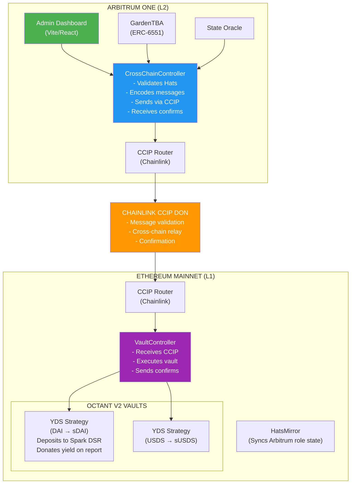
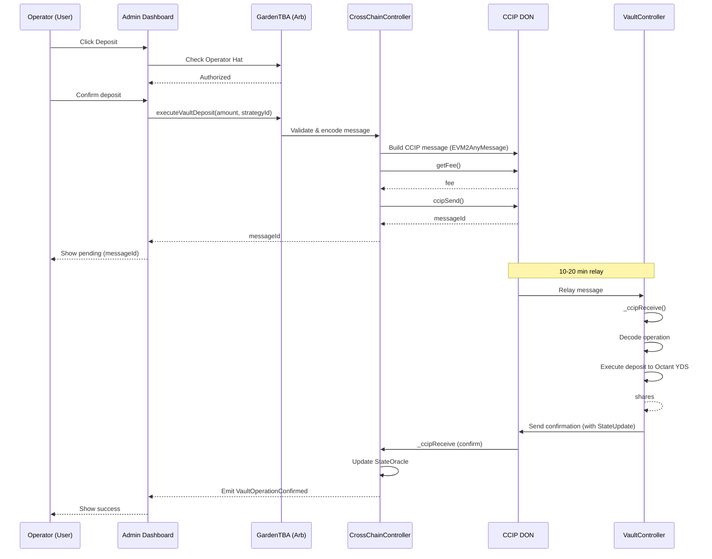
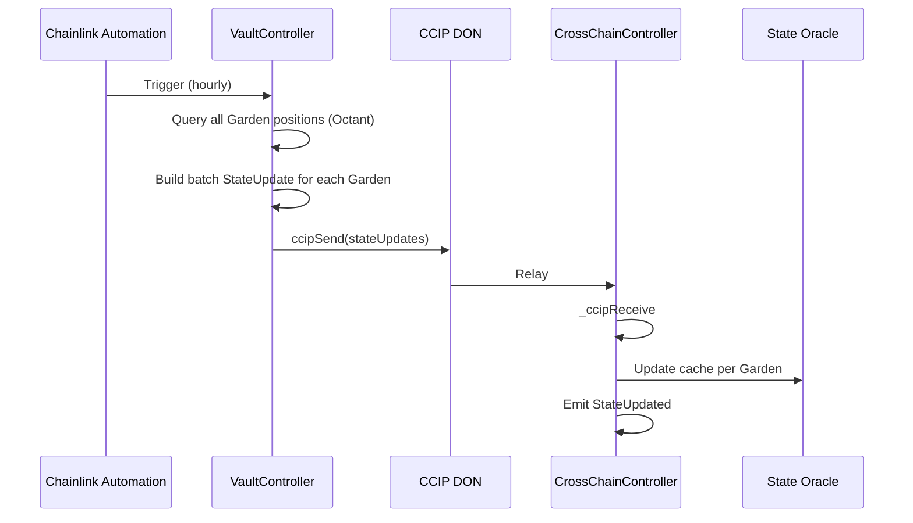
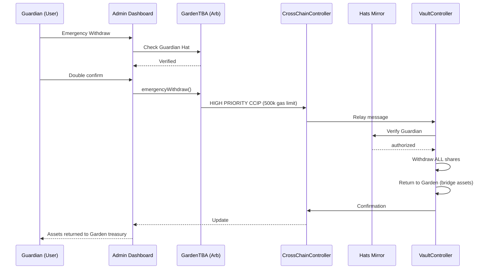

# Cross-Chain Architecture — Phase 2 (Archived)

> **This document is an archive.** The primary architecture is Arbitrum-native (see [Feature Spec](./octant-feature-spec) and [Tech Spec](./octant-tech-spec)). This appendix preserves the cross-chain CCIP design for future Phase 2 implementation when deeper Ethereum liquidity pools are needed.

**Original Author:** Engineering Team
**Archived:** February 2026
**Reason:** Phase 1 uses Arbitrum-native vaults. Cross-chain adds complexity without proportional benefit for initial launch.

---

## 1. Cross-Chain Overview

While Phase 1 deploys ERC-4626 vaults natively on Arbitrum using Aave V3, Phase 2 enables accessing Ethereum-based yield strategies (sDAI, sUSDS) via Chainlink CCIP cross-chain messaging. This provides access to deeper liquidity pools and Ethereum-native yield sources.

### Why Cross-Chain (Phase 2)?

| Factor | Arbitrum-Native (Phase 1) | Cross-Chain CCIP (Phase 2) |
| :--- | :--- | :--- |
| Transaction Cost | ~$0.01-0.05 in ETH | ~$0.20-0.50 LINK per operation |
| Latency | 2-5 seconds | 10-20 minutes |
| Complexity | Low (single chain) | High (2 chains, state sync) |
| Smart Contracts | 2-3 contracts on 1 chain | 4-5 contracts on 2 chains |
| Failure Modes | Standard tx failures | CCIP stuck messages, desync |
| Liquidity Access | Arbitrum DeFi only | Ethereum mainnet DeFi |

---

## 2. Cross-Chain Architecture



---

## 3. Contract Architecture

### 3.1 CrossChainController (Arbitrum)

```solidity
// packages/contracts/src/controllers/CrossChainController.sol (Phase 2)
interface ICrossChainController {
    function executeVaultDeposit(
        address garden,
        uint256 amount,
        bytes32 strategyId
    ) external returns (bytes32 messageId);

    function executeVaultWithdraw(
        address garden,
        uint256 shares,
        address recipient
    ) external returns (bytes32 messageId);

    function emergencyWithdraw(
        address garden
    ) external returns (bytes32 messageId);

    function getVaultPosition(
        address garden
    ) external view returns (
        uint256 shares,
        uint256 value,
        uint256 pendingRewards,
        uint256 lastUpdated
    );
}
```

- Inherits `CCIPReceiver` from Chainlink
- Maps Gardens to authorized positions
- Encodes operation payloads for CCIP messages
- Tracks pending operations by `messageId`
- Receives confirmations and updates `StateOracle`

### 3.2 VaultController (Ethereum)

- Inherits `CCIPReceiver`
- Maps Garden addresses to `VaultPositions`
- Executes deposits/withdrawals on Octant YDS vaults
- Sends confirmation messages back to Arbitrum
- Holds ERC-4626 shares on behalf of Gardens

### 3.3 StateOracle (Arbitrum)

- Caches Ethereum vault positions per Garden
- Updated via CCIP confirmations
- Provides sync freshness indicators
- Stores: shares, value, pendingRewards, lastUpdated

### 3.4 HatsMirror (Ethereum)

- Receives role updates from Arbitrum via CCIP
- Caches Operator/Guardian permissions per Garden
- Used by VaultController for emergency authorization

---

## 4. Message Types

```solidity
library MessageTypes {
    enum Operation {
        DEPOSIT,
        WITHDRAW,
        EMERGENCY_WITHDRAW,
        CLAIM_REWARDS,
        UPDATE_DONATION_ADDRESS,
        SYNC_ROLES
    }

    enum Priority {
        STANDARD,   // 300,000 gas limit
        HIGH        // 500,000 gas limit (emergency)
    }

    struct StateUpdate {
        bytes32 vaultId;
        uint256 shares;
        uint256 value;
        uint256 pendingRewards;
        uint256 timestamp;
    }
}
```

---

## 5. Sequence Diagrams

### 5.1 Cross-Chain Deposit Flow



### 5.2 State Sync Flow



### 5.3 Emergency Withdrawal Flow



---

## 6. Data Model (Cross-Chain Specific)

```graphql
# Indexed from CrossChainController events on Arbitrum
type CrossChainMessage {
  id: ID!                          # CCIP messageId
  garden: Garden!
  operation: Operation!
  sourceChain: Int!
  destChain: Int!
  amount: BigInt
  shares: BigInt
  strategyId: String
  recipient: String
  status: MessageStatus!
  txHashSource: String!
  txHashDest: String
  timestamp: BigInt!
  confirmationTimestamp: BigInt
  error: String
}

enum Operation {
  DEPOSIT
  WITHDRAW
  EMERGENCY_WITHDRAW
  CLAIM_REWARDS
  UPDATE_DONATION_ADDRESS
  SYNC_ROLES
}

enum MessageStatus {
  PENDING
  CONFIRMED
  FAILED
  RETRYING
}
```

---

## 7. Non-Functional Requirements (Cross-Chain)

| Operation | Target | Notes |
| :--- | :--- | :--- |
| CCIP message send | < 5 seconds | To router confirmation |
| Cross-chain completion | 10-20 minutes | CCIP typical latency |
| State sync (batch) | < 1 hour | Chainlink Automation |
| Message delivery | 99.9% (CCIP SLA) | |

**Estimated CCIP Costs:**

| Operation | Fee |
| :--- | :--- |
| Deposit | ~0.1-0.2 LINK |
| Withdraw | ~0.1-0.2 LINK |
| Emergency Withdraw | ~0.15-0.25 LINK |
| State Sync (per garden) | ~0.05 LINK |

---

## 8. Contract Addresses (Reference)

> **Verify before use.** These addresses were captured in early 2026. CCIP routers, token addresses, and third-party contracts may have been upgraded or migrated. Always verify against official documentation before implementing Phase 2.

| Contract | Network | Address |
| :--- | :--- | :--- |
| CCIP Router | Arbitrum One | `0x141fa059441E0ca23ce184B6A78bafD2A517DdE8` |
| CCIP Router | Ethereum | `0x80226fc0Ee2b096224EeAc085Bb9a8cba1146f7D` |
| LINK Token | Arbitrum One | `0xf97f4df75117a78c1A5a0DBb814Af92458539FB4` |
| sDAI | Ethereum | `0x83F20F44975D03b1b09E64809B757c47f942BEeA` |
| sUSDS | Ethereum | `0xa3931d71877C0E7a3148CB7Eb4463524FEc27fbD` |
| HypercertMinter | Arbitrum | `0x822F17A9A5EeCFd66dBAFf7946a8071C265D1d07` |

---

## 9. Migration Path

When Phase 2 is needed:

1. Deploy Ethereum contracts (VaultController, HatsMirror)
2. Deploy CrossChainController on Arbitrum
3. Add sDAI/sUSDS strategies for Gardens wanting deeper liquidity
4. Maintain Arbitrum-native as primary option
5. Fund CCIP operations with LINK

---

## 10. Risks (Cross-Chain Specific)

| Risk | Likelihood | Impact | Mitigation |
| :--- | :--- | :--- | :--- |
| CCIP message stuck | Low | High | Manual execution fallback, monitoring alerts |
| StateOracle desync | Medium | Medium | Automatic hourly sync, manual refresh |
| LINK price spike | Medium | Low | Maintain LINK buffer, monitor fees |
| HatsMirror role desync | Low | Medium | Periodic role sync, fallback to source chain |

---

*End of Cross-Chain Appendix*
