# GG-FEAT-006: Octant Vault Integration (Cross-Chain Yield Donating)

**Feature ID:** GG-FEAT-006
**Priority:** High
**Status:** Planned
**Estimated Effort:** 8 weeks
**Last Updated:** January 18, 2026

---

## 1. Feature Overview

**Brief description:** Enable Garden treasuries (ERC-6551 GardenAccounts on Arbitrum) to deposit capital into Yield Donating Strategy (YDS) vaults (Arbitrum-native or Ethereum via CCIP). Generated yield is allocated via conviction voting to **purchase Hypercert fractions** on behalf of the Garden, building a portfolio of verified environmental impact while preserving principal capital. This creates the "Octant-Backstopped Impact Floor" described in the PRD.

**Target user:** Garden Operator (Persona B from PRD)

**Related goals/objectives:**
- PRD Goal 1 (Capital Formation): Establishes sustainable yield-based funding for Gardens
- PRD M3 Integration: Octant V2 vault integration for $250k+ TVL target
- Arbitrum Grant M3: Cross-chain vault operations demonstrating Arbitrum to Ethereum DeFi
- North Star TVIV: Yield used to purchase Hypercert fractions contributes to Garden's verified impact portfolio

**Feature-specific success criteria:**
- First cross-chain deposit executed within 48 hours of feature launch
- 90% of deposit/withdraw operations complete successfully (no stuck messages)
- Average cross-chain message latency under 20 minutes (Arbitrum to Ethereum)
- Zero loss of user principal due to contract bugs
- $50k+ TVL in Green Goods vaults within first month

**Non-goals:**
- Direct user deposits to Octant (users deposit to Gardens, Gardens deposit to Octant)
- Yield-generating strategies that increase PPS (only yield-donating strategies)
- Multi-strategy vault management (Phase 2)
- Conviction Voting UI/UX (see GG-FEAT-007 for governance dashboard)
- Cross-chain token bridging (yield stays on Arbitrum/Ethereum, only messages cross chains)

**Dependencies / preconditions:**
- GG-FEAT-002 (Passkey Auth): Operators need authenticated wallets
- GG-FEAT-004 (Admin Dashboard v2): UI container for vault management
- GG-FEAT-005 (Hypercerts): Minted Hypercerts are purchase targets
- GG-FEAT-007 (Gardens Conviction Voting): Determines yield allocation
- Hats Protocol: Operator role required for vault operations
- GardenAccount (ERC-6551): Token-bound accounts must hold depositable assets
- Chainlink CCIP: Production deployment on Arbitrum and Ethereum lanes (Phase 2)
- Aave V3 / Yearn V3: DeFi protocols on Arbitrum for yield generation

**Key Architecture Decision - Yield Routing:**

Yield generated from vault positions is **NOT** sent to a configurable "donation address." Instead:

1. **Yield is harvested** from YDS strategies (Aave V3, Yearn V3, etc.)
2. **Conviction voting** (GG-FEAT-007) determines allocation percentages across Hypercerts
3. **Yield purchases Hypercert fractions** on the marketplace based on conviction %
4. **Fractions are deposited** to the Garden treasury (GardenAccount TBA)

This creates a direct link between vault yield and verified impact ownership. The Garden accumulates a portfolio of Hypercert fractions over time, representing ownership of verified environmental impact.

See GG-TECH-006 Section 4.1.2 (Yield Harvest Flow) for technical details.

---

## 2. Feature Map (Actions + Integration Points)

### 2.1 User Actions (what people do)

- **Action A:** View vault positions and yield status (Operator monitors Garden's vault position)
- **Action B:** Deposit assets to vault (Operator initiates deposit to YDS strategy)
- **Action C:** Withdraw assets from vault (Operator initiates withdrawal)
- **Action D:** View yield allocation (Operator sees how yield is routed via conviction voting)
- **Action E:** View transaction history (Operator tracks deposits, withdrawals, yield allocations)
- **Action F:** Emergency withdrawal (Guardian initiates emergency exit)

### 2.2 Integration / Interaction Points

- [x] **UI / Client** (Admin Dashboard vault management screens)
- [x] **Backend API** (State oracle queries, transaction building)
- [x] **Data layer** (Envio indexer for vault events, Chainlink CCIP explorer)
- [x] **External services** (Chainlink CCIP, Pimlico for gas sponsorship)
- [x] **Onchain / contracts (Arbitrum)** (CrossChainController, GardenTBA, StateOracle)
- [x] **Onchain / contracts (Ethereum)** (VaultController, Octant YDS vaults, HatsMirror)
- [x] **Permissions / roles** (Hats Protocol Operator/Guardian roles)
- [x] **Notifications** (Deposit confirmed, withdrawal complete, yield allocated, Hypercert fractions purchased)

### 2.3 Action x Integration Matrix

| Action | UI | API | Data | External | Onchain (Arb) | Onchain (Eth) | Permissions | Notifications |
| :---- | :----: | :----: | :----: | :----: | :----: | :----: | :----: | :----: |
| View positions | Yes | Yes | Yes | Yes | Yes | Yes | - | - |
| Deposit to vault | Yes | Yes | Yes | Yes | Yes | Yes | Yes | Yes |
| Withdraw from vault | Yes | Yes | Yes | Yes | Yes | Yes | Yes | Yes |
| View yield allocation | Yes | Yes | Yes | - | Yes | - | - | - |
| View tx history | Yes | Yes | Yes | Yes | Yes | Yes | - | - |
| Emergency withdraw | Yes | Yes | Yes | Yes | Yes | Yes | Yes | Yes |

### 2.4 API Endpoint Inventory

**GraphQL Queries (Reads via Envio + State Oracle)**

```graphql
# Fetch Garden's Octant vault positions (from StateOracle cache)
query GetGardenVaultPositions($gardenId: String!) {
  gardenVaultPositions(where: &#123; gardenId: $gardenId &#125;) {
    id
    vaultAddress
    strategyName
    shares
    valueInUnderlying
    pendingRewards
    donationAddressShares
    lastSyncTimestamp
    chainId
  }
}

# Fetch cross-chain message history
query GetCrossChainMessages($gardenId: String!, $status: MessageStatus) {
  crossChainMessages(
    where: &#123; gardenId: $gardenId, status: $status &#125;
    orderBy: timestamp_DESC
    first: 50
  ) {
    id
    messageId
    operation
    sourceChain
    destChain
    status
    amount
    txHashSource
    txHashDest
    timestamp
    confirmationTimestamp
    error
  }
}

# Fetch available YDS strategies on Ethereum
query GetAvailableStrategies($asset: String!) {
  ydsStrategies(where: &#123; asset: $asset, isActive: true &#125;) {
    id
    address
    name
    asset
    apy
    tvl
    riskLevel
    donationAddress
    minDeposit
    maxDeposit
  }
}
```

**Contract Calls (Arbitrum - via CrossChainController)**

| Function | Purpose | Auth | Parameters |
| :---- | :---- | :---- | :---- |
| `executeVaultDeposit` | Initiate deposit to Ethereum vault | Operator Hat | `amount`, `strategyId` |
| `executeVaultWithdraw` | Initiate withdrawal from vault | Operator Hat | `shares`, `recipient` |
| `emergencyWithdraw` | Initiate emergency full withdrawal | Guardian Hat | - |
| `setDonationAddress` | Propose new donation address | Operator Hat | `newDonationAddress` |
| `getVaultPosition` | Read cached vault state | Public | - |

**Contract Calls (Ethereum - via VaultController)**

| Function | Purpose | Auth | Parameters |
| :---- | :---- | :---- | :---- |
| `_ccipReceive` | Process incoming CCIP message | Router Only | `Any2EVMMessage` |
| `triggerBatchStateSync` | Push state updates to Arbitrum | Keeper | `gardens[]` |
| `getPositionValue` | Read current vault position | Public | `garden`, `strategy` |

---

## 3. User Experience (Flows per Action)

### 3.1 Action A: View Vault Positions and Yield Status

**User story:** As an Operator, I want to see my Garden's Octant vault positions, so I can monitor principal and donated yield.

**Primary flow:**
1. Operator navigates to Admin Dashboard and selects Garden
2. Clicks "Treasury" or "Vaults" tab
3. System queries StateOracle for cached Ethereum vault positions
4. System displays position cards showing:
   - Strategy name and underlying asset
   - Principal deposited (original amount)
   - Current value (may differ slightly due to fees)
   - Donated yield (total donated since inception)
   - Pending rewards (not yet distributed)
   - Last sync timestamp
5. System shows sync status indicator (green if less than 1 hour old, yellow if 1-6 hours, red if greater than 6 hours)
6. Operator can click "Refresh" to trigger manual state sync

**Alternate flows:**
- No positions: Show empty state with "Deposit to Octant" CTA
- Stale data (greater than 6 hours): Show warning banner "Data may be outdated. Last sync: [time]"
- StateOracle unavailable: Show cached data with "Offline mode" indicator

**Edge cases:**
- Position in loss (rare for YDS): Show position value lower than principal with explanation
- Donation buffer exhausted: Show warning "Loss protection depleted"

### 3.2 Action B: Deposit Assets to Octant Vault

**User story:** As an Operator, I want to deposit Garden treasury assets into Octant YDS vaults, so the yield can fund ecosystem initiatives.

**Primary flow:**
1. Operator clicks "Deposit to Octant" from Treasury view
2. System checks Operator Hats permission
3. System displays deposit form:
   - Asset selector (USDC, DAI, ETH - based on Garden holdings)
   - Strategy selector (filtered by compatible YDS strategies)
   - Amount input (max = Garden balance)
   - Strategy details: APY estimate, risk level, donation address
4. Operator selects asset, strategy, and enters amount
5. System validates:
   - Amount greater than strategy minimum
   - Amount less than strategy maximum (if applicable)
   - Garden has sufficient balance
6. Operator clicks "Preview Deposit"
7. System shows confirmation:
   - Amount and asset
   - Estimated shares to receive
   - Cross-chain fee (LINK)
   - Estimated completion time (10-20 minutes)
8. Operator clicks "Confirm Deposit"
9. System constructs CCIP message via CrossChainController
10. Operator signs transaction (Passkey)
11. System shows pending state:
    - "Message sent to CCIP router..."
    - "Waiting for Ethereum confirmation..."
12. On CCIP confirmation callback:
    - Update StateOracle
    - Show success with new position

**Cross-chain message structure:**
```solidity
struct DepositMessage {
    Operation operation;     // DEPOSIT
    bytes32 vaultId;        // Target strategy identifier
    uint256 amount;         // Amount in underlying asset
    bytes32 strategyId;     // Specific YDS strategy
    address garden;         // Garden TBA address (for tracking)
}
```

**Alternate flows:**
- Insufficient LINK for CCIP fee: Show error "Insufficient LINK for cross-chain fee"
- Strategy at capacity: Show error "Strategy deposit limit reached"
- Network congestion: Show estimated higher wait time

**Edge cases:**
- CCIP message stuck (greater than 1 hour): Show "Message pending" with CCIP explorer link, manual retry option
- Ethereum transaction reverts: CCIP handles automatic retry, show status updates

### 3.3 Action C: Withdraw Assets from Octant Vault

**User story:** As an Operator, I want to withdraw assets from Octant, so I can access Garden capital when needed.

**Primary flow:**
1. Operator views existing position in Treasury
2. Clicks "Withdraw" on position card
3. System displays withdrawal form:
   - Current position (shares and value)
   - Amount input (shares or underlying equivalent)
   - Recipient address (default: Garden treasury)
4. Operator enters withdrawal amount
5. System validates amount less than or equal to available shares
6. Operator clicks "Preview Withdrawal"
7. System shows confirmation:
   - Shares to burn
   - Estimated underlying to receive
   - Cross-chain fee (LINK)
   - Note: "Final amount may vary slightly"
8. Operator clicks "Confirm Withdrawal"
9. System constructs CCIP message
10. Operator signs transaction
11. System shows pending state (same as deposit)
12. On confirmation: Assets returned to Garden treasury (or specified recipient)

**Cross-chain message structure:**
```solidity
struct WithdrawMessage {
    Operation operation;     // WITHDRAW
    bytes32 vaultId;
    uint256 shares;         // Shares to redeem
    address recipient;      // Where to send underlying
    address garden;
}
```

**Alternate flows:**
- Partial withdrawal: Allow any amount up to total position
- Full withdrawal: Special "Withdraw All" option that redeems exact shares

**Edge cases:**
- Slippage during withdrawal: Actual amount may be slightly less due to PPS changes
- Strategy has withdrawal queue: Show estimated wait time, track in history

### 3.4 Action D: View Yield Allocation

**User story:** As an Operator, I want to see how yield is being allocated via conviction voting, so I can understand how the Garden's yield is being used to purchase Hypercert fractions.

**Primary flow:**
1. Operator navigates to "Yield Allocation" section in Treasury dashboard
2. System displays current allocation summary:
   - Total yield generated (cumulative)
   - Total yield allocated (used to purchase Hypercerts)
   - Pending yield (not yet allocated)
3. System shows conviction-based allocation breakdown:
   - List of Hypercerts receiving yield based on conviction %
   - Each shows: Hypercert ID, verification status, conviction %, yield allocated, fractions purchased
4. Operator can click "View Governance" to see conviction voting dashboard (GG-FEAT-007)
5. System shows Garden's Hypercert portfolio (fractions owned from purchases)

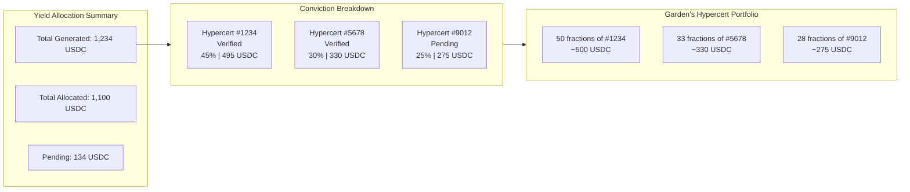

**Note:** Yield allocation is determined by conviction voting in the Gardens CVStrategy pool (see GG-FEAT-007). Operators can participate in conviction voting to influence allocation, but cannot directly configure a "donation address" - the system routes yield to purchase Hypercert fractions based on community consensus.

**Alternate flows:**
- No active conviction voting: Show "Set up Governance" prompt linking to GG-FEAT-007
- All yield pending: Show "Allocation pending" with countdown to next harvest

**Edge cases:**
- Hypercert marketplace has no fractions for sale: Yield held in escrow until fractions available
- Hypercert verification revoked: Show warning, yield may be reallocated

### 3.5 Action E: View Transaction History

**User story:** As an Operator, I want to see all vault operations, so I can track deposits, withdrawals, yield allocations, and Hypercert purchases.

**Primary flow:**
1. Operator navigates to "Cross-Chain History" section
2. System displays list of CCIP messages:
   - Operation type (Deposit, Withdraw, Emergency, State Sync)
   - Amount and asset
   - Status (Pending, Confirmed, Failed)
   - Source chain transaction
   - Destination chain transaction (if complete)
   - Timestamp and duration
3. Operator can filter by status, operation type, date range
4. Clicking a row shows full details:
   - CCIP message ID
   - Full transaction data
   - Link to CCIP Explorer
   - Error message (if failed)

**Alternate flows:**
- No history: Show empty state "No cross-chain operations yet"
- Failed message: Show "Retry" button if retryable

**Edge cases:**
- Message in-flight during page load: Show "Syncing..." indicator
- Multiple pending messages: Display in order with individual statuses

### 3.6 Action F: Emergency Withdrawal

**User story:** As a Guardian, I want to initiate emergency withdrawal if there's a security concern, so Garden capital is protected.

**Primary flow:**
1. Guardian accesses Emergency Controls (separate from regular Operator UI)
2. System verifies Guardian Hats role
3. Guardian clicks "Emergency Withdraw All"
4. System shows serious warning:
   - "This will withdraw ALL positions immediately"
   - "Normal withdrawal delays bypassed"
   - "Only use for genuine emergencies"
5. Guardian confirms with secondary authentication
6. System constructs high-priority CCIP message
7. Guardian signs transaction
8. System shows priority pending state
9. On confirmation: All assets returned to Garden treasury

**Authorization:**
- Only addresses wearing Guardian Hat can execute
- Guardian role is separate from Operator (higher privilege)
- Multi-sig Guardian possible via Hats Module

**Edge cases:**
- Strategy doesn't support emergency withdrawal: Execute normal withdrawal with priority flag
- Multiple strategies: Withdraws from all in parallel

---

## 4. System Architecture

### 4.1 High-Level Architecture

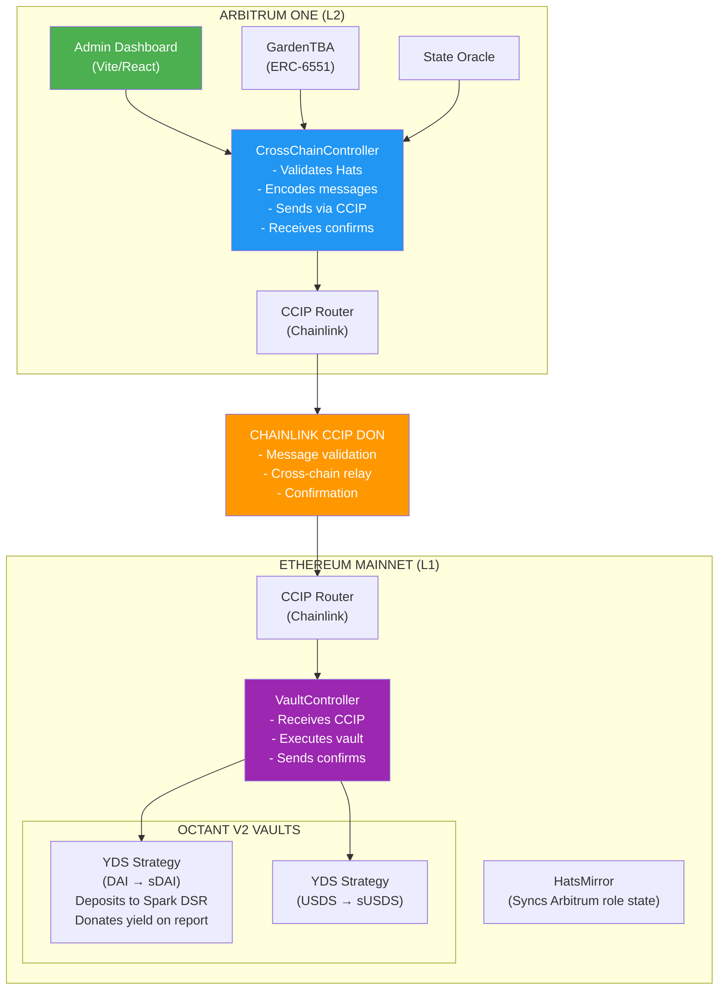

<details>
<summary>PNG Fallback</summary>

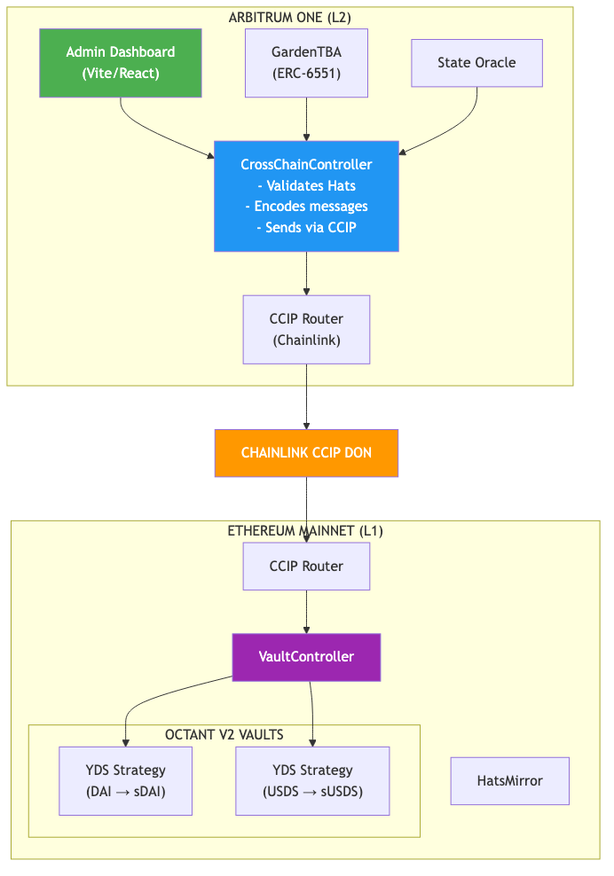
</details>

### 4.2 Contract Architecture

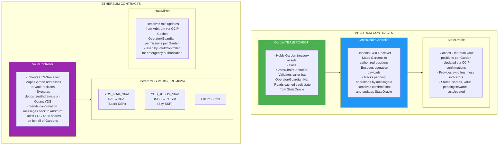

<details>
<summary>PNG Fallback</summary>

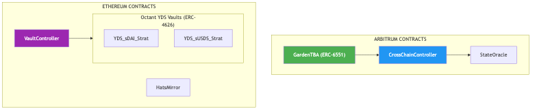
</details>

### 4.3 Message Types

```solidity
// packages/contracts/src/shared/MessageTypes.sol

library MessageTypes {
    enum Operation {
        DEPOSIT,
        WITHDRAW,
        EMERGENCY_WITHDRAW,
        CLAIM_REWARDS,
        UPDATE_DONATION_ADDRESS,
        SYNC_ROLES
    }

    enum Priority {
        STANDARD,   // 300,000 gas limit
        HIGH        // 500,000 gas limit (emergency)
    }

    struct StateUpdate {
        bytes32 vaultId;
        uint256 shares;
        uint256 value;
        uint256 pendingRewards;
        uint256 timestamp;
    }
}
```

---

## 5. Data Model

### 5.1 Envio Indexer Schema

```graphql
# Indexed from CrossChainController events on Arbitrum
type CrossChainMessage {
  id: ID!                          # CCIP messageId
  garden: Garden!
  operation: Operation!
  sourceChain: Int!                # Chain ID
  destChain: Int!
  amount: BigInt
  shares: BigInt
  strategyId: String
  recipient: String
  status: MessageStatus!
  txHashSource: String!
  txHashDest: String
  timestamp: BigInt!
  confirmationTimestamp: BigInt
  error: String
}

enum Operation {
  DEPOSIT
  WITHDRAW
  EMERGENCY_WITHDRAW
  CLAIM_REWARDS
  UPDATE_DONATION_ADDRESS
  SYNC_ROLES
}

enum MessageStatus {
  PENDING
  CONFIRMED
  FAILED
  RETRYING
}

# Cached from StateOracle on Arbitrum
type VaultPosition {
  id: ID!                          # gardenId-vaultId
  garden: Garden!
  vaultId: String!
  strategyName: String!
  asset: String!
  shares: BigInt!
  valueInUnderlying: BigInt!
  pendingRewards: BigInt!
  donationAddress: String!
  totalDonated: BigInt!
  lastSyncTimestamp: BigInt!
}

# YDS Strategy metadata
type YDSStrategy {
  id: ID!                          # Strategy address
  address: String!
  name: String!
  asset: String!
  apy: Float
  tvl: BigInt
  riskLevel: String
  donationAddress: String!
  minDeposit: BigInt
  maxDeposit: BigInt
  isActive: Boolean!
}
```

### 5.2 Client-Side State (Zustand)

```typescript
// packages/shared/src/stores/useVaultStore.ts

interface VaultState {
  // Current positions
  positions: VaultPosition[];
  positionsLoading: boolean;
  positionsError: string | null;

  // Pending operations
  pendingMessages: CrossChainMessage[];

  // Available strategies
  strategies: YDSStrategy[];
  strategiesLoading: boolean;

  // Deposit/Withdraw form state
  selectedStrategy: YDSStrategy | null;
  depositAmount: string;
  withdrawShares: string;

  // Transaction state
  txState: VaultTxState;

  // Actions
  fetchPositions: (gardenId: string) => Promise<void>;
  fetchStrategies: (asset: string) => Promise<void>;
  initiateDeposit: (params: DepositParams) => Promise<string>;
  initiateWithdraw: (params: WithdrawParams) => Promise<string>;
  emergencyWithdraw: () => Promise<string>;
  pollMessageStatus: (messageId: string) => Promise<void>;
}

interface VaultTxState {
  status: 'idle' | 'building' | 'signing' | 'pending_source' |
          'pending_ccip' | 'pending_dest' | 'confirmed' | 'failed';
  messageId: string | null;
  txHashSource: string | null;
  txHashDest: string | null;
  error: string | null;
  estimatedCompletion: number | null; // timestamp
}

interface DepositParams {
  gardenId: string;
  strategyId: string;
  amount: bigint;
  asset: string;
}

interface WithdrawParams {
  gardenId: string;
  vaultId: string;
  shares: bigint;
  recipient?: string; // defaults to Garden treasury
}
```

### 5.3 TypeScript Interfaces

```typescript
// packages/shared/src/types/vaults.ts

import type { Address, Hex } from 'viem';

export interface VaultPosition {
  id: string;
  garden: Address;
  vaultId: Hex;
  strategyName: string;
  asset: Address;
  shares: bigint;
  valueInUnderlying: bigint;
  pendingRewards: bigint;
  donationAddress: Address;
  totalDonated: bigint;
  lastSyncTimestamp: bigint;
}

export interface YDSStrategy {
  id: string;
  address: Address;
  name: string;
  asset: Address;
  apy: number;
  tvl: bigint;
  riskLevel: 'low' | 'medium' | 'high';
  donationAddress: Address;
  minDeposit: bigint;
  maxDeposit: bigint | null;
  isActive: boolean;
}

export interface CrossChainMessage {
  id: Hex; // CCIP messageId
  garden: Address;
  operation: Operation;
  sourceChain: number;
  destChain: number;
  amount?: bigint;
  shares?: bigint;
  strategyId?: Hex;
  recipient?: Address;
  status: MessageStatus;
  txHashSource: Hex;
  txHashDest?: Hex;
  timestamp: bigint;
  confirmationTimestamp?: bigint;
  error?: string;
}

export type Operation =
  | 'DEPOSIT'
  | 'WITHDRAW'
  | 'EMERGENCY_WITHDRAW'
  | 'CLAIM_REWARDS'
  | 'UPDATE_DONATION_ADDRESS'
  | 'SYNC_ROLES';

export type MessageStatus =
  | 'PENDING'
  | 'CONFIRMED'
  | 'FAILED'
  | 'RETRYING';

// CCIP Message structure
export interface CCIPMessage {
  receiver: Address;
  data: Hex;
  tokenAmounts: TokenAmount[];
  extraArgs: Hex;
  feeToken: Address;
}

export interface TokenAmount {
  token: Address;
  amount: bigint;
}
```

---

## 6. Sequence Diagrams

### 6.1 Deposit Flow (Arbitrum to Ethereum)

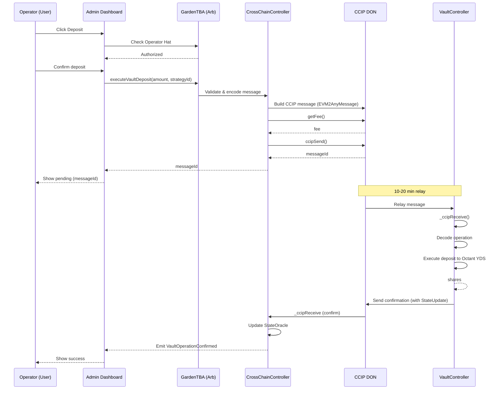

<details>
<summary>PNG Fallback</summary>

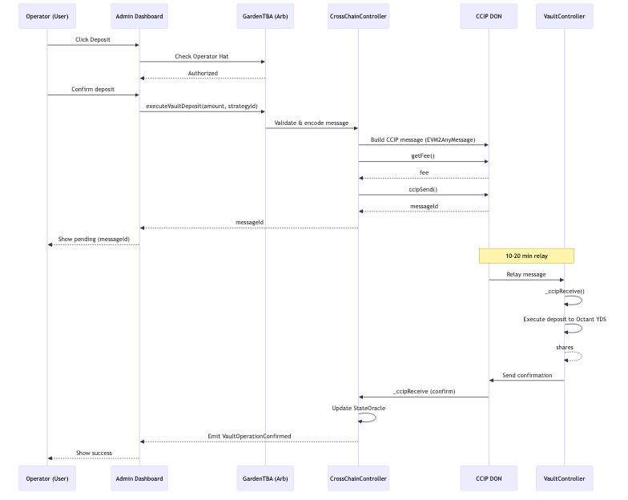
</details>

### 6.2 State Sync Flow (Ethereum to Arbitrum)

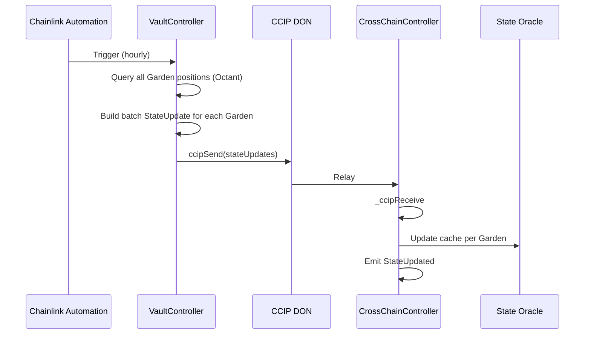

<details>
<summary>PNG Fallback</summary>

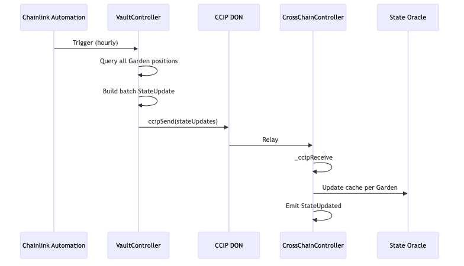
</details>

### 6.3 Emergency Withdrawal Flow

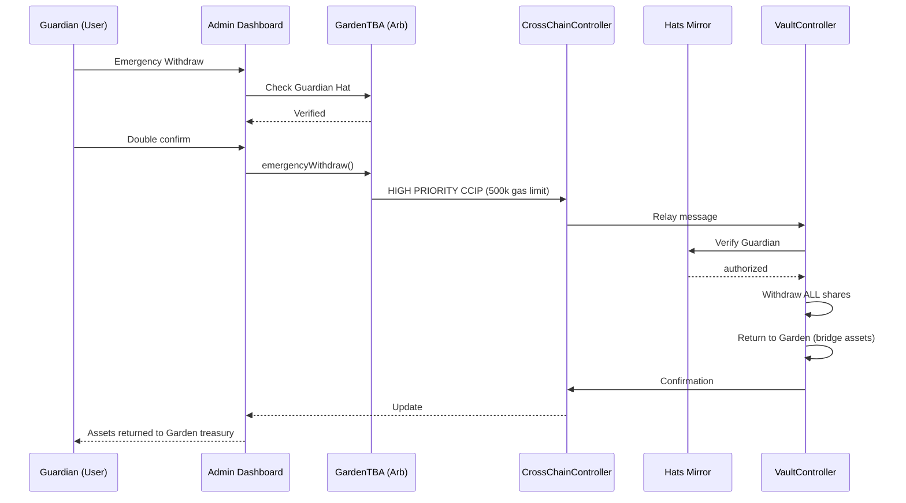

<details>
<summary>PNG Fallback</summary>

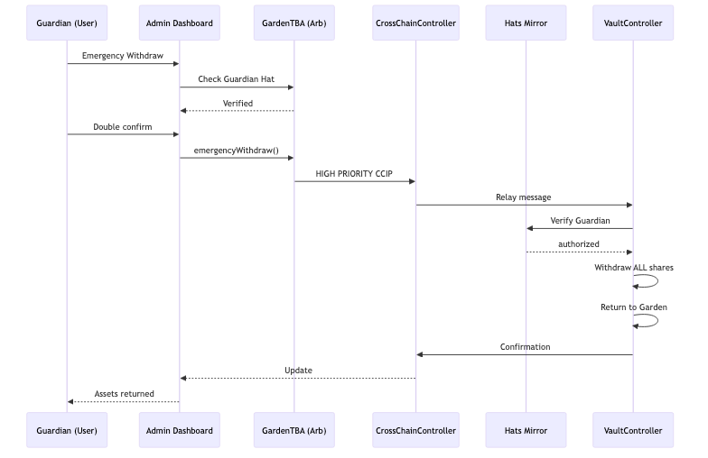
</details>

---

## 7. Smart Contract Implementation

See [Technical Specification](./octant-tech-spec) for full contract implementations including:
- `CrossChainController.sol` (Arbitrum)
- `VaultController.sol` (Ethereum)
- `GardenVaultManager.sol` (Arbitrum-Native)

---

## 8. Requirements

### 8.1 Requirements by Action

**Action A: View Vault Positions**

- **FR-A-001:** System shall display cached vault positions from StateOracle
  - Priority: High
  - AC1: Position shows shares, value, pending rewards
  - AC2: Sync timestamp displayed with freshness indicator
  - AC3: Data refreshes on page load and manual trigger

- **FR-A-002:** System shall indicate data freshness
  - Priority: Medium
  - AC1: Green indicator if synced within 1 hour
  - AC2: Yellow indicator if 1-6 hours old
  - AC3: Red indicator if greater than 6 hours old

**Action B: Deposit to Vault**

- **FR-B-001:** System shall validate Operator permissions via Hats Protocol
  - Priority: Critical
  - AC1: Check Operator Hat before showing deposit form
  - AC2: Re-validate before transaction submission
  - AC3: Clear error if permission revoked

- **FR-B-002:** System shall construct valid CCIP message for deposit
  - Priority: Critical
  - AC1: Message includes correct operation type
  - AC2: Message includes strategy ID and amount
  - AC3: Message uses appropriate gas limit

- **FR-B-003:** System shall track cross-chain message status
  - Priority: High
  - AC1: Display pending state with messageId
  - AC2: Update status on confirmation
  - AC3: Show error if message fails

**Action C: Withdraw from Vault**

- **FR-C-001:** System shall validate withdrawal amount against position
  - Priority: Critical
  - AC1: Block withdrawal exceeding available shares
  - AC2: Show current position during withdrawal

- **FR-C-002:** System shall support partial and full withdrawals
  - Priority: High
  - AC1: Allow specific share amount
  - AC2: "Withdraw All" option for full position

**Action F: Emergency Withdrawal**

- **FR-F-001:** System shall restrict emergency to Guardian role
  - Priority: Critical
  - AC1: Only Guardian Hat wearers can access
  - AC2: Double confirmation required
  - AC3: Uses HIGH priority CCIP message

- **FR-F-002:** System shall verify Guardian on Ethereum via HatsMirror
  - Priority: Critical
  - AC1: HatsMirror caches Arbitrum role state
  - AC2: VaultController verifies before execution

### 8.2 Cross-Cutting Requirements

- **FR-X-001:** All cross-chain operations shall use Chainlink CCIP
  - AC1: Never use other bridges
  - AC2: Pay fees in LINK
  - AC3: Handle CCIP-specific errors

- **FR-X-002:** State synchronization shall be automatic
  - AC1: Chainlink Automation triggers hourly sync
  - AC2: Operations also trigger state updates
  - AC3: Manual refresh available

- **FR-X-003:** All operations shall be idempotent
  - AC1: Duplicate messages handled gracefully
  - AC2: Pending operations tracked by messageId
  - AC3: Confirmation prevents double-execution

---

## 9. Non-Functional Requirements

**Performance:**

| Operation | Target | Notes |
| :---- | :---- | :---- |
| Position load (from cache) | less than 1 second | StateOracle on Arbitrum |
| CCIP message send | less than 5 seconds | To router confirmation |
| Cross-chain completion | 10-20 minutes | CCIP typical latency |
| State sync (batch) | less than 1 hour | Chainlink Automation |

**Reliability:**

| Metric | Target |
| :---- | :---- |
| Message delivery | 99.9% (CCIP SLA) |
| State sync freshness | less than 1 hour |
| Operational uptime | 99.5% |

**Security:**

- All vault operations require valid Hats role
- Cross-chain messages validated by source chain + sender
- Emergency operations require Guardian role
- No direct user access to Ethereum contracts (only via CCIP)

**Cost:**

| Operation | Estimated CCIP Fee |
| :---- | :---- |
| Deposit | ~0.1-0.2 LINK |
| Withdraw | ~0.1-0.2 LINK |
| Emergency Withdraw | ~0.15-0.25 LINK |
| State Sync (per garden) | ~0.05 LINK |
| Role Sync (batch) | ~0.1 LINK |

---

## 10. Analytics and Telemetry

### 10.1 Events

| Event Name | When | Properties |
| :---- | :---- | :---- |
| vault_deposit_initiated | User clicks deposit confirm | gardenId, strategyId, amount, asset |
| vault_deposit_confirmed | CCIP confirmation received | gardenId, messageId, shares, duration_seconds |
| vault_deposit_failed | Operation failed | gardenId, messageId, error_type, error_message |
| vault_withdraw_initiated | User clicks withdraw confirm | gardenId, shares, recipient |
| vault_withdraw_confirmed | CCIP confirmation received | gardenId, messageId, assets_received, duration_seconds |
| vault_emergency_initiated | Guardian triggers emergency | gardenId, guardian_address |
| vault_state_sync | State update received | gardenId, shares, value, sync_latency_seconds |

### 10.2 Metrics

- **TVL**: Total value deposited across all Gardens
- **Active Gardens**: Gardens with non-zero vault positions
- **CCIP Message Volume**: Messages per day/week
- **Average Latency**: Cross-chain completion time
- **Failure Rate**: Failed operations / total operations

---

## 11. Testing Strategy

### 11.1 Test Scenarios

**Happy Path:**
- TS1: Deposit DAI to sDAI strategy, verify position
- TS2: Withdraw partial shares, verify remaining
- TS3: Full withdrawal, verify position cleared
- TS4: Emergency withdrawal as Guardian

**Edge Cases:**
- TS5: CCIP message timeout (manual retry)
- TS6: Insufficient LINK for fees
- TS7: Strategy at deposit capacity
- TS8: Stale state data warning

**Security:**
- TS9: Non-Operator cannot deposit
- TS10: Non-Guardian cannot emergency withdraw
- TS11: Invalid source chain rejected

### 11.2 Test Networks

- **Development**: Arbitrum Sepolia and Ethereum Sepolia
- **Staging**: Arbitrum Sepolia and Ethereum Sepolia (with testnet Octant)
- **Production**: Arbitrum One and Ethereum Mainnet

---

## 12. Arbitrum-Native Vault Deployment (Alternative Architecture)

### 12.1 Overview

While the primary architecture (Sections 1-11) focuses on cross-chain integration with Ethereum-based Octant YDS vaults via Chainlink CCIP, an **alternative approach** enables deploying Yield Donating Strategy (YDS) vaults natively on Arbitrum. This eliminates cross-chain complexity and costs while providing equivalent yield-donating functionality.

**Recommendation:** Deploy Arbitrum-native vaults for Phase 1 launch, with cross-chain Ethereum integration as Phase 2 for access to deeper liquidity pools.

### 12.2 Why Arbitrum-Native?

| Factor | Cross-Chain (CCIP) | Arbitrum-Native |
| :---- | :---- | :---- |
| Transaction Cost | ~$0.20-0.50 LINK per operation | ~$0.01-0.05 in ETH |
| Latency | 10-20 minutes | 2-5 seconds |
| Complexity | High (2 chains, state sync) | Low (single chain) |
| Smart Contracts | 4-5 contracts on 2 chains | 2-3 contracts on 1 chain |
| Failure Modes | CCIP stuck messages, desync | Standard tx failures |
| Arbitrum Grant Alignment | Partial (bridges out) | Full (native TVL) |

### 12.3 Arbitrum DeFi Yield Sources

#### 12.3.1 Aave V3 on Arbitrum (Recommended)

**Overview:** Aave V3 is deployed on Arbitrum with full feature parity to Ethereum mainnet. ERC-4626 wrappers exist for aTokens.

**Supported Assets:**
- USDC, USDC.e
- DAI
- WETH
- WBTC
- ARB

**ERC-4626 Wrapper:** `waUSDC` at `0xDAF2D8AAc9174B1168b9f78075FE64a04bae197B`

**Estimated APY:** 3-8% (variable based on utilization)

#### 12.3.2 Yearn V3 on Arbitrum

**Overview:** Yearn V3 multi-strategy vaults are live on Arbitrum with ERC-4626 compliance.

**Key Features:**
- Multiple strategies per vault (risk diversification)
- Tokenized strategies can be used directly
- Built-in debt allocation and risk management

**Estimated APY:** 5-15% (depending on strategy mix)

### 12.4 Arbitrum-Native Architecture

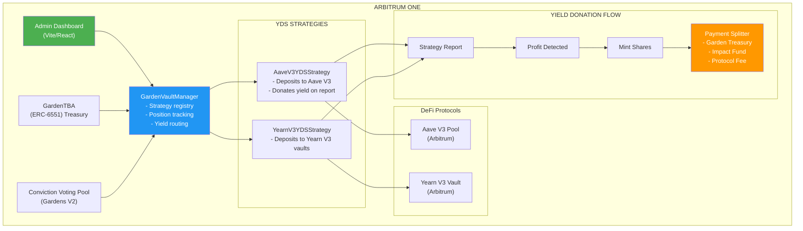

<details>
<summary>PNG Fallback</summary>

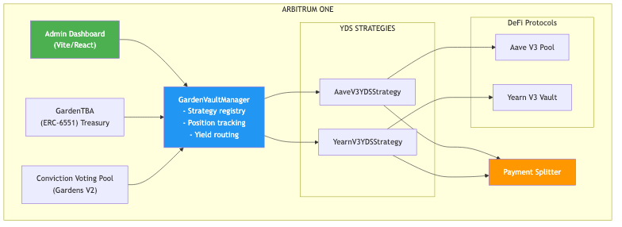
</details>

### 12.5 Migration Path

**Phase 1: Arbitrum-Native Launch**
1. Deploy GardenVaultManager on Arbitrum
2. Deploy AaveV3YDSStrategy for USDC/DAI
3. Register strategies and Gardens
4. Begin deposits and yield donation

**Phase 2: Cross-Chain Expansion (Optional)**
1. Deploy Ethereum contracts (VaultController, HatsMirror)
2. Deploy CrossChainController on Arbitrum
3. Add sDAI/sUSDS strategies for Gardens wanting deeper liquidity
4. Maintain Arbitrum-native as primary

### 12.6 Arbitrum-Native Contract Addresses

| Contract | Network | Address |
| :---- | :---- | :---- |
| Aave V3 Pool | Arbitrum One | `0x794a61358D6845594F94dc1DB02A252b5b4814aD` |
| Aave V3 PoolDataProvider | Arbitrum One | `0x69FA688f1Dc47d4B5d8029D5a35FB7a548310654` |
| waUSDC (ERC-4626) | Arbitrum One | `0xDAF2D8AAc9174B1168b9f78075FE64a04bae197B` |
| USDC | Arbitrum One | `0xaf88d065e77c8cC2239327C5EDb3A432268e5831` |
| USDC.e (Bridged) | Arbitrum One | `0xFF970A61A04b1cA14834A43f5dE4533eBDDB5CC8` |
| DAI | Arbitrum One | `0xDA10009cBd5D07dd0CeCc66161FC93D7c9000da1` |
| Hats Protocol | Arbitrum One | `0x3bc1A0Ad72417f2d411118085256fC53CBdDd137` |

---

## 13. Risks and Mitigations

| Risk | Likelihood | Impact | Mitigation |
| :---- | :---- | :---- | :---- |
| CCIP message stuck | Low | High | Manual execution fallback, monitoring alerts |
| Octant strategy loss | Low | High | Only use audited strategies, diversification in Phase 2 |
| StateOracle desync | Medium | Medium | Automatic hourly sync, manual refresh |
| LINK price spike | Medium | Low | Maintain LINK buffer, monitor fees |
| Guardian key compromise | Low | Critical | Multi-sig Guardian via Hats Module |
| Aave V3 smart contract risk | Low | High | Use audited wrappers, diversify across strategies |
| Arbitrum sequencer downtime | Low | Medium | Monitor sequencer, pause operations if needed |
| Yield fluctuation | High | Low | Set expectations, display historical APY ranges |

---

## 14. Open Questions

- **Q1:** Should we bridge yield back to Arbitrum or keep on Ethereum?
  - Owner: @engineering
  - By: February 15, 2026
  - Impact: Affects donation flow and Conviction Voting integration

- **Q2:** How do we handle Octant vault upgrades?
  - Owner: @engineering
  - By: February 10, 2026
  - Impact: VaultController may need upgrade path

- **Q3:** What strategies should be available at launch?
  - Owner: @product
  - By: February 1, 2026
  - Recommendation: Aave V3 USDC (Arbitrum-native) for Phase 1; sDAI/sUSDS for Phase 2

- **Q4:** Should we prioritize Arbitrum-native vaults over cross-chain?
  - Owner: @product + @engineering
  - By: January 25, 2026
  - Impact: Architecture complexity, timeline, Arbitrum grant alignment
  - Recommendation: Yes, Arbitrum-native for Phase 1

---

## 15. Appendix

**References:**
- Octant V2 Docs: https://docs.v2.octant.build
- Chainlink CCIP Docs: https://docs.chain.link/ccip
- Hypercerts Feature Spec: GG-FEAT-005
- Green Goods PRD: Green_Goods_v1_PRD_FINAL_v2.md

**Contract Addresses (Mainnet):**
- CCIP Router (Arbitrum One): 0x141fa059441E0ca23ce184B6A78bafD2A517DdE8
- CCIP Router (Ethereum): 0x80226fc0Ee2b096224EeAc085Bb9a8cba1146f7D
- HypercertMinter (Arbitrum): 0x822F17A9A5EeCFd66dBAFf7946a8071C265D1d07
- sDAI (Ethereum): 0x83F20F44975D03b1b09E64809B757c47f942BEeA
- sUSDS (Ethereum): 0xa3931d71877C0E7a3148CB7Eb4463524FEc27fbD

---

**Changelog:**

| Version | Date | Author | Changes |
| :---- | :---- | :---- | :---- |
| 1.0 | Jan 18, 2026 | Claude | Initial specification |
| 1.1 | Jan 18, 2026 | Claude | Added Section 12: Arbitrum-Native Vault Deployment |
| 2.0 | Jan 22, 2026 | Claude | Converted to Mermaid diagrams, moved to Docusaurus |

---

*End of Feature Specification*
