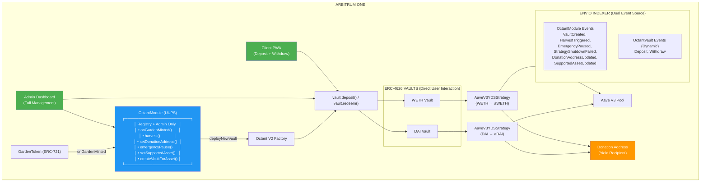
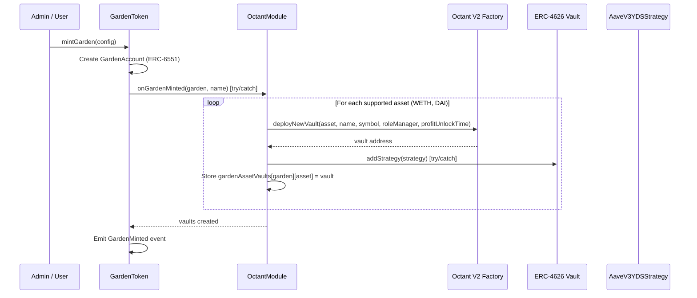
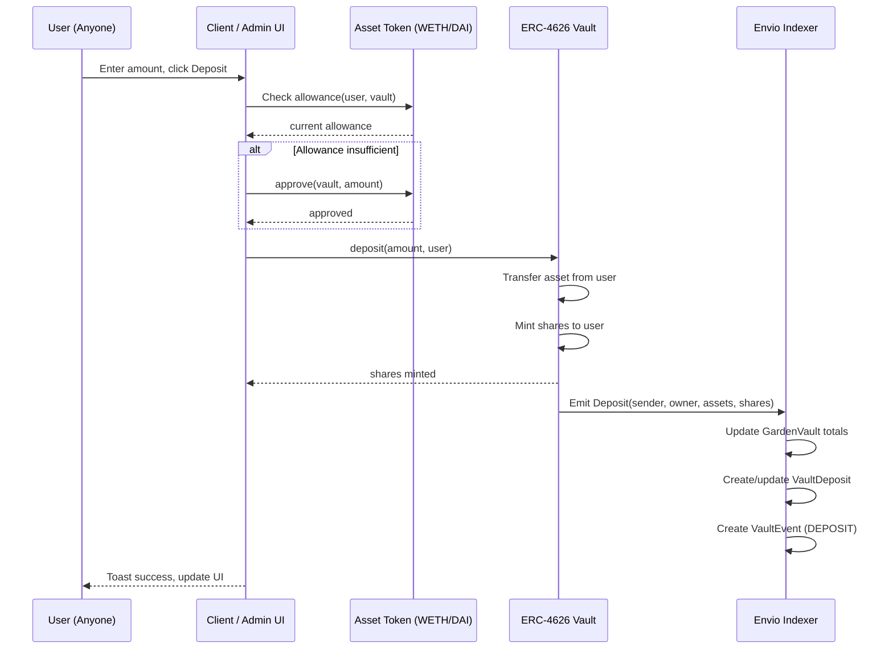
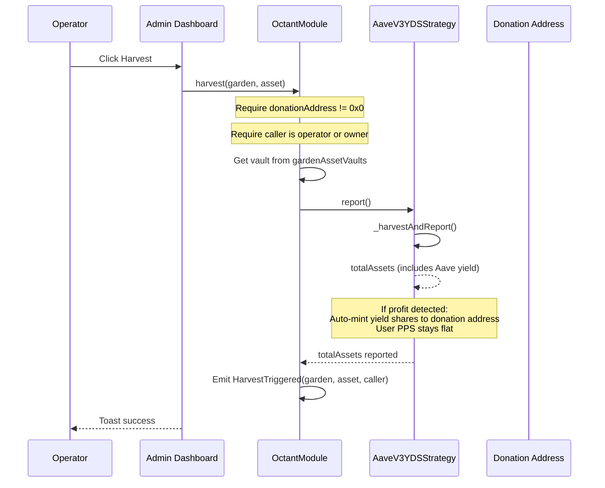

# GG-FEAT-006: Octant Vault Integration (Arbitrum-Native Yield Donating)

**Feature ID:** GG-FEAT-006
**Priority:** High
**Status:** Implementation Complete — Not Deployed (requires Octant V2 factory deployment and env configuration; see [Tech Spec § Deployment](./octant-tech-spec#7-deployment))
**Estimated Effort:** 3 weeks (parallelized)
**Last Updated:** February 9, 2026
**Branch:** `feature/octant-defi-vaults`

---

## 1. Feature Overview

**Brief description:** Enable anyone to deposit capital into per-garden ERC-4626 vaults on Arbitrum. Each garden gets two vaults (WETH + DAI) at mint time, deployed via the Octant V2 MultiStrategyVaultFactory. Users interact with vaults directly — `vault.deposit()` and `vault.redeem()` — without any proxy contract. OctantModule serves as a registry and admin layer for vault creation, harvest, donation configuration, and emergency pause. Generated yield is routed to a configurable per-garden donation address (Phase 1), with conviction-based Hypercert purchasing planned for Phase 2.

**Target users:**
- **Anyone** — Can deposit to and withdraw from garden vaults (open access)
- **Garden Operator** — Can trigger harvest, configure donation address
- **Garden Owner** — Can trigger emergency pause (in addition to Operator actions)
- **Protocol Owner** — Can manage supported assets and strategies

**Related goals/objectives:**
- PRD Goal 1 (Capital Formation): Establishes sustainable yield-based funding for Gardens
- PRD M3 Integration: Octant V2 vault integration for $250k+ TVL target
- Arbitrum Grant M3: Native Arbitrum TVL and DeFi composability

**Feature-specific success criteria:**
- First deposit executed within 48 hours of feature launch
- 90% of deposit/withdraw operations complete successfully
- Zero loss of user principal due to contract bugs
- $50k+ TVL in Green Goods vaults within first month

**Non-goals (Phase 1):**
- Conviction-based Hypercert purchasing (Phase 2 — yield goes to donation address)
- Cross-chain CCIP integration (Phase 2 — see [Cross-Chain Appendix](./octant-cross-chain-appendix))
- Multi-strategy per asset / rebalancing (Phase 2)
- Automated harvest (manual operator trigger only)
- Protocol fee on yield (100% to donation address)
- Migration of existing gardens (new gardens only)
- USDC vault support (extensible via `setSupportedAsset()`)

**Dependencies / preconditions:**
- GG-FEAT-002 (Passkey Auth): Operators need authenticated wallets
- GG-FEAT-004 (Admin Dashboard v2): UI container for vault management
- Hats Protocol: Operator/Owner roles for admin vault operations
- Octant V2 Factory: Deployed on Arbitrum for vault creation
- Aave V3: Deployed on Arbitrum for yield generation (WETH + DAI)

**Key Architecture Decision — Direct Vault Interaction:**

Users interact with ERC-4626 vaults directly. OctantModule is a **registry + admin layer only** — it never touches deposits or withdrawals.

| Call | Target | Access |
|------|--------|--------|
| `vault.deposit(assets, receiver)` | ERC-4626 Vault | Anyone (must approve first) |
| `vault.redeem(shares, receiver, owner)` | ERC-4626 Vault | Anyone (own shares) |
| `octantModule.harvest(garden, asset)` | OctantModule | Operator/Owner |
| `octantModule.setDonationAddress(garden, addr)` | OctantModule | Operator/Owner |
| `octantModule.emergencyPause(garden, asset)` | OctantModule | Owner only |

**Key Architecture Decision — Yield Routing (Phase 1):**

Yield is **NOT** routed via conviction voting in Phase 1. Instead:

1. Operator calls `octantModule.harvest(garden, asset)` which calls `strategy.report()`
2. Strategy detects profit and **auto-mints shares to the donation address** (YDS behavior)
3. User PPS stays flat — depositors only get their principal value back
4. Donation recipient accumulates shares representing the yield; they can redeem anytime

The donation address must be explicitly set per-garden before harvest. No default.

---

## 2. Feature Map (Actions + Integration Points)

### 2.1 User Actions

- **Action A:** View vault positions and yield status (anyone views garden vault metrics)
- **Action B:** Deposit assets to vault (anyone deposits directly to ERC-4626 vault)
- **Action C:** Withdraw assets from vault (anyone redeems own shares)
- **Action D:** Trigger yield harvest (Operator/Owner triggers `strategy.report()` via OctantModule)
- **Action E:** Configure donation address (Operator/Owner sets yield recipient)
- **Action F:** View transaction history (anyone views deposit/withdraw/harvest events)
- **Action G:** Emergency pause (Owner pauses a vault's strategy)

### 2.2 Integration / Interaction Points

- [x] **UI / Client** (Client PWA treasury drawer — deposit + withdraw + read)
- [x] **UI / Admin** (Admin dashboard — full vault management + Treasury overview)
- [x] **Data layer** (Envio indexer for vault events — dual source: OctantModule + Vault)
- [x] **Onchain / contracts (Arbitrum)** (OctantModule, ERC-4626 Vaults, AaveV3YDSStrategy)
- [x] **Permissions / roles** (Hats Protocol Operator/Owner roles for admin operations)

### 2.3 Action x Integration Matrix

| Action | Client UI | Admin UI | Data | Onchain | Permissions |
| :--- | :---: | :---: | :---: | :---: | :---: |
| View positions | Yes | Yes | Yes | Yes | — |
| Deposit to vault | Yes | Yes | Yes | Yes | — |
| Withdraw from vault | Yes | Yes | Yes | Yes | — |
| Trigger harvest | — | Yes | Yes | Yes | Operator/Owner |
| Configure donation | — | Yes | Yes | Yes | Operator/Owner |
| View tx history | — | Yes | Yes | Yes | — |
| Emergency pause | — | Yes | Yes | Yes | Owner only |

### 2.4 Contract Interface

**Direct Vault Interaction (standard ERC-4626):**

| Function | Target | Access | Notes |
|----------|--------|--------|-------|
| `vault.deposit(assets, receiver)` | IOctantVault | Anyone | Must `asset.approve(vault, amount)` first |
| `vault.redeem(shares, receiver, owner)` | IOctantVault | Anyone (own shares) | Shares holder redeems directly |
| `vault.balanceOf(address)` | IOctantVault | Anyone | Read share balance |
| `vault.convertToAssets(shares)` | IOctantVault | Anyone | Preview redemption value |
| `vault.previewDeposit(assets)` | IOctantVault | Anyone | Preview shares to receive |
| `vault.maxDeposit(address)` | IOctantVault | Anyone | Max deposit allowed |
| `vault.totalAssets()` | IOctantVault | Anyone | Total vault TVL |

**OctantModule Admin Operations:**

| Function | Access | Notes |
|----------|--------|-------|
| `harvest(garden, asset)` | Operator/Owner | Triggers `strategy.report()`, requires donation address set |
| `setDonationAddress(garden, addr)` | Operator/Owner | Updates both module mapping AND strategy |
| `emergencyPause(garden, asset)` | Owner only | Calls `strategy.shutdown()` (emits `StrategyShutdownFailed` on failure), always emits `EmergencyPaused` |
| `createVaultForAsset(garden, asset)` | Operator/Owner | Create vault for newly supported asset |
| `setSupportedAsset(asset, strategy)` | Protocol Owner | Add/remove supported assets |
| `getVaultForAsset(garden, asset)` | Anyone | Read vault address |

### 2.5 GraphQL Queries (Envio Indexer)

```graphql
# Fetch garden's vault positions
query GetGardenVaults($garden: String!, $chainId: Int!) {
  GardenVault(where: { garden: $garden, chainId: $chainId }) {
    id
    garden
    asset
    vaultAddress
    totalDeposited
    totalWithdrawn
    totalHarvestCount
    donationAddress
    depositorCount
    paused
  }
}

# Fetch user's deposits in a garden's vaults
query GetVaultDeposits($garden: String!, $depositor: String) {
  VaultDeposit(where: { garden: $garden, depositor: $depositor }) {
    id
    garden
    asset
    vaultAddress
    depositor
    shares
    totalDeposited
    totalWithdrawn
  }
}

# Fetch vault event history
query GetVaultEvents($garden: String!, $limit: Int) {
  VaultEvent(where: { garden: $garden }, limit: $limit, order_by: { timestamp: desc }) {
    id
    garden
    asset
    eventType
    actor
    amount
    shares
    txHash
    timestamp
  }
}
```

---

## 3. User Experience (Flows per Action)

### 3.1 Action A: View Vault Positions

**User story:** As anyone viewing a garden, I want to see vault positions and yield status, so I can understand the garden's treasury.

**Primary flow:**
1. User navigates to a Garden (client or admin)
2. Opens Treasury view (drawer in client, page in admin)
3. System queries Envio indexer for `GardenVault` entities
4. System displays per-asset vault cards showing:
   - Asset name + icon (WETH / DAI)
   - Total deposited (net of withdrawals)
   - Total harvest count
   - Depositor count
   - Donation address status (configured / not set)
   - Paused status (if emergency paused)
5. For admin users: additional onchain reads for current yield via `vault.totalAssets()`

**Alternate flows:**
- No vaults: Garden was minted before vault support — show empty state
- Paused vault: Show warning badge, deposit/harvest disabled

### 3.2 Action B: Deposit Assets to Vault

**User story:** As anyone, I want to deposit assets into a garden's vault, so I can support the garden while preserving my principal.

**Primary flow:**
1. User opens deposit interface (drawer in client, modal in admin)
2. User selects asset (WETH or DAI toggle)
3. System displays wallet balance for selected asset
4. User enters deposit amount (with "Max" button)
5. System shows preview: estimated shares from `vault.previewDeposit(amount)`
6. User clicks "Deposit"
7. Two-step transaction:
   a. **Approve** — `asset.approve(vault, amount)` (skipped if existing allowance sufficient)
   b. **Deposit** — `vault.deposit(amount, receiver)` (direct vault call)
8. Transaction feedback via toast notifications
9. On success: invalidate query cache, show updated position

**Passkey users:** Transactions routed through `smartAccountClient.sendTransaction()` instead of Wagmi's `writeContractAsync`.

**Alternate flows:**
- Insufficient balance: Deposit button disabled, show balance
- Zero amount: Deposit button disabled

**Edge cases:**
- Approval already exists: Skip approve step, single transaction
- Vault paused (emergency): Deposit may fail at strategy level

### 3.3 Action C: Withdraw Assets from Vault

**User story:** As a depositor, I want to withdraw my assets from a vault at any time, so I can access my principal.

**Primary flow:**
1. User views their deposits (shows shares per asset)
2. User selects asset to withdraw from
3. User enters shares amount (with "Max" button showing their balance)
4. System shows preview: estimated assets from `vault.convertToAssets(shares)`
5. User clicks "Withdraw"
6. Single-step transaction: `vault.redeem(shares, receiver, owner)`
7. On success: invalidate query cache, show updated position

**Alternate flows:**
- No deposits: Show "Support this garden by depositing" CTA
- Partial withdrawal: Any amount up to total shares

### 3.4 Action D: Trigger Yield Harvest

**User story:** As an Operator/Owner, I want to trigger a yield harvest, so the generated yield is distributed to the donation address.

**Primary flow:**
1. Operator opens vault management page (admin only)
2. Clicks "Harvest" on a vault position card
3. System calls `octantModule.harvest(garden, asset)`
4. OctantModule calls `strategy.report()` which triggers internal `_harvestAndReport()`
5. If profit detected: strategy auto-mints shares to the donation address
6. Event emitted, indexed by Envio
7. Toast success notification

**Precondition:** Donation address must be set. If not, harvest reverts with `NoDonationAddress`.

**Alternate flows:**
- Donation address not set: Show warning banner, harvest button disabled
- No yield accrued: Transaction succeeds but no shares minted

### 3.5 Action E: Configure Donation Address

**User story:** As an Operator/Owner, I want to set a donation address for my garden's vaults, so harvested yield goes to the right recipient.

**Primary flow:**
1. Operator views donation address config section (admin vault page, top of page)
2. If not set: shows "Not Set" warning with edit button
3. Operator clicks edit, enters valid Ethereum address
4. System validates address format
5. Operator saves — calls `octantModule.setDonationAddress(garden, addr)`
6. OctantModule updates both its mapping AND propagates to all vault strategies
7. On success: donation address displayed, harvest now enabled

### 3.6 Action F: View Transaction History

**User story:** As anyone, I want to see all vault operations, so I can track deposits, withdrawals, and harvests.

**Primary flow:**
1. User navigates to event history section (admin vault page, bottom)
2. System queries `VaultEvent` entities from Envio indexer
3. Displays table with columns: Type (badge), Asset, Amount, Actor, Tx Hash, Timestamp
4. Type badges: DEPOSIT (green), WITHDRAW (blue), HARVEST (purple), EMERGENCY_PAUSED (red)
5. Paginated (20 events per page), sorted by timestamp descending
6. Tx hash links to block explorer

### 3.7 Action G: Emergency Pause

**User story:** As a Garden Owner, I want to emergency pause a vault if there's a security concern, so deposits are halted.

**Primary flow:**
1. Owner accesses vault management (admin only)
2. Clicks "Emergency Pause" on a vault position card
3. System shows confirmation dialog: "This will pause deposits for this vault"
4. Owner confirms
5. System calls `octantModule.emergencyPause(garden, asset)`
6. OctantModule calls `strategy.shutdown()` — if shutdown fails, emits `StrategyShutdownFailed(garden, asset, strategy)` for observability
7. Event emitted: `EmergencyPaused(garden, asset, caller)` (always emitted regardless of shutdown success)
8. Vault shows paused badge

**Important:** Emergency pause does NOT force-withdraw user funds. Users can still redeem their shares at any time. It only signals the strategy to stop accepting new deposits.

**Observability note:** The `EmergencyPaused` event is **always emitted**, regardless of whether `strategy.shutdown()` succeeded or failed. If shutdown fails, a separate `StrategyShutdownFailed(garden, asset, strategy)` event is emitted for observability. Operators should verify strategy state independently after an emergency pause — the `EmergencyPaused` event alone does not guarantee the strategy has stopped.

**Authorization:** Owner only (not Operator). Uses existing Hats Protocol `isOwner()` check.

---

## 4. System Architecture

### 4.1 Architecture Diagram


```mermaid
graph TB
    subgraph Arbitrum["ARBITRUM ONE"]
        Client["Client PWA<br/>(Deposit + Withdraw)"]
        Admin["Admin Dashboard<br/>(Full Management)"]

        Client --> Vault
        Admin --> OctantModule
        Admin --> Vault

        OctantModule["OctantModule (UUPS)<br/>┌────────────────────────┐<br/>│ Registry + Admin Only   │<br/>│ • onGardenMinted()      │<br/>│ • harvest()             │<br/>│ • setDonationAddress()  │<br/>│ • emergencyPause()      │<br/>│ • setSupportedAsset()   │<br/>│ • createVaultForAsset() │<br/>└────────────────────────┘"]

        GardenToken["GardenToken (ERC-721)"] --> |onGardenMinted| OctantModule
        OctantModule --> |deployNewVault| Factory["Octant V2 Factory"]
        Factory --> Vault

        subgraph Vaults["ERC-4626 VAULTS (Direct User Interaction)"]
            WETHVault["WETH Vault"]
            DAIVault["DAI Vault"]
        end

        Vault["vault.deposit() / vault.redeem()"] --> WETHVault
        Vault --> DAIVault

        WETHVault --> WETHStrat["AaveV3YDSStrategy<br/>(WETH → aWETH)"]
        DAIVault --> DAIStrat["AaveV3YDSStrategy<br/>(DAI → aDAI)"]

        WETHStrat --> AavePool["Aave V3 Pool"]
        DAIStrat --> AavePool

        WETHStrat --> Donation["Donation Address<br/>(Yield Recipient)"]
        DAIStrat --> Donation

        subgraph Indexer["ENVIO INDEXER (Dual Event Source)"]
            Source1["OctantModule Events<br/>VaultCreated, HarvestTriggered,<br/>EmergencyPaused, StrategyShutdownFailed,<br/>DonationAddressUpdated, SupportedAssetUpdated"]
            Source2["OctantVault Events (Dynamic)<br/>Deposit, Withdraw"]
        end
    end

    style Client fill:#4CAF50,color:#fff
    style Admin fill:#4CAF50,color:#fff
    style OctantModule fill:#2196F3,color:#fff
    style Donation fill:#FF9800,color:#fff
```

### 4.2 Vault Creation Flow


```mermaid
sequenceDiagram
    participant Admin as Admin / User
    participant GT as GardenToken
    participant OM as OctantModule
    participant Factory as Octant V2 Factory
    participant Vault as ERC-4626 Vault
    participant Strategy as AaveV3YDSStrategy

    Admin->>GT: mintGarden(config)
    GT->>GT: Create GardenAccount (ERC-6551)
    GT->>OM: onGardenMinted(garden, name) [try/catch]

    loop For each supported asset (WETH, DAI)
        OM->>Factory: deployNewVault(asset, name, symbol, roleManager, profitUnlockTime)
        Factory-->>OM: vault address
        OM->>Vault: addStrategy(strategy) [try/catch]
        OM->>OM: Store gardenAssetVaults[garden][asset] = vault
    end

    OM-->>GT: vaults created
    GT->>GT: Emit GardenMinted event
```

### 4.3 Deposit Flow (Direct Vault)


```mermaid
sequenceDiagram
    participant User as User (Anyone)
    participant UI as Client / Admin UI
    participant Token as Asset Token (WETH/DAI)
    participant Vault as ERC-4626 Vault
    participant Indexer as Envio Indexer

    User->>UI: Enter amount, click Deposit
    UI->>Token: Check allowance(user, vault)
    Token-->>UI: current allowance

    alt Allowance insufficient
        UI->>Token: approve(vault, amount)
        Token-->>UI: approved
    end

    UI->>Vault: deposit(amount, user)
    Vault->>Vault: Transfer asset from user
    Vault->>Vault: Mint shares to user
    Vault-->>UI: shares minted

    Vault->>Indexer: Emit Deposit(sender, owner, assets, shares)
    Indexer->>Indexer: Update GardenVault totals
    Indexer->>Indexer: Create/update VaultDeposit
    Indexer->>Indexer: Create VaultEvent (DEPOSIT)

    UI-->>User: Toast success, update UI
```

### 4.4 Harvest Flow (YDS Report)


```mermaid
sequenceDiagram
    participant Op as Operator
    participant Admin as Admin Dashboard
    participant OM as OctantModule
    participant Strategy as AaveV3YDSStrategy
    participant Donation as Donation Address

    Op->>Admin: Click Harvest
    Admin->>OM: harvest(garden, asset)

    Note over OM: Require donationAddress != 0x0
    Note over OM: Require caller is operator or owner

    OM->>OM: Get vault from gardenAssetVaults
    OM->>Strategy: report()
    Strategy->>Strategy: _harvestAndReport()
    Strategy-->>Strategy: totalAssets (includes Aave yield)

    Note over Strategy: If profit detected:<br/>Auto-mint yield shares to donation address<br/>User PPS stays flat

    Strategy-->>OM: totalAssets reported
    OM->>OM: Emit HarvestTriggered(garden, asset, caller)

    Admin-->>Op: Toast success
```

---

## 5. Data Model

### 5.1 Envio Indexer Schema

```graphql
type GardenVault @entity {
  id: ID!                          # chainId-garden-asset
  chainId: Int!
  garden: String!
  asset: String!
  vaultAddress: String!
  totalDeposited: BigInt!
  totalWithdrawn: BigInt!
  totalHarvestCount: Int!
  donationAddress: String
  depositorCount: Int!
  paused: Boolean!
  createdAt: BigInt!
}

type VaultDeposit @entity {
  id: ID!                          # chainId-vault-depositor
  chainId: Int!
  garden: String!
  asset: String!
  vaultAddress: String!
  depositor: String!
  shares: BigInt!
  totalDeposited: BigInt!
  totalWithdrawn: BigInt!
}

type VaultEvent @entity {
  id: ID!                          # chainId-txHash-logIndex
  chainId: Int!
  garden: String!
  asset: String!
  vaultAddress: String!
  eventType: String!               # DEPOSIT | WITHDRAW | HARVEST | EMERGENCY_PAUSED
  actor: String!
  amount: BigInt!
  shares: BigInt!
  txHash: String!
  timestamp: BigInt!
}
```

**Index entities (efficient lookups):**

```graphql
type GardenVaultIndex @entity {
  id: ID!                          # chainId-garden
  chainId: Int!
  garden: String!
  assets: [String!]!               # List of asset addresses with vaults
}

type VaultAddressIndex @entity {
  id: ID!                          # chainId-vaultAddress
  chainId: Int!
  vaultAddress: String!
  garden: String!
  asset: String!
}
```

- `GardenVaultIndex` — Maps garden → all asset addresses in vaults (enables "does this garden have vaults?" check)
- `VaultAddressIndex` — Maps vault address → (garden, asset) pair (enables reverse lookup from vault contract events)

### 5.2 TypeScript Types

```typescript
// packages/shared/src/types/vaults.ts
import type { Address } from '@green-goods/shared';

export interface GardenVault {
  id: string;
  chainId: number;
  garden: Address;
  asset: Address;
  vaultAddress: Address;
  totalDeposited: bigint;
  totalWithdrawn: bigint;
  totalHarvestCount: number;
  donationAddress: Address | null;
  depositorCount: number;
  paused: boolean;
}

export interface VaultDeposit {
  id: string;
  garden: Address;
  asset: Address;
  vaultAddress: Address;
  depositor: Address;
  shares: bigint;
  totalDeposited: bigint;
  totalWithdrawn: bigint;
}

export interface VaultEvent {
  id: string;
  garden: Address;
  asset: Address;
  eventType: 'DEPOSIT' | 'WITHDRAW' | 'HARVEST' | 'EMERGENCY_PAUSED';
  actor: Address;
  amount: bigint;
  shares: bigint;
  txHash: string;
  timestamp: number;
}

export interface DepositParams {
  vaultAddress: Address;
  assetAddress: Address;
  amount: bigint;
}

export interface WithdrawParams {
  vaultAddress: Address;
  shares: bigint;
}

export interface VaultPreview {
  sharesToReceive: bigint;
  assetsToReceive: bigint;
  maxDeposit: bigint;
  userShares: bigint;
  totalAssets: bigint;
}
```

### 5.3 Query Keys

```typescript
// packages/shared/src/hooks/query-keys.ts
vaults: {
  all: ["greengoods", "vaults"],
  byChain: (chainId) => [..., "chain", chainId],
  byGarden: (garden, chainId) => [..., "garden", garden, chainId],
  deposits: (garden, chainId) => [..., "deposits", garden, chainId],
  myDeposits: (garden, user, chainId) => [..., "myDeposits", garden, user, chainId],
  events: (garden, chainId) => [..., "events", garden, chainId],
  preview: (vault, amount?, shares?, user?, chainId?) => [..., "preview", ...]
}
```

---

## 6. UI Specification

### 6.1 Admin Dashboard

**Routes:**
- `gardens/:id/vault` — Per-garden vault management page
- `/treasury` — Cross-garden vault overview

**Garden Vault Page (`Vault.tsx`):**
1. Header with garden name + "Treasury" breadcrumb
2. KPI row: Total Value Locked, Total Harvests, Depositor Count
3. Warning banner if donation address not set
4. Donation address config section (editable, prominent)
5. Per-asset vault position cards (WETH + DAI) in 2-column grid
6. Deposit/Withdraw modals (triggered from position cards)
7. Event history table (bottom)

**Treasury Overview (`Treasury/index.tsx`):**
- Shows only gardens with vaults (no empty states)
- Grouped by garden: name, location, per-asset TVL, donation status
- Summary KPIs: Total TVL, Total Harvests, Gardens with Vaults
- Click garden → navigates to vault detail page

**Components:**
- `PositionCard` — Per-asset metrics, action buttons (Deposit, Withdraw, Harvest, Emergency Pause)
- `DepositModal` — Asset selector, amount input, wallet balance, share preview, two-step flow
- `WithdrawModal` — Shares input, asset preview, single-step flow
- `DonationAddressConfig` — Inline edit, address validation, warning state
- `VaultEventHistory` — Responsive table/card list, paginated, type badges

### 6.2 Client PWA

**Treasury Drawer (`TreasuryDrawer.tsx`):**
- Triggered by treasury icon in TopNav (visible when garden has vaults)
- Uses existing `ModalDrawer` component
- Single scrollable view with sections:

**Section 1: Vault Summary** — Per-asset stat cards (total deposited, harvests, donation address)

**Section 2: My Deposits** — User's share balance + current value per asset, inline withdraw

**Section 3: Deposit** — Asset selector, amount input, share preview, two-step approve + deposit

**No admin operations in client** — harvest, emergency, donation config are admin-only.

---

## 7. Requirements

### 7.1 Functional Requirements

| ID | Title | Description | Priority |
| :--- | :--- | :--- | :--- |
| FR-001 | View Vault Positions | Display all active vault positions for a garden with TVL, harvest count, depositor count | High |
| FR-002 | Direct Deposit | Anyone can deposit assets directly to ERC-4626 vault via `vault.deposit()` | Critical |
| FR-003 | Direct Withdraw | Anyone can withdraw own shares via `vault.redeem()` | Critical |
| FR-004 | Harvest Yield | Operator/Owner triggers `strategy.report()` via OctantModule, yield auto-minted to donation address | High |
| FR-005 | Configure Donation | Operator/Owner sets per-garden donation address, propagated to all vault strategies | High |
| FR-006 | Emergency Pause | Owner can pause vault strategy via `strategy.shutdown()` | Critical |
| FR-007 | Vault Creation at Mint | Vaults created automatically for all supported assets when garden is minted | High |
| FR-008 | Asset Registry | Protocol owner manages supported assets with per-asset strategy addresses | Medium |
| FR-009 | Create Vault for New Asset | Operator/Owner can create vault for newly supported asset on existing garden | Medium |

### 7.2 Authorization Requirements

| ID | Title | Description | Priority |
| :--- | :--- | :--- | :--- |
| FR-010 | Open Deposit Access | Anyone can deposit to any garden vault | Critical |
| FR-011 | Own-Share Withdrawal | Anyone can withdraw their own shares, permissionless | Critical |
| FR-012 | Operator Harvest | Only Operator/Owner can trigger harvest | Critical |
| FR-013 | Owner Emergency | Only Owner can trigger emergency pause | Critical |
| FR-014 | Donation Address Required | Harvest reverts if donation address not set | High |

### 7.3 Non-Functional Requirements

**Performance:**

| Metric | Target |
| :--- | :--- |
| Deposit TX confirmation | < 5 seconds (Arbitrum block time) |
| Position query (indexer) | < 200ms |
| Dashboard initial load | < 2 seconds |
| Deposit TX gas | < 500,000 gas |
| Withdraw TX gas | < 450,000 gas |

**Security:**

| Requirement | Implementation |
| :--- | :--- |
| Role-Based Admin Control | Hats Protocol Operator/Owner |
| No Proxy Overhead | Direct ERC-4626 vault interaction |
| Try/Catch Resilience | Strategy failures non-blocking |
| Asset Deactivation | Block new vaults, existing vaults still work |

---

## 8. Risks and Mitigations

| Risk | Likelihood | Impact | Mitigation |
| :--- | :--- | :--- | :--- |
| Smart contract vulnerability | Low | Critical | External audit, Foundry tests, fork tests |
| Aave V3 protocol exploit | Low | Critical | Audited strategies, emergency pause |
| Octant V2 factory not on Arbitrum | High | High | Deploy factory ourselves; IOctantFactory matches |
| OctantModule exceeds 24KB | Low | Medium | Admin-only (no deposit/withdraw), extract to lib if needed |
| Aave V3 yield too low | Medium | Low | Extensible strategy system; add Yearn/Pendle in Phase 2 |
| Two-step deposit UX | Medium | Medium | Check allowance first, skip approve if sufficient |
| Donation address not set | Medium | Medium | Revert in harvest(), UI warning banner |
| Fresh GardenToken deploy | Medium | Medium | Testnet only; mainnet is first real deployment |

---

## 9. Open Questions (Resolved)

| Question | Resolution | Date |
| :--- | :--- | :--- |
| Q1: Should we prioritize Arbitrum-native over cross-chain? | **Yes.** Arbitrum-native for Phase 1. Cross-chain CCIP in Phase 2 appendix. | Jan 25, 2026 |
| Q2: What strategies at launch? | **Aave V3 on Arbitrum for WETH + DAI.** MockYDSStrategy on Sepolia testnet. Fork tests verify real Aave behavior. | Jan 28, 2026 |
| Q3: How to handle Octant vault upgrades? | **Fresh deployment for Phase 1 launch** — clean storage, new proxy for both OctantModule and GardenToken (no migration from prior contracts). Both contracts remain UUPS upgradeable for future improvements. | Feb 1, 2026 |
| Q4: Should yield bridge back or stay on-chain? | **Stays on Arbitrum.** Single-chain architecture. Donation address receives yield shares on same chain. | Feb 1, 2026 |

---

## 10. References

- [Octant V2 Docs](https://docs.v2.octant.build)
- [Aave V3 Docs](https://docs.aave.com)
- [ERC-4626 Spec](https://eips.ethereum.org/EIPS/eip-4626)
- [Hats Protocol Docs](https://docs.hatsprotocol.xyz)
- [Cross-Chain Appendix](./octant-cross-chain-appendix) — Archived Phase 2 CCIP architecture
- [Final Implementation Plan](/.plans/octant-vaults-final-plan.md) — Authoritative plan document

---

## Changelog

| Version | Date | Author | Changes |
| :--- | :--- | :--- | :--- |
| 1.0 | Jan 18, 2026 | Claude | Initial specification (cross-chain primary) |
| 1.1 | Jan 18, 2026 | Claude | Added Section 12: Arbitrum-Native alternative |
| 2.0 | Jan 22, 2026 | Claude | Mermaid diagrams, Docusaurus migration |
| 3.0 | Feb 9, 2026 | Claude | **Full rewrite**: Arbitrum-native primary, direct vault interaction, open deposits, donation address yield routing, cross-chain moved to appendix. Matches implementation on `feature/octant-defi-vaults`. |

---

*End of Feature Specification*
