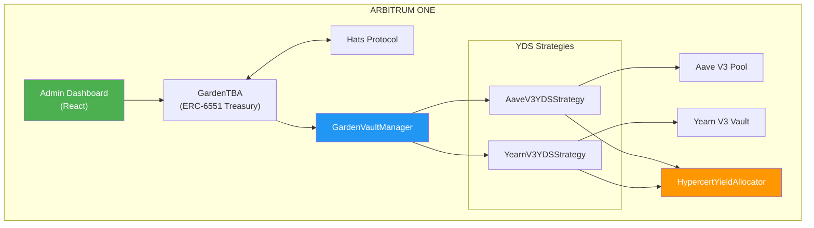
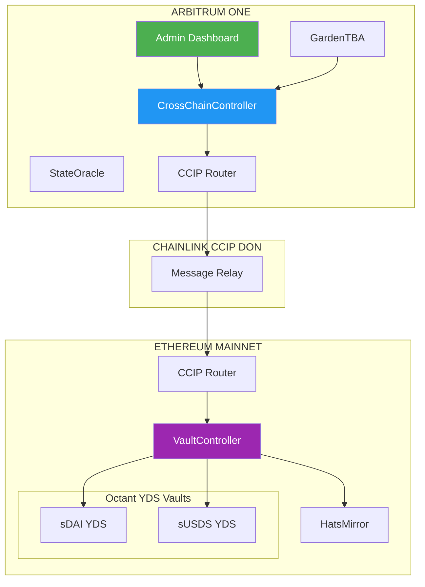

# Octant Vaults Integration

**Status:** In Development
**Feature ID:** GG-FEAT-006
**Tech Spec ID:** GG-TECH-006
**Priority:** High
**Estimated Effort:** 8 weeks

## Overview

Enable Garden treasuries (ERC-6551 GardenAccounts) to deposit capital into Yield Donating Strategy (YDS) vaults. Generated yield is allocated via conviction voting to **purchase Hypercert fractions** on behalf of the Garden, building a portfolio of verified environmental impact while preserving principal capital.

## Key Features

- **Arbitrum-Native Deployment (Phase 1)**: Deploy YDS vaults directly on Arbitrum using Aave V3 and Yearn V3
- **Cross-Chain Integration (Phase 2)**: Optional Ethereum integration via Chainlink CCIP for deeper liquidity pools
- **Conviction-Based Yield Allocation**: Yield purchases Hypercert fractions based on community voting
- **Hats Protocol Authorization**: Role-based access control for Operators and Guardians
- **Emergency Withdrawal**: Guardian-only immediate exit capability

## Documents

| Document | Description |
|----------|-------------|
| [Feature Specification](./octant-feature-spec) | Product requirements, user stories, acceptance criteria |
| [Technical Specification](./octant-tech-spec) | Engineering architecture, implementation details |

## Architecture Phases

### Phase 1: Arbitrum-Native (Recommended)

### Phase 2: Cross-Chain (Optional)

## Success Criteria

- First deposit executed within 48 hours of feature launch
- 90% of deposit/withdraw operations complete successfully
- Average cross-chain message latency under 20 minutes (Phase 2)
- Zero loss of user principal due to contract bugs
- $50k+ TVL in Green Goods vaults within first month

## Dependencies

- **GG-FEAT-002**: Passkey Auth (Operators need authenticated wallets)
- **GG-FEAT-004**: Admin Dashboard v2 (UI container for vault management)
- **GG-FEAT-005**: Hypercerts (Minted Hypercerts are purchase targets)
- **GG-FEAT-007**: Gardens Conviction Voting (Determines yield allocation)
- **Hats Protocol**: Operator role required for vault operations
- **GardenAccount (ERC-6551)**: Token-bound accounts must hold depositable assets
