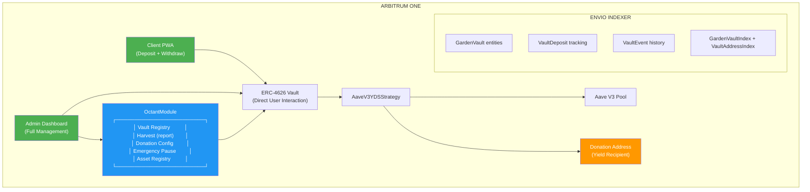

# Octant Vaults Integration

**Status:** Implementation Complete — Not Deployed (requires Octant V2 factory deployment and env configuration; see [Tech Spec § Deployment](./octant-tech-spec#7-deployment))
**Feature ID:** GG-FEAT-006
**Tech Spec ID:** GG-TECH-006
**Priority:** High
**Estimated Effort:** 3 weeks (parallelized)
**Branch:** `feature/octant-defi-vaults`

## Overview

Enable anyone to deposit capital into per-garden Yield Donating Strategy (YDS) vaults deployed on Arbitrum via the Octant V2 MultiStrategyVaultFactory. Each garden gets two ERC-4626 vaults (WETH + DAI) created automatically at mint time. Users interact with vaults directly — `vault.deposit()` and `vault.redeem()` — without any proxy or intermediary contract. Generated yield is routed to a configurable per-garden donation address (Phase 1), with conviction-based Hypercert fraction purchasing planned for Phase 2.

## Key Features

- **Arbitrum-Native Deployment (Phase 1)**: YDS vaults deployed directly on Arbitrum using Aave V3 for yield generation (WETH + DAI)
- **Direct ERC-4626 Interaction**: Users call `vault.deposit()` and `vault.redeem()` directly — standard, composable, gas-efficient
- **Open Access Deposits**: Anyone can deposit to support a garden; withdrawals are permissionless for own shares
- **OctantModule Registry**: Admin layer for vault creation, harvest triggering, donation config, and emergency pause
- **Hats Protocol Authorization**: Operator/Owner roles for admin operations (harvest, donation config, emergency)
- **Donation Address Yield Routing**: Yield auto-minted as shares to a per-garden donation address via YDS `report()`
- **Cross-Chain Integration (Phase 2)**: Optional Ethereum integration via Chainlink CCIP for deeper liquidity pools

## Documents

| Document | Description |
|----------|-------------|
| [Feature Specification](./octant-feature-spec) | Product requirements, user stories, acceptance criteria |
| [Technical Specification](./octant-tech-spec) | Engineering architecture, implementation details |
| [Cross-Chain Appendix](./octant-cross-chain-appendix) | Archived Phase 2 CCIP architecture for future reference |

## Architecture

### Phase 1: Arbitrum-Native (Current)

```mermaid
graph TB
    subgraph Arbitrum["ARBITRUM ONE"]
        Client["Client PWA<br/>(Deposit + Withdraw)"]
        Admin["Admin Dashboard<br/>(Full Management)"]

        Client --> Vault
        Admin --> OctantModule
        Admin --> Vault

        OctantModule["OctantModule<br/>┌────────────────────────┐<br/>│ Vault Registry          │<br/>│ Harvest (report)        │<br/>│ Donation Config         │<br/>│ Emergency Pause         │<br/>│ Asset Registry          │<br/>└────────────────────────┘"]

        OctantModule --> Vault["ERC-4626 Vault<br/>(Direct User Interaction)"]

        Vault --> AaveStrat["AaveV3YDSStrategy"]
        AaveStrat --> AavePool["Aave V3 Pool"]

        AaveStrat --> Donation["Donation Address<br/>(Yield Recipient)"]

        subgraph Indexer["ENVIO INDEXER"]
            GV["GardenVault entities"]
            VD["VaultDeposit tracking"]
            VE["VaultEvent history"]
            VI["GardenVaultIndex + VaultAddressIndex"]
        end
    end

    style Client fill:#4CAF50,color:#fff
    style Admin fill:#4CAF50,color:#fff
    style OctantModule fill:#2196F3,color:#fff
    style Donation fill:#FF9800,color:#fff
```

### Phase 2: Cross-Chain (Future)

See [Cross-Chain Appendix](./octant-cross-chain-appendix) for the CCIP-based architecture enabling Ethereum vault access.

## Success Criteria

- First deposit executed within 48 hours of feature launch
- 90% of deposit/withdraw operations complete successfully
- Zero loss of user principal due to contract bugs
- $50k+ TVL in Green Goods vaults within first month

## Dependencies

- **GG-FEAT-002**: Passkey Auth (Operators need authenticated wallets)
- **GG-FEAT-004**: Admin Dashboard v2 (UI container for vault management)
- **Hats Protocol**: Operator/Owner roles for admin vault operations
- **Octant V2 Factory**: Deployed on Arbitrum for vault creation
- **Aave V3**: Deployed on Arbitrum for yield generation
