# GG-TECH-006: Octant Vaults Technical Specification

**Document ID:** GG-TECH-006
**Feature Reference:** GG-FEAT-006
**Version:** 2.0
**Status:** Draft
**Last Updated:** January 22, 2026
**Author:** Engineering Team

---

## 1. Overview

### 1.1 Purpose

This technical specification defines the implementation details for the Octant Vault Integration feature, enabling Green Goods Gardens to deposit treasury capital into yield-generating vaults and donate the generated yield to fund verified environmental impact. The document covers both the **Arbitrum-native deployment** (Phase 1, recommended) and the **cross-chain Ethereum integration** (Phase 2) architectures.

This specification serves as the engineering blueprint for:
- Smart contract development and deployment
- Frontend integration with the Admin Dashboard
- Indexer and data layer configuration
- Testing and quality assurance
- DevOps and deployment procedures

### 1.2 Scope

**In Scope:**
- Arbitrum-native YDS vault contracts (GardenVaultManager, YDS strategies)
- Cross-chain vault controller contracts (CrossChainController, VaultController)
- State synchronization between Arbitrum and Ethereum
- Admin Dashboard vault management UI components
- Envio indexer schema and handlers
- Integration with Hats Protocol for authorization
- Integration with ERC-6551 GardenAccounts

**Out of Scope:**
- Conviction Voting integration for yield allocation (see GG-TECH-007)
- Multi-strategy vault rebalancing (Phase 2)
- Custom YDS strategy development (uses Octant-provided strategies)
- Direct user deposits (users interact via Garden Operators)
- Token bridging (only CCIP messages cross chains, not tokens)

### 1.3 Definitions, Acronyms, and Abbreviations

| Term | Definition |
| :--- | :--- |
| **YDS** | Yield Donating Strategy - ERC-4626 vault that donates profit to a configured address |
| **CCIP** | Chainlink Cross-Chain Interoperability Protocol |
| **PPS** | Price Per Share - ratio of vault assets to shares |
| **TBA** | Token Bound Account (ERC-6551) |
| **GardenAccount** | ERC-6551 account bound to Garden NFT, holds treasury |
| **Operator** | Garden role authorized to manage vault operations |
| **Guardian** | Garden role authorized for emergency actions |
| **StateOracle** | Contract caching Ethereum vault state on Arbitrum |
| **DON** | Decentralized Oracle Network (Chainlink) |
| **EIP-4626** | Tokenized Vault Standard |
| **Hats Protocol** | Onchain role management system |

### 1.4 References

| Document | Description |
| :--- | :--- |
| GG-FEAT-006 | Octant Vaults Feature Specification |
| GG-FEAT-007 | Gardens Conviction Voting Feature Specification |
| GG-TECH-007 | Gardens Conviction Voting Technical Specification (yield allocation logic) |
| GG-PRD-001 | Green Goods v1 Product Requirements Document |
| Octant V2 Docs | https://docs.v2.octant.build |
| Chainlink CCIP Docs | https://docs.chain.link/ccip |
| ERC-4626 Spec | https://eips.ethereum.org/EIPS/eip-4626 |
| Hats Protocol Docs | https://docs.hatsprotocol.xyz |
| Aave V3 Docs | https://docs.aave.com |
| Yearn V3 Docs | https://docs.yearn.fi/developers/v3/overview |
| Gardens V2 Docs | https://docs.gardens.fund |
| Hypercerts Docs | https://hypercerts.org/docs |

---

## 2. System Overview

### 2.1 System Architecture

The system supports two deployment modes:

#### 2.1.1 Arbitrum-Native Architecture (Phase 1 - Recommended)

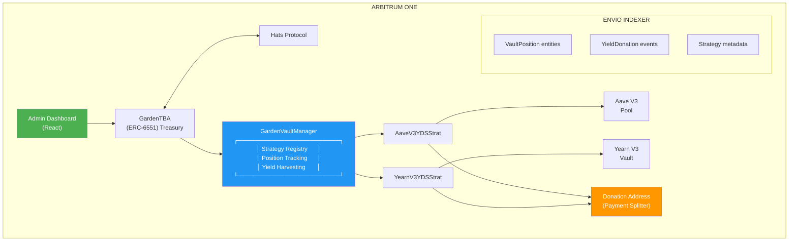

<details>
<summary>PNG Fallback</summary>

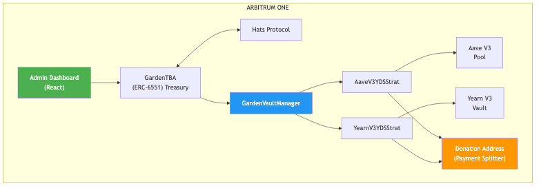
</details>

#### 2.1.2 Cross-Chain Architecture (Phase 2)

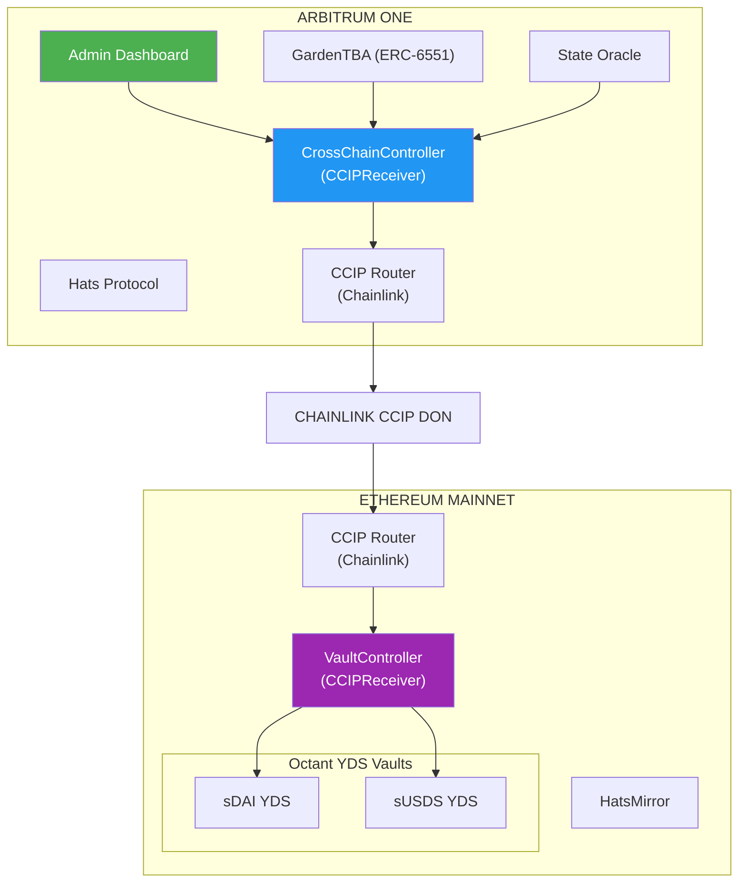

<details>
<summary>PNG Fallback</summary>

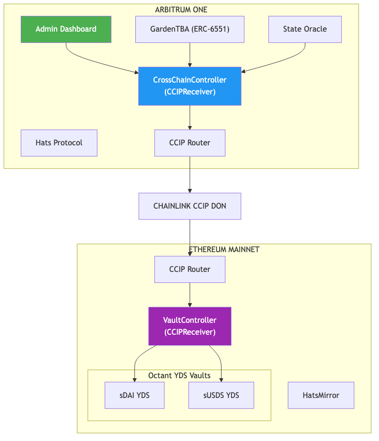
</details>

### 2.2 Environment

#### 2.2.1 Development Environment

| Component | Technology | Version |
| :--- | :--- | :--- |
| Smart Contracts | Solidity | ^0.8.25 |
| Contract Framework | Foundry | Latest |
| Frontend | Vite + React + TypeScript | Vite 5.x, React 19.x |
| State Management | Zustand + XState | 4.x, 5.x |
| GraphQL Client | React Query + graphql-request | 5.x |
| Indexer | Envio | Latest |
| Testing | Foundry (contracts), Vitest + Playwright (frontend) | Latest |

#### 2.2.2 Network Configuration

| Network | Chain ID | RPC | Explorer |
| :--- | :--- | :--- | :--- |
| Arbitrum One | 42161 | https://arb1.arbitrum.io/rpc | https://arbiscan.io |
| Arbitrum Sepolia | 421614 | https://sepolia-rollup.arbitrum.io/rpc | https://sepolia.arbiscan.io |
| Ethereum Mainnet | 1 | https://eth.llamarpc.com | https://etherscan.io |
| Ethereum Sepolia | 11155111 | https://rpc.sepolia.org | https://sepolia.etherscan.io |

#### 2.2.3 External Dependencies

| Dependency | Network | Address |
| :--- | :--- | :--- |
| Aave V3 Pool | Arbitrum One | `0x794a61358D6845594F94dc1DB02A252b5b4814aD` |
| Aave V3 PoolDataProvider | Arbitrum One | `0x69FA688f1Dc47d4B5d8029D5a35FB7a548310654` |
| waUSDC (ERC-4626) | Arbitrum One | `0xDAF2D8AAc9174B1168b9f78075FE64a04bae197B` |
| USDC | Arbitrum One | `0xaf88d065e77c8cC2239327C5EDb3A432268e5831` |
| USDC.e (Bridged) | Arbitrum One | `0xFF970A61A04b1cA14834A43f5dE4533eBDDB5CC8` |
| DAI | Arbitrum One | `0xDA10009cBd5D07dd0CeCc66161FC93D7c9000da1` |
| Hats Protocol | Arbitrum One | `0x3bc1A0Ad72417f2d411118085256fC53CBdDd137` |
| CCIP Router | Arbitrum One | `0x141fa059441E0ca23ce184B6A78bafD2A517DdE8` |
| CCIP Router | Ethereum | `0x80226fc0Ee2b096224EeAc085Bb9a8cba1146f7D` |
| LINK Token | Arbitrum One | `0xf97f4df75117a78c1A5a0DBb814Af92458539FB4` |
| sDAI | Ethereum | `0x83F20F44975D03b1b09E64809B757c47f942BEeA` |
| sUSDS | Ethereum | `0xa3931d71877C0E7a3148CB7Eb4463524FEc27fbD` |

---

## 3. Detailed Requirements

### 3.1 Functional Requirements

#### 3.1.1 Vault Position Management

| ID | Title | Description | Priority | Acceptance Criteria |
| :--- | :--- | :--- | :--- | :--- |
| FR-001 | View Vault Positions | System shall display all active vault positions for a Garden with shares, value, and yield donated | High | Position data matches onchain state within 1 block |
| FR-002 | Deposit to Vault | Operators shall be able to deposit Garden treasury assets into registered YDS strategies | Critical | Deposit transaction succeeds, shares credited, position updated |
| FR-003 | Withdraw from Vault | Operators shall be able to withdraw assets from vault positions | Critical | Withdrawal transaction succeeds, assets returned to Garden |
| FR-004 | Emergency Withdrawal | Guardians shall be able to trigger immediate full withdrawal | Critical | All positions liquidated, assets returned to Garden |
| FR-005 | Harvest Yield | System shall harvest yield and route to HypercertYieldAllocator for conviction-based Hypercert fraction purchases | High | Yield routed to allocator, Hypercert fractions purchased based on conviction %, event emitted |
| FR-006 | Conviction-Based Allocation | System shall allocate yield to Hypercerts proportionally based on conviction voting percentages from Gardens CVStrategy | High | Yield split matches conviction ratios, fractions purchased for Garden treasury |

#### 3.1.2 Strategy Management

| ID | Title | Description | Priority | Acceptance Criteria |
| :--- | :--- | :--- | :--- | :--- |
| FR-010 | List Strategies | System shall display all registered YDS strategies with metadata | High | Strategies show name, asset, APY, TVL, limits |
| FR-011 | Strategy Registration | Admin shall be able to register new YDS strategies | Medium | Strategy appears in registry, callable |
| FR-012 | Strategy Deactivation | Admin shall be able to deactivate strategies | Medium | Strategy no longer accepts deposits |

#### 3.1.3 Authorization

| ID | Title | Description | Priority | Acceptance Criteria |
| :--- | :--- | :--- | :--- | :--- |
| FR-020 | Operator Authorization | Only Operator Hat wearers can execute vault operations | Critical | Non-operators cannot call deposit/withdraw |
| FR-021 | Guardian Authorization | Only Guardian Hat wearers can execute emergency withdrawal | Critical | Non-guardians cannot call emergencyWithdraw |
| FR-022 | Garden Registration | Gardens must be registered before vault operations | High | Unregistered gardens cannot interact |

### 3.2 Non-Functional Requirements

#### 3.2.1 Performance

| Metric | Requirement | Target |
| :--- | :--- | :--- |
| Deposit Transaction Gas | Arbitrum-native | less than 500,000 gas |
| Deposit Transaction Gas | Cross-chain (CCIP) | less than 800,000 gas |
| Position Query Latency | API response time | less than 200ms |
| UI Load Time | Initial dashboard load | less than 2 seconds |
| State Sync Frequency | Cross-chain updates | Every 1 hour |

#### 3.2.2 Security

| Requirement | Implementation |
| :--- | :--- |
| Role-Based Access Control | Hats Protocol integration |
| Cross-Chain Message Validation | Source chain + sender verification |
| Reentrancy Protection | OpenZeppelin ReentrancyGuard |
| Integer Overflow Protection | Solidity 0.8.x built-in |
| Upgrade Safety | UUPS proxy pattern with timelock |
| Emergency Pause | Pausable modifier on critical functions |

### 3.3 Interface Requirements

#### 3.3.1 Smart Contract Interfaces

```solidity
// packages/contracts/src/interfaces/IGardenVaultManager.sol
interface IGardenVaultManager {
    struct StrategyInfo {
        address strategyAddress;
        address asset;
        string name;
        bool isActive;
        uint256 minDeposit;
        uint256 maxDeposit;
    }

    struct VaultPosition {
        uint256 shares;
        uint256 depositedValue;
        uint256 lastUpdateTimestamp;
        bool exists;
    }

    function deposit(
        address garden,
        bytes32 strategyId,
        uint256 amount
    ) external returns (uint256 shares);

    function withdraw(
        address garden,
        bytes32 strategyId,
        uint256 shares,
        address recipient
    ) external returns (uint256 assets);

    function harvestAndDonate(
        address garden,
        bytes32 strategyId
    ) external returns (uint256 yieldAmount);

    function getPositionValue(
        address garden,
        bytes32 strategyId
    ) external view returns (
        uint256 shares,
        uint256 currentValue,
        uint256 depositedValue
    );

    function getActiveStrategies() external view returns (StrategyInfo[] memory);
}
```

```solidity
// packages/contracts/src/interfaces/ICrossChainController.sol (Phase 2)
interface ICrossChainController {
    function executeVaultDeposit(
        address garden,
        uint256 amount,
        bytes32 strategyId
    ) external returns (bytes32 messageId);

    function executeVaultWithdraw(
        address garden,
        uint256 shares,
        address recipient
    ) external returns (bytes32 messageId);

    function emergencyWithdraw(
        address garden
    ) external returns (bytes32 messageId);

    function getVaultPosition(
        address garden
    ) external view returns (
        uint256 shares,
        uint256 value,
        uint256 pendingRewards,
        uint256 lastUpdated
    );
}
```

#### 3.3.2 GraphQL API Interface

```graphql
type Query {
  # Get all vault positions for a garden
  gardenVaultPositions(gardenId: String!): [VaultPosition!]!

  # Get specific position
  vaultPosition(gardenId: String!, strategyId: String!): VaultPosition

  # Get available strategies
  ydsStrategies(asset: String, isActive: Boolean): [YDSStrategy!]!

  # Get cross-chain message history (Phase 2)
  crossChainMessages(
    gardenId: String!
    status: MessageStatus
    first: Int
    skip: Int
  ): [CrossChainMessage!]!

  # Get yield donation history
  yieldDonations(
    gardenId: String!
    first: Int
    skip: Int
  ): [YieldDonation!]!
}

type VaultPosition {
  id: ID!
  garden: Garden!
  strategyId: String!
  strategy: YDSStrategy!
  shares: BigInt!
  depositedValue: BigInt!
  currentValue: BigInt!
  totalYieldDonated: BigInt!
  lastUpdateTimestamp: BigInt!
}

type YDSStrategy {
  id: ID!
  address: String!
  name: String!
  asset: String!
  apy: Float
  tvl: BigInt
  minDeposit: BigInt
  maxDeposit: BigInt
  isActive: Boolean!
  donationAddress: String!
}

type YieldDonation {
  id: ID!
  garden: Garden!
  strategy: YDSStrategy!
  amount: BigInt!
  donationAddress: String!
  timestamp: BigInt!
  txHash: String!
}

enum MessageStatus {
  PENDING
  CONFIRMED
  FAILED
}
```

#### 3.3.3 Frontend Component Interface

```typescript
// packages/shared/src/types/vault.ts
export interface VaultPosition {
  id: string;
  gardenId: string;
  strategyId: string;
  strategyName: string;
  asset: Address;
  shares: bigint;
  depositedValue: bigint;
  currentValue: bigint;
  unrealizedYield: bigint;
  totalYieldDonated: bigint;
  lastUpdated: number;
}

export interface YDSStrategy {
  id: string;
  address: Address;
  name: string;
  asset: Address;
  assetSymbol: string;
  apy: number;
  tvl: bigint;
  minDeposit: bigint;
  maxDeposit: bigint | null;
  isActive: boolean;
  riskLevel: 'low' | 'medium' | 'high';
}

export interface DepositParams {
  gardenId: string;
  strategyId: string;
  amount: bigint;
}

export interface WithdrawParams {
  gardenId: string;
  strategyId: string;
  shares: bigint;
  recipient?: Address;
}

// packages/shared/src/hooks/vault/useVaultOperations.ts
export interface UseVaultOperations {
  // Read operations
  positions: VaultPosition[];
  strategies: YDSStrategy[];
  isLoading: boolean;
  error: Error | null;

  // Write operations
  deposit: (params: DepositParams) => Promise<TransactionResult>;
  withdraw: (params: WithdrawParams) => Promise<TransactionResult>;
  emergencyWithdraw: () => Promise<TransactionResult>;
  harvestYield: (strategyId: string) => Promise<TransactionResult>;

  // Utilities
  refetch: () => Promise<void>;
  estimateDepositShares: (strategyId: string, amount: bigint) => bigint;
  estimateWithdrawAssets: (strategyId: string, shares: bigint) => bigint;
}
```

---

## 4. System Design

### 4.1 Data Flow Diagrams

#### 4.1.1 Arbitrum-Native Deposit Flow

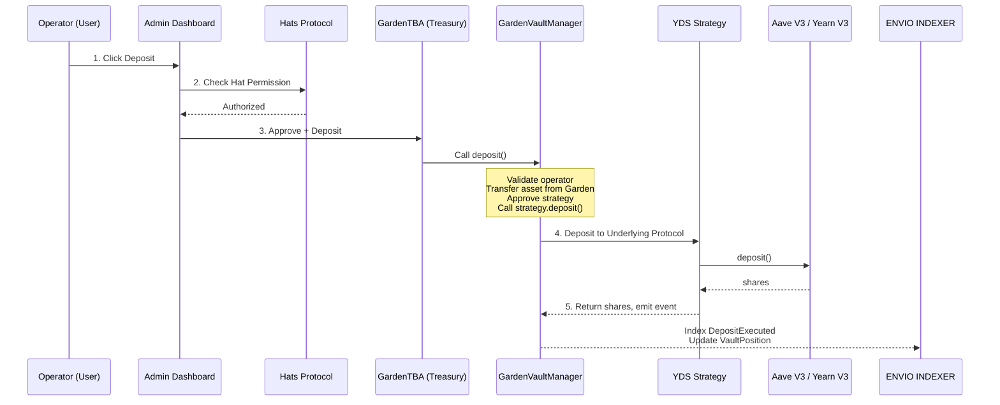

<details>
<summary>PNG Fallback</summary>

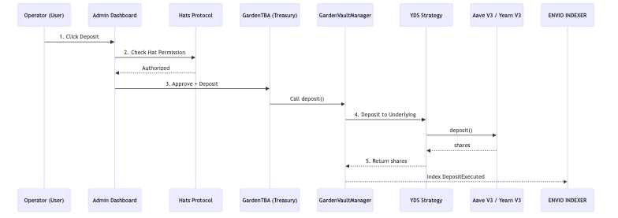
</details>

#### 4.1.2 Yield Harvest Flow

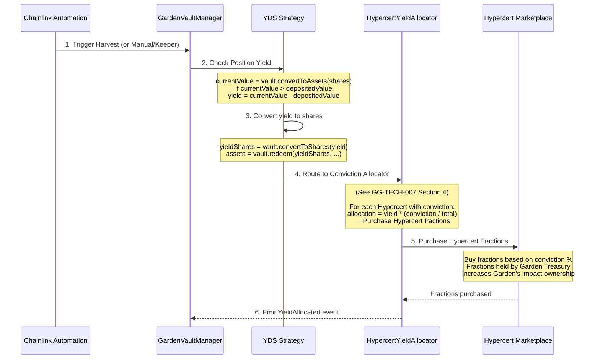

<details>
<summary>PNG Fallback</summary>

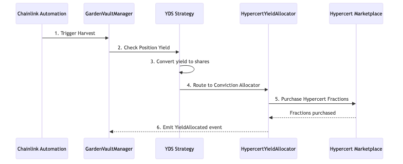
</details>

**Note:** Yield is routed to the `HypercertYieldAllocator` contract which uses conviction voting percentages (from Gardens CVStrategy) to determine how yield is split across multiple Hypercerts. The yield is then used to **purchase Hypercert fractions** on the marketplace, with those fractions held by the Garden's treasury (GardenAccount TBA). This creates a direct link between vault yield and verified environmental impact ownership.

:::info Cross-Reference
For complete conviction voting implementation details, see:
- [GG-TECH-007 Section 4: HypercertYieldAllocator Adapter Specification](/specs/gardens/gardens-tech-spec#4-hypercertyieldallocator-adapter-specification) for the adapter contract interfaces
- [GG-TECH-007 Section 3: PR #714 Implementation Analysis](/specs/gardens/gardens-tech-spec#3-pr-714-implementation-analysis) for CVVault and CVYDSFacet integration
- [GG-TECH-007 Section 6.1: Data Flow Diagrams](/specs/gardens/gardens-tech-spec#61-data-flow-diagrams) for conviction voting and yield allocation flow
:::

#### 4.1.3 Cross-Chain Deposit Flow (Phase 2)

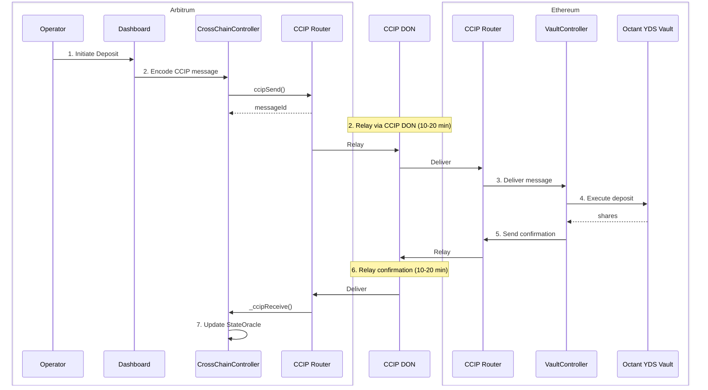

<details>
<summary>PNG Fallback</summary>

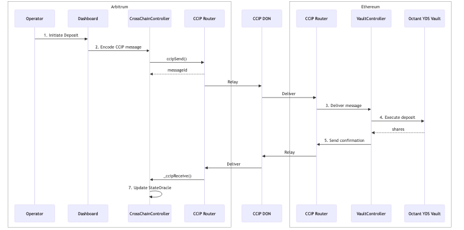
</details>

### 4.2 Data Model and Database Design

#### 4.2.1 Envio Entity Schema

```graphql
# Core entities
type Garden @entity {
  id: ID!                              # Garden TBA address
  nftTokenId: BigInt!
  operator: String!
  guardian: String
  vaultPositions: [VaultPosition!]! @derivedFrom(field: "garden")
  yieldDonations: [YieldDonation!]! @derivedFrom(field: "garden")
  totalValueLocked: BigInt!
  totalYieldDonated: BigInt!
  createdAt: BigInt!
  updatedAt: BigInt!
}

type VaultPosition @entity {
  id: ID!                              # gardenId-strategyId
  garden: Garden!
  strategy: YDSStrategy!
  shares: BigInt!
  depositedValue: BigInt!              # Original deposit amount
  currentValue: BigInt!                # Current value (updated on sync)
  totalYieldDonated: BigInt!           # Cumulative yield donated
  deposits: [PositionDeposit!]! @derivedFrom(field: "position")
  withdrawals: [PositionWithdrawal!]! @derivedFrom(field: "position")
  createdAt: BigInt!
  updatedAt: BigInt!
}

type YDSStrategy @entity {
  id: ID!                              # Strategy contract address
  address: String!
  name: String!
  asset: String!                       # Underlying asset address
  assetSymbol: String!
  assetDecimals: Int!
  apy: BigDecimal                      # Current APY (updated periodically)
  tvl: BigInt!                         # Total value locked
  minDeposit: BigInt!
  maxDeposit: BigInt                   # null = unlimited
  donationAddress: String!
  isActive: Boolean!
  riskLevel: String!                   # "low", "medium", "high"
  positions: [VaultPosition!]! @derivedFrom(field: "strategy")
  createdAt: BigInt!
  updatedAt: BigInt!
}

type PositionDeposit @entity {
  id: ID!                              # Transaction hash
  position: VaultPosition!
  amount: BigInt!
  shares: BigInt!
  timestamp: BigInt!
  txHash: String!
  blockNumber: BigInt!
}

type PositionWithdrawal @entity {
  id: ID!                              # Transaction hash
  position: VaultPosition!
  shares: BigInt!
  assets: BigInt!
  recipient: String!
  timestamp: BigInt!
  txHash: String!
  blockNumber: BigInt!
}

type YieldDonation @entity {
  id: ID!                              # Transaction hash
  garden: Garden!
  strategy: YDSStrategy!
  amount: BigInt!
  donationAddress: String!
  timestamp: BigInt!
  txHash: String!
  blockNumber: BigInt!
}
```

#### 4.2.2 Entity Relationships

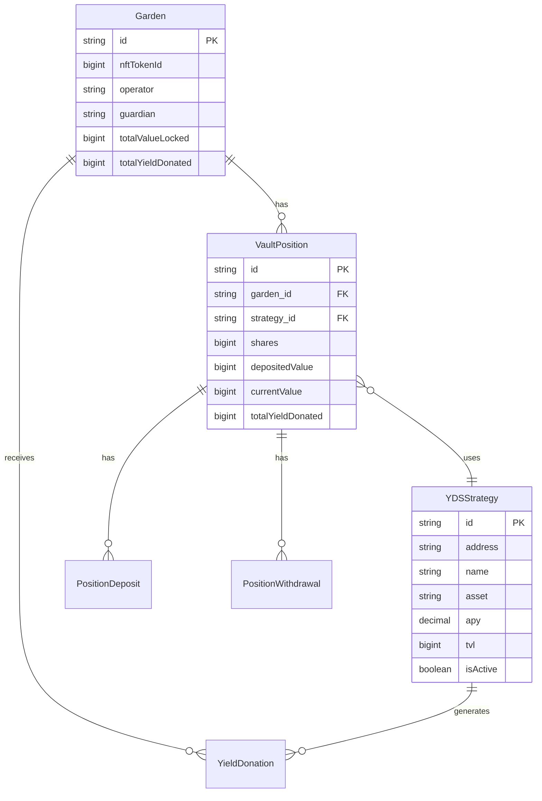

<details>
<summary>PNG Fallback</summary>

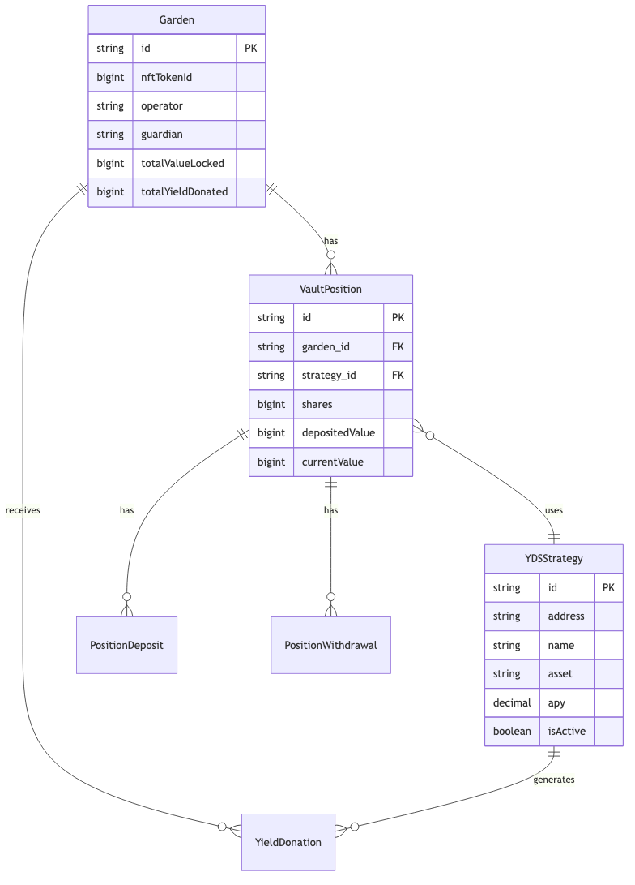
</details>

---

## 5. Implementation Plan

### 5.1 Technology Stack

| Layer | Technology | Justification |
| :--- | :--- | :--- |
| **Smart Contracts** | Solidity 0.8.25+ | Latest features, built-in overflow protection |
| **Contract Framework** | Foundry | Fast compilation, powerful testing, fuzzing |
| **Frontend** | Vite + React 19 + TypeScript | Fast HMR, type safety, existing codebase |
| **State Management** | Zustand | Lightweight, TypeScript-first |
| **Async State** | XState 5 | Complex transaction state machines |
| **GraphQL Client** | React Query + graphql-request | Powerful caching, TypeScript-first, minimal bundle |
| **Indexer** | Envio | TypeScript handlers, fast sync |
| **Wallet** | wagmi + viem | Modern React hooks, TypeScript |
| **AA/Passkeys** | Pimlico | ERC-4337 bundler, passkey support |
| **Cross-Chain** | Chainlink CCIP | Industry standard, battle-tested |

### 5.2 Milestones and Timeline

| Milestone | Duration | Deliverables |
| :--- | :--- | :--- |
| **M1: Contract Development** | 2 weeks | GardenVaultManager, AaveV3YDSStrategy, tests |
| **M2: Indexer + API** | 1 week | Envio schema, handlers, GraphQL API |
| **M3: Frontend Integration** | 2 weeks | Dashboard components, deposit/withdraw flows |
| **M4: Testing + Audit Prep** | 1 week | Integration tests, documentation, audit package |
| **M5: Testnet Deployment** | 1 week | Arbitrum Sepolia deployment, QA |
| **M6: Mainnet Launch** | 1 week | Arbitrum One deployment, monitoring |
| **M7: Cross-Chain (Phase 2)** | 3 weeks | CCIP integration, Ethereum deployment |

**Total: 11 weeks** (8 weeks Phase 1, 3 weeks Phase 2)

---

## 6. Testing and Quality Assurance

### 6.1 Testing Strategy

#### 6.1.1 Unit Testing (Smart Contracts)

**Framework:** Foundry Test

**Coverage Target:** greater than 95%

**Example Tests:**
```solidity
// packages/contracts/test/unit/GardenVaultManager.t.sol
contract GardenVaultManagerTest is Test {
    function testDeposit_Success() public {
        // Arrange
        vm.startPrank(operator);
        usdc.approve(address(vaultManager), 1000e6);

        // Act
        uint256 shares = vaultManager.deposit(garden, strategyId, 1000e6);

        // Assert
        assertGt(shares, 0);
        (uint256 posShares,,) = vaultManager.getPositionValue(garden, strategyId);
        assertEq(posShares, shares);
    }

    function testDeposit_RevertIfNotOperator() public {
        vm.prank(randomUser);
        vm.expectRevert(GardenVaultManager.NotAuthorized.selector);
        vaultManager.deposit(garden, strategyId, 1000e6);
    }

    function testFuzz_Deposit(uint256 amount) public {
        amount = bound(amount, minDeposit, maxDeposit);
        // ...
    }
}
```

#### 6.1.2 Integration Testing

**Framework:** Foundry Fork Tests + Vitest

```solidity
// packages/contracts/test/integration/AaveIntegration.t.sol
contract AaveIntegrationTest is Test {
    function setUp() public {
        // Fork Arbitrum mainnet
        vm.createSelectFork(vm.envString("ARBITRUM_RPC_URL"));
        // Deploy contracts
    }

    function testFullDepositWithdrawCycle() public {
        // 1. Deposit USDC
        vaultManager.deposit(garden, aaveUsdcStrategy, 10000e6);

        // 2. Advance time to accrue yield
        vm.warp(block.timestamp + 30 days);

        // 3. Harvest yield
        uint256 yield = vaultManager.harvestAndDonate(garden, aaveUsdcStrategy);
        assertGt(yield, 0);

        // 4. Withdraw principal
        (uint256 shares,,) = vaultManager.getPositionValue(garden, aaveUsdcStrategy);
        vaultManager.withdraw(garden, aaveUsdcStrategy, shares, garden);

        // 5. Verify position closed
        (shares,,) = vaultManager.getPositionValue(garden, aaveUsdcStrategy);
        assertEq(shares, 0);
    }
}
```

#### 6.1.3 E2E Testing (Playwright)

```typescript
// tests/e2e/vault-deposit.spec.ts
import { test, expect } from '@playwright/test';

test.describe('Vault Deposit Flow', () => {
  test('operator can deposit to Aave USDC strategy', async ({ page }) => {
    // Navigate to treasury dashboard
    await page.goto('/garden/0x123.../treasury');

    // Open deposit modal
    await page.getByRole('button', { name: 'Deposit' }).click();

    // Select strategy
    await page.getByRole('combobox', { name: 'Strategy' }).click();
    await page.getByRole('option', { name: 'Aave V3 USDC' }).click();

    // Enter amount
    await page.getByLabel('Amount').fill('1000');

    // Preview should show estimated shares
    await expect(page.getByText(/~[\d,.]+ shares/)).toBeVisible();

    // Confirm deposit
    await page.getByRole('button', { name: 'Confirm Deposit' }).click();

    // Wait for transaction confirmation
    await expect(page.getByText('Deposit successful')).toBeVisible({ timeout: 30000 });

    // Verify position appears in dashboard
    await expect(page.getByTestId('position-card-aave-usdc')).toBeVisible();
    await expect(page.getByTestId('position-value')).toContainText('$1,000');
  });
});
```

### 6.2 Quality Metrics

| Metric | Target | Measurement Method |
| :--- | :--- | :--- |
| Contract Test Coverage | greater than 95% | `forge coverage` |
| Frontend Unit Test Coverage | greater than 80% | Vitest coverage report |
| E2E Test Coverage | Critical paths 100% | Playwright test suite |
| Mutation Testing Score | greater than 80% | `gambit` for Solidity |
| Gas Optimization | less than 500k gas/deposit | Foundry gas reports |
| Slither Findings | 0 High/Medium | `slither` analysis |

---

## 7. Deployment and Maintenance

### 7.1 Deployment Checklist

**Pre-Deployment:**
- [ ] All tests passing
- [ ] Slither analysis clean
- [ ] Gas costs within budget
- [ ] External audit complete (for mainnet)
- [ ] Multisig wallets configured
- [ ] Emergency contacts established

**Deployment Order (Arbitrum-Native):**
1. Deploy GardenVaultManager
2. Deploy AaveV3YDSStrategy
3. Deploy YearnV3YDSStrategy (if ready)
4. Register strategies in GardenVaultManager
5. Configure donation addresses
6. Transfer ownership to multisig

### 7.2 Monitoring

**Contract Monitoring:**
- OpenZeppelin Defender for transaction monitoring
- Tenderly alerts for failed transactions
- Custom Grafana dashboards for TVL, yield, operations

**Indexer Monitoring:**
- Envio dashboard for sync status
- Alerts for sync lag greater than 100 blocks

---

## 8. Implementation Guide

This section provides detailed implementation guidance for AI agents and developers building this feature.

### 8.1 Dependency Graph

Build order for contracts and packages:

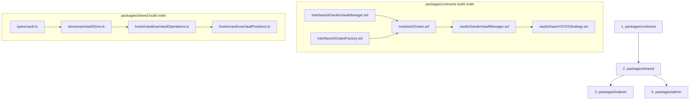

### 8.2 Error Taxonomy

All vault-related errors with codes and recovery strategies:

| Error Code | Name | Description | Recovery Strategy |
|------------|------|-------------|-------------------|
| `VAULT_001` | `NotAuthorized` | Caller doesn't wear required Hat | Check Hats role, prompt user to contact operator |
| `VAULT_002` | `StrategyNotActive` | Strategy has been deactivated | Show alternative active strategies |
| `VAULT_003` | `InsufficientBalance` | Garden doesn't have enough assets | Show current balance, adjust amount |
| `VAULT_004` | `BelowMinDeposit` | Amount below strategy minimum | Show minimum deposit requirement |
| `VAULT_005` | `AboveMaxDeposit` | Amount exceeds strategy cap | Show maximum allowed, split into multiple |
| `VAULT_006` | `VaultCreationFailed` | Factory failed to create vault | Retry with different parameters |
| `VAULT_007` | `CCIPMessageFailed` | Cross-chain message failed | Show CCIP explorer link, manual retry |
| `VAULT_008` | `StateOracleStale` | State data older than threshold | Trigger manual sync, show warning |

### 8.3 GraphQL Contracts

Complete query/mutation signatures with expected responses:

```typescript
// packages/shared/src/modules/data/vault-queries.ts
import { gql } from 'graphql-request';

export const VAULT_POSITIONS_QUERY = gql`
  query GetVaultPositions($gardenId: String!) {
    vaultPositions(where: { garden_id: $gardenId }) {
      id
      strategy { id name asset apy }
      shares
      depositedValue
      currentValue
      totalYieldDonated
      lastUpdateTimestamp
    }
  }
`;

// Expected response shape
export interface VaultPositionsResponse {
  vaultPositions: {
    id: string;
    strategy: {
      id: string;
      name: string;
      asset: string;
      apy: number;
    };
    shares: string;
    depositedValue: string;
    currentValue: string;
    totalYieldDonated: string;
    lastUpdateTimestamp: string;
  }[];
}

export const YDS_STRATEGIES_QUERY = gql`
  query GetYDSStrategies($asset: String, $isActive: Boolean) {
    ydsStrategies(
      where: { asset: $asset, isActive: $isActive }
      orderBy: apy_DESC
    ) {
      id
      address
      name
      asset
      assetSymbol
      apy
      tvl
      minDeposit
      maxDeposit
      riskLevel
      isActive
    }
  }
`;
```

### 8.4 Zustand Store Shape

Complete store implementation following existing patterns:

```typescript
// packages/shared/src/stores/useVaultStore.ts
import { create } from 'zustand';

export enum VaultTxStatus {
  Idle = 'idle',
  Building = 'building',
  Signing = 'signing',
  PendingSource = 'pending_source',
  PendingCCIP = 'pending_ccip',
  PendingDest = 'pending_dest',
  Confirmed = 'confirmed',
  Failed = 'failed',
}

export interface VaultTxState {
  status: VaultTxStatus;
  messageId: string | null;
  txHashSource: string | null;
  txHashDest: string | null;
  error: string | null;
  estimatedCompletion: number | null;
}

interface VaultState {
  // Positions
  positions: VaultPosition[];
  positionsLoading: boolean;
  positionsError: string | null;

  // Strategies
  strategies: YDSStrategy[];
  strategiesLoading: boolean;

  // Form state
  selectedStrategyId: string | null;
  depositAmount: string;
  withdrawShares: string;

  // Transaction state
  txState: VaultTxState;

  // Actions
  setSelectedStrategy: (id: string | null) => void;
  setDepositAmount: (amount: string) => void;
  setWithdrawShares: (shares: string) => void;
  setTxState: (state: Partial<VaultTxState>) => void;
  reset: () => void;
}

const initialTxState: VaultTxState = {
  status: VaultTxStatus.Idle,
  messageId: null,
  txHashSource: null,
  txHashDest: null,
  error: null,
  estimatedCompletion: null,
};

export const useVaultStore = create<VaultState>((set) => ({
  positions: [],
  positionsLoading: false,
  positionsError: null,
  strategies: [],
  strategiesLoading: false,
  selectedStrategyId: null,
  depositAmount: '',
  withdrawShares: '',
  txState: initialTxState,

  setSelectedStrategy: (id) => set({ selectedStrategyId: id }),
  setDepositAmount: (amount) => set({ depositAmount: amount }),
  setWithdrawShares: (shares) => set({ withdrawShares: shares }),
  setTxState: (state) =>
    set((prev) => ({ txState: { ...prev.txState, ...state } })),
  reset: () =>
    set({
      selectedStrategyId: null,
      depositAmount: '',
      withdrawShares: '',
      txState: initialTxState,
    }),
}));
```

### 8.5 Component API Contracts

Props and events for UI components:

```typescript
// packages/admin/src/features/treasury/types.ts

// VaultDashboard
export interface VaultDashboardProps {
  gardenId: string;
}

// PositionCard
export interface PositionCardProps {
  position: VaultPosition;
  strategy: YDSStrategy;
  onWithdraw: () => void;
  onHarvest: () => void;
}

// DepositModal
export interface DepositModalProps {
  open: boolean;
  onOpenChange: (open: boolean) => void;
  gardenId: string;
  strategies: YDSStrategy[];
  gardenBalance: Record<string, bigint>;
}

export interface DepositModalEvents {
  onDeposit: (params: DepositParams) => Promise<void>;
  onPreview: (params: DepositParams) => Promise<DepositPreview>;
}

export interface DepositPreview {
  estimatedShares: bigint;
  pricePerShare: bigint;
  fee: bigint;
  estimatedCompletionTime: number;
}

// WithdrawModal
export interface WithdrawModalProps {
  open: boolean;
  onOpenChange: (open: boolean) => void;
  position: VaultPosition;
  strategy: YDSStrategy;
}
```

### 8.6 Performance Budgets

Timing and size constraints:

| Metric | Target | Max | Measurement |
|--------|--------|-----|-------------|
| Deposit TX gas | 400k | 500k | `forge test --gas-report` |
| Withdraw TX gas | 350k | 450k | `forge test --gas-report` |
| Position list render | 16ms | 50ms | React DevTools Profiler |
| Strategy list load | 200ms | 500ms | Network waterfall |
| Dashboard bundle size | 50kb | 100kb | `vite-bundle-analyzer` |
| First Contentful Paint | 1.2s | 2s | Lighthouse |
| Time to Interactive | 2.5s | 4s | Lighthouse |

### 8.7 Accessibility Requirements

WCAG 2.1 AA compliance for vault UI:

| Component | Requirement | Implementation |
|-----------|-------------|----------------|
| DepositModal | Focus trap | `Dialog` from Radix UI |
| Amount inputs | Screen reader labels | `aria-label` with current balance |
| Strategy selector | Keyboard navigation | Arrow keys, Enter to select |
| Position cards | Status announcements | `aria-live="polite"` for updates |
| Error states | Descriptive errors | `aria-describedby` linking to error |
| Loading states | Progress indication | `aria-busy="true"`, skeleton screens |
| Transaction status | Live updates | `role="status"` with progress |

### 8.8 Observability and Telemetry

Events and metrics for monitoring:

```typescript
// packages/shared/src/modules/analytics/vault-events.ts
import { posthog } from '../posthog';

export const VaultEvents = {
  // User actions
  DEPOSIT_INITIATED: 'vault_deposit_initiated',
  DEPOSIT_CONFIRMED: 'vault_deposit_confirmed',
  DEPOSIT_FAILED: 'vault_deposit_failed',
  WITHDRAW_INITIATED: 'vault_withdraw_initiated',
  WITHDRAW_CONFIRMED: 'vault_withdraw_confirmed',
  EMERGENCY_INITIATED: 'vault_emergency_initiated',
  HARVEST_TRIGGERED: 'vault_harvest_triggered',
  STRATEGY_SELECTED: 'vault_strategy_selected',

  // System events
  STATE_SYNC: 'vault_state_sync',
  CCIP_MESSAGE_SENT: 'vault_ccip_message_sent',
  CCIP_MESSAGE_CONFIRMED: 'vault_ccip_message_confirmed',
} as const;

export interface VaultDepositEvent {
  gardenId: string;
  strategyId: string;
  amount: string;
  asset: string;
  estimatedShares: string;
}

export interface VaultDepositConfirmedEvent {
  gardenId: string;
  messageId: string;
  shares: string;
  durationSeconds: number;
}

export function trackVaultDeposit(event: VaultDepositEvent) {
  posthog.capture(VaultEvents.DEPOSIT_INITIATED, event);
}

export function trackVaultDepositConfirmed(event: VaultDepositConfirmedEvent) {
  posthog.capture(VaultEvents.DEPOSIT_CONFIRMED, {
    ...event,
    // Performance metric
    $set: { last_vault_deposit_duration: event.durationSeconds },
  });
}
```

**Grafana Dashboard Metrics:**

| Metric Name | Type | Labels | Description |
|-------------|------|--------|-------------|
| `vault_tvl_total` | Gauge | garden, strategy | Total value locked per garden/strategy |
| `vault_deposits_count` | Counter | garden, strategy, status | Number of deposit operations |
| `vault_withdrawals_count` | Counter | garden, strategy, status | Number of withdrawal operations |
| `vault_yield_donated_total` | Counter | garden, strategy | Cumulative yield donated |
| `vault_ccip_latency_seconds` | Histogram | direction | CCIP message completion time |
| `vault_state_sync_age_seconds` | Gauge | garden | Time since last state sync |

---

## 9. Risk Management

### 9.1 Risk Analysis

| Risk | Likelihood | Impact | Score |
| :--- | :--- | :--- | :--- |
| Smart contract vulnerability | Low | Critical | High |
| Aave V3 protocol exploit | Low | Critical | High |
| CCIP message stuck (Phase 2) | Low | High | Medium |
| Yield fluctuation | High | Low | Medium |
| Arbitrum sequencer downtime | Low | Medium | Low |
| Indexer desync | Medium | Low | Low |
| Key compromise | Low | Critical | High |

### 9.2 Mitigation Strategies

| Risk | Mitigation |
| :--- | :--- |
| Smart contract vulnerability | External audit, formal verification, bug bounty |
| Aave V3 protocol exploit | Diversify across strategies, implement emergency withdraw |
| CCIP message stuck | Manual execution fallback, monitoring alerts |
| Yield fluctuation | Set user expectations, show historical ranges |
| Arbitrum sequencer downtime | Graceful degradation, cached state display |
| Indexer desync | Multiple data sources, fallback to direct RPC |
| Key compromise | Multisig, timelocks, Guardian role separation |

---

## Changelog

| Version | Date | Author | Changes |
| :--- | :--- | :--- | :--- |
| 1.0 | Jan 18, 2026 | Engineering | Initial specification |
| 2.0 | Jan 22, 2026 | Claude | Added Implementation Guide, Mermaid diagrams, moved to Docusaurus |

---

*End of Technical Specification*
