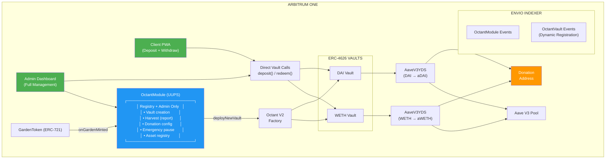
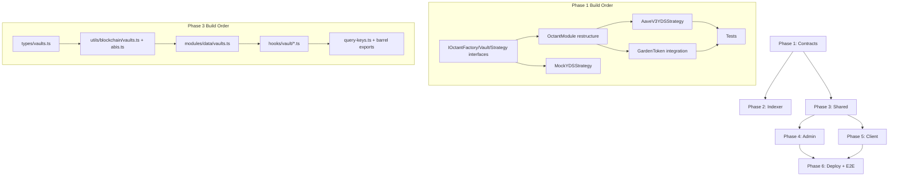

# GG-TECH-006: Octant Vaults Technical Specification

**Document ID:** GG-TECH-006
**Feature Reference:** GG-FEAT-006
**Version:** 3.0
**Status:** Implementation Complete — Not Deployed (requires Octant V2 factory deployment and env configuration; see [§ Deployment](#7-deployment))
**Last Updated:** February 9, 2026
**Branch:** `feature/octant-defi-vaults`

---

## 1. Overview

### 1.1 Purpose

This technical specification defines the implementation details for the Octant Vault Integration feature, enabling anyone to deposit into per-garden ERC-4626 vaults on Arbitrum. Users interact with vaults directly — `vault.deposit()` and `vault.redeem()` — while OctantModule serves as a registry and admin layer for vault creation, harvest, donation configuration, and emergency pause.

This specification serves as the engineering blueprint for:
- Smart contract architecture (OctantModule, AaveV3YDSStrategy)
- Frontend integration (Admin Dashboard + Client PWA)
- Indexer and data layer configuration (Envio dual event source)
- Testing and quality assurance
- Deployment procedures

### 1.2 Scope

**In Scope:**
- OctantModule — vault registry and admin layer (UUPS upgradeable)
- Direct ERC-4626 vault interaction for deposits/withdrawals
- AaveV3YDSStrategy for WETH + DAI on Arbitrum
- MockYDSStrategy for testnet (Ethereum Sepolia)
- Admin Dashboard vault management UI
- Client PWA treasury drawer (deposit + withdraw)
- Envio indexer schema and handlers (dual event source)
- Integration with Hats Protocol for admin authorization
- Vault creation at garden mint via GardenToken callback

**Out of Scope:**
- Conviction Voting for yield allocation (Phase 2 — see GG-TECH-007)
- Cross-chain CCIP integration (Phase 2 — see [Cross-Chain Appendix](./octant-cross-chain-appendix))
- Multi-strategy per asset / rebalancing
- Automated harvest (manual operator trigger only)
- USDC vault support (architecture supports it via `setSupportedAsset()`)
- Protocol fee on yield
- Existing garden migration

### 1.3 Definitions

| Term | Definition |
| :--- | :--- |
| **YDS** | Yield Donating Strategy — ERC-4626 vault that donates profit to a configured address |
| **PPS** | Price Per Share — ratio of vault assets to shares |
| **OctantModule** | Registry + admin layer for vault creation, harvest, donation config, emergency |
| **ERC-4626** | Tokenized Vault Standard — the interface users interact with directly |
| **Operator** | Garden role authorized for harvest, donation config (via Hats Protocol) |
| **Owner** | Garden role authorized for emergency pause (in addition to Operator actions) |

### 1.4 References

| Document | Description |
| :--- | :--- |
| GG-FEAT-006 | [Octant Vaults Feature Specification](./octant-feature-spec) |
| Cross-Chain Appendix | [Archived Phase 2 CCIP Architecture](./octant-cross-chain-appendix) |
| Final Plan | `.plans/octant-vaults-final-plan.md` — Authoritative implementation plan |
| Octant V2 Docs | https://docs.v2.octant.build |
| ERC-4626 Spec | https://eips.ethereum.org/EIPS/eip-4626 |
| Aave V3 Docs | https://docs.aave.com |
| Hats Protocol Docs | https://docs.hatsprotocol.xyz |

---

## 2. System Architecture

### 2.1 High-Level Architecture


```mermaid
graph TB
    subgraph Arbitrum["ARBITRUM ONE"]
        Client["Client PWA<br/>(Deposit + Withdraw)"]
        Admin["Admin Dashboard<br/>(Full Management)"]

        Client --> Vault
        Admin --> OM
        Admin --> Vault

        GT["GardenToken (ERC-721)"] --> |onGardenMinted| OM

        OM["OctantModule (UUPS)<br/>┌────────────────────────┐<br/>│ Registry + Admin Only   │<br/>│ • Vault creation        │<br/>│ • Harvest (report)      │<br/>│ • Donation config       │<br/>│ • Emergency pause       │<br/>│ • Asset registry        │<br/>└────────────────────────┘"]

        OM --> |deployNewVault| Factory["Octant V2<br/>Factory"]
        Factory --> WETHVault
        Factory --> DAIVault

        subgraph Vaults["ERC-4626 VAULTS"]
            WETHVault["WETH Vault"]
            DAIVault["DAI Vault"]
        end

        Vault["Direct Vault Calls<br/>deposit() / redeem()"] --> WETHVault
        Vault --> DAIVault

        WETHVault --> WETHStrat["AaveV3YDS<br/>(WETH → aWETH)"]
        DAIVault --> DAIStrat["AaveV3YDS<br/>(DAI → aDAI)"]

        WETHStrat --> AavePool["Aave V3 Pool"]
        DAIStrat --> AavePool

        WETHStrat --> Donation["Donation<br/>Address"]
        DAIStrat --> Donation

        subgraph Indexer["ENVIO INDEXER"]
            Source1["OctantModule Events"]
            Source2["OctantVault Events<br/>(Dynamic Registration)"]
        end
    end

    style Client fill:#4CAF50,color:#fff
    style Admin fill:#4CAF50,color:#fff
    style OM fill:#2196F3,color:#fff
    style Donation fill:#FF9800,color:#fff
```

### 2.2 Environment

#### 2.2.1 Development Environment

| Component | Technology | Version |
| :--- | :--- | :--- |
| Smart Contracts | Solidity | ^0.8.25 |
| Contract Framework | Foundry | Latest |
| Frontend | Vite + React + TypeScript | Vite 7.x, React 19.x |
| State Management | TanStack Query (server) + Zustand (client) | v5 |
| GraphQL Client | TanStack Query + graphql-request | v5 |
| Indexer | Envio | Latest |
| Testing | Foundry (contracts), Vitest (frontend) | Latest |
| Formatting | Biome | Latest |
| Linting | oxlint (frontend), solhint (contracts) | Latest |

#### 2.2.2 Network Configuration

| Network | Chain ID | Purpose | Strategy Status |
| :--- | :--- | :--- | :--- |
| Ethereum Sepolia | 11155111 | Testnet (MockYDSStrategy) | Defined |
| Base Sepolia | 84532 | Testnet (placeholder only) | No strategy defined |
| Arbitrum One | 42161 | Mainnet (AaveV3YDSStrategy) | Defined |
| Celo | 42220 | Mainnet (placeholder only) | No strategy defined |

> **Note:** Deployment artifacts and indexer config include placeholder entries for all 4 networks. Only **Ethereum Sepolia** (MockYDSStrategy) and **Arbitrum One** (AaveV3YDSStrategy) have defined strategies for Phase 1. Base Sepolia and Celo entries are structural placeholders — no vault strategies exist for those networks.

#### 2.2.3 External Dependencies

| Dependency | Network | Address |
| :--- | :--- | :--- |
| Aave V3 Pool | Arbitrum One | `0x794a61358D6845594F94dc1DB02A252b5b4814aD` |
| WETH | Arbitrum One | `0x82aF49447D8a07e3bd95BD0d56f35241523fBab1` |
| DAI | Arbitrum One | `0xDA10009cBd5D07dd0CeCc66161FC93D7c9000da1` |
| aWETH | Arbitrum One | `0xe50fA9b3c56FfB159cB0FCA61F5c9D750e8128c8` |
| aDAI | Arbitrum One | `0x82E64f49Ed5EC1bC6e43DAD4FC8Af9bb3A2312EE` |
| Hats Protocol | Arbitrum One | `0x3bc1A0Ad72417f2d411118085256fC53CBdDd137` |

---

## 3. Smart Contract Design

### 3.1 Contract Overview

| Contract | Purpose | Upgrade | Location |
| :--- | :--- | :--- | :--- |
| OctantModule | Vault registry + admin layer | UUPS (fresh deploy) | `src/modules/Octant.sol` |
| IOctantFactory | Factory interface for vault deployment | N/A (interface) | `src/interfaces/IOctantFactory.sol` |
| IOctantVault | ERC-4626 vault interface | N/A (interface) | `src/interfaces/IOctantFactory.sol` |
| IOctantStrategy | YDS strategy interface | N/A (interface) | `src/interfaces/IOctantFactory.sol` |
| AaveV3YDSStrategy | Aave V3 yield strategy (mainnet) | Not upgradeable | `src/strategies/AaveV3YDSStrategy.sol` |
| MockYDSStrategy | Test strategy (testnet) | Not upgradeable | `src/mocks/MockYDSStrategy.sol` |
| MockOctantFactory | Test factory | Not upgradeable | `src/mocks/Octant.sol` |
| MockOctantVault | Test vault | Not upgradeable | `src/mocks/Octant.sol` |
| GardenToken | ERC-721 with vault creation callback | UUPS (fresh deploy) | `src/tokens/Garden.sol` |

### 3.2 OctantModule

**Role:** Registry + admin layer. Never touches deposits or withdrawals.

**Storage Layout:**

```solidity
IOctantFactory public octantFactory;
uint256 public defaultProfitUnlockTime;
mapping(address garden => address donationAddress) public gardenDonationAddresses;
mapping(address garden => mapping(address asset => address vault)) public gardenAssetVaults;
mapping(address asset => address strategy) public supportedAssets;
address[] public supportedAssetList;
uint256 public supportedAssetCount;
address public gardenToken;
uint256[42] private __gap;
```

**Functions:**

| Function | Access | Description |
| :--- | :--- | :--- |
| `initialize(owner, factory, profitUnlockTime)` | — | One-time init |
| `onGardenMinted(garden, name)` | onlyGardenToken | Creates vaults for all supported assets |
| `harvest(garden, asset)` | Operator/Owner | Calls `strategy.report()`, requires donation address |
| `emergencyPause(garden, asset)` | Owner only | Calls `strategy.shutdown()` (emits `StrategyShutdownFailed` on failure), always emits `EmergencyPaused` |
| `setDonationAddress(garden, addr)` | Operator/Owner | Updates module mapping + all vault strategies |
| `createVaultForAsset(garden, asset)` | Operator/Owner | Create vault for newly supported asset |
| `setSupportedAsset(asset, strategy)` | Protocol Owner | Register/deactivate asset-strategy pair |
| `setOctantFactory(factory)` | Protocol Owner | Update factory address |
| `setDefaultProfitUnlockTime(time)` | Protocol Owner | Update profit unlock period |
| `setGardenToken(addr)` | Protocol Owner | Register GardenToken |
| `getVaultForAsset(garden, asset)` | Anyone | View vault address |
| `getSupportedAssets()` | Anyone | View all registered asset addresses |

**Events:**

```solidity
event VaultCreated(address indexed garden, address indexed vault, address indexed asset);
event FactoryUpdated(address indexed oldFactory, address indexed newFactory);
event GardenTokenUpdated(address indexed oldGardenToken, address indexed newGardenToken);
event HarvestTriggered(address indexed garden, address indexed asset, address indexed caller);
event EmergencyPaused(address indexed garden, address indexed asset, address indexed caller);
event DonationAddressUpdated(address indexed garden, address indexed oldAddress, address indexed newAddress);
event SupportedAssetUpdated(address indexed asset, address indexed strategy);
event DefaultProfitUnlockTimeUpdated(uint256 oldUnlockTime, uint256 newUnlockTime);
event StrategyShutdownFailed(address indexed garden, address indexed asset, address indexed strategy);
```

**Errors:**

```solidity
error UnauthorizedCaller(address caller);
error ZeroAddress();
error FactoryNotConfigured();
error UnsupportedAsset(address asset);
error AssetDeactivated(address asset);
error NoVaultForAsset(address garden, address asset);
error VaultAlreadyExists(address garden, address asset);
error NoDonationAddress(address garden);
```

**Access Control:**

```solidity
modifier onlyGardenOperatorOrOwner(address garden) {
    // Protocol owner (contract owner) always has access
    if (msg.sender == owner()) { _; return; }

    // Try garden-level role checks via IGardenAccessControl (isolated try/catch)
    bool isOperator = false;
    bool isGardenOwner = false;
    try IGardenAccessControl(garden).isOperator(msg.sender) returns (bool result) {
        isOperator = result;
    } catch { }
    try IGardenAccessControl(garden).isOwner(msg.sender) returns (bool result) {
        isGardenOwner = result;
    } catch { }

    if (!isOperator && !isGardenOwner) revert UnauthorizedCaller(msg.sender);
    _;
}

modifier onlyGardenOwner(address garden) {
    // Protocol owner always has access
    if (msg.sender == owner()) { _; return; }

    bool isGardenOwner = false;
    try IGardenAccessControl(garden).isOwner(msg.sender) returns (bool result) {
        isGardenOwner = result;
    } catch { }

    if (!isGardenOwner) revert UnauthorizedCaller(msg.sender);
    _;
}
```

> **Note:** Access checks use try/catch isolation so the module remains non-opinionated about the garden's role backend. If `IGardenAccessControl` is not implemented on the garden address, the call fails gracefully and falls through to the revert.

### 3.3 IOctantFactory Interface

```solidity
interface IOctantFactory {
    function deployNewVault(
        address asset,
        string calldata name,
        string calldata symbol,
        address roleManager,
        uint256 profitMaxUnlockTime
    ) external returns (address vault);
}
```

### 3.4 IOctantVault Interface (ERC-4626)

```solidity
interface IOctantVault {
    // Core ERC-4626
    function deposit(uint256 assets, address receiver) external returns (uint256 shares);
    function withdraw(uint256 assets, address receiver, address owner) external returns (uint256 shares);
    function redeem(uint256 shares, address receiver, address owner) external returns (uint256 assets);

    // View functions
    function balanceOf(address account) external view returns (uint256);
    function totalAssets() external view returns (uint256);
    function totalSupply() external view returns (uint256);
    function convertToAssets(uint256 shares) external view returns (uint256);
    function convertToShares(uint256 assets) external view returns (uint256);
    function previewDeposit(uint256 assets) external view returns (uint256);
    function previewWithdraw(uint256 assets) external view returns (uint256);
    function maxDeposit(address receiver) external view returns (uint256);
    function maxWithdraw(address owner) external view returns (uint256);
    function asset() external view returns (address);

    // Strategy management
    function addStrategy(address strategy) external;
}
```

### 3.5 IOctantStrategy Interface

```solidity
interface IOctantStrategy {
    function report() external returns (uint256 totalAssets);
    function setDonationAddress(address donationAddress) external;
    function shutdown() external;
}
```

### 3.6 AaveV3YDSStrategy

**Purpose:** Real yield strategy wrapping Aave V3 lending on Arbitrum. Deployed twice (once for WETH, once for DAI).

**Architecture:**
- Immutable dependencies: Aave Pool, underlying asset, aToken
- Ownable: only owner (OctantModule) can deploy/free funds and set donation
- Pause control: `depositsPaused` flag for emergency

**Functions:**

| Function | Access | Purpose |
| :--- | :--- | :--- |
| `deployFunds(amount)` | Owner | Deposit assets to Aave V3 pool |
| `freeFunds(amount, receiver)` | Owner | Withdraw from Aave to receiver |
| `report()` | IOctantStrategy | Return total AUM: idle + aToken balance |
| `setDonationAddress(addr)` | Owner | Update yield recipient |
| `setDepositsPaused(bool)` | Owner | Pause/unpause |
| `shutdown()` | Owner | Emergency: pause deposits |

**Yield Flow:**

```
Strategy holds WETH → deployFunds() → Aave pool → Earns aWETH interest
report() returns: idle WETH + aToken balance = total AUM
OctantModule.harvest() → strategy.report() → vault detects profit → mints shares to donation address
```

### 3.7 GardenToken Integration

```solidity
// In _initializeGardenModules(), after KarmaGAP block:
if (address(octantModule) != address(0)) {
    try octantModule.onGardenMinted(gardenAccount, config.name) {
    } catch {
        // Non-blocking — mirrors KarmaGAP pattern
    }
}
```

---

## 4. Indexer Design

### 4.1 Schema

See GG-FEAT-006 Section 5.1 for entity definitions. Key entities:
- `GardenVault` (id: `chainId-garden-asset`)
- `VaultDeposit` (id: `chainId-vault-depositor`)
- `VaultEvent` (id: `chainId-txHash-logIndex`)
- `GardenVaultIndex` (garden → assets lookup)
- `VaultAddressIndex` (vault → garden/asset reverse lookup)

### 4.2 Event Sources (config.yaml)

Two event sources needed (since deposits go directly to vault, not OctantModule):

**1. OctantModule contract:**
- `VaultCreated(garden, vault, asset)` → Create GardenVault, register dynamic vault
- `HarvestTriggered(garden, asset, caller)` → Create VaultEvent (HARVEST)
- `EmergencyPaused(garden, asset, caller)` → Set paused flag, create VaultEvent
- `StrategyShutdownFailed(garden, asset, strategy)` → Log failed shutdown attempt (emitted in `emergencyPause` catch block)
- `DonationAddressUpdated(garden, old, new)` → Update GardenVault donation address
- `SupportedAssetUpdated(asset, strategy)` → Asset registry tracking

**2. Dynamic OctantVault contracts (registered via `context.addOctantVault(vaultAddress)`):**
- `Deposit(sender, owner, assets, shares)` → Create/update VaultDeposit, update GardenVault totals
- `Withdraw(sender, receiver, owner, assets, shares)` → Update VaultDeposit, update totals

### 4.3 Handler Patterns

- Chain-prefixed entity IDs: `${chainId}-${garden}-${asset}`
- Address normalization: all addresses lowercased before query/store
- `VaultAddressIndex` enables reverse lookup from vault contract → (garden, asset)
- `depositorCount` incremented only on first deposit (guard with existing deposit check)
- Dynamic vault registration on `VaultCreated` via `context.addOctantVault(vaultAddress)`

---

## 5. Frontend Design

### 5.1 Hooks (packages/shared/src/hooks/vault/)

All hooks follow TanStack Query for reads, wagmi `useWriteContract` for writes.

| Hook | Purpose |
| :--- | :--- |
| `useGardenVaults(garden?, options)` | Fetch GardenVault entities from indexer |
| `useVaultDeposits(garden?, options)` | Fetch VaultDeposit entities (my deposits) |
| `useVaultEvents(garden?, options)` | Fetch VaultEvent history |
| `useVaultPreview(options)` | Onchain multicall: previewDeposit, convertToAssets, maxDeposit, balanceOf, totalAssets |
| `useVaultDeposit()` | Mutation: two-step approve + deposit (direct vault call) |
| `useVaultWithdraw()` | Mutation: single-step redeem (direct vault call) |
| `useHarvest()` | Mutation: OctantModule.harvest() |
| `useEmergencyPause()` | Mutation: OctantModule.emergencyPause() |
| `useSetDonationAddress()` | Mutation: OctantModule.setDonationAddress() |

**Passkey routing:** All write mutations check `isPasskeyUser` and route through `smartAccountClient.sendTransaction()` instead of wagmi's `writeContractAsync`.

**Error handling:** All mutations use `createMutationErrorHandler()` with `toastService` for user feedback.

**Query invalidation:** Mutations invalidate relevant cache keys (`onVaultDeposit`, `onVaultWithdraw`, `onVaultHarvest`).

### 5.2 ABIs (packages/shared/src/utils/blockchain/abis.ts)

```typescript
// OCTANT_VAULT_ABI — ERC-4626 functions for direct vault interaction
// deposit, redeem, previewDeposit, convertToAssets, balanceOf, totalAssets, maxDeposit, asset

// OCTANT_MODULE_ABI — Admin functions
// harvest, emergencyPause, setDonationAddress, getVaultForAsset, gardenDonationAddresses

// ERC20_ALLOWANCE_ABI — Token approval
// allowance, approve
```

### 5.3 Vault Utilities (packages/shared/src/utils/blockchain/vaults.ts)

```typescript
// Asset metadata lookup
getVaultAssetSymbol(asset, chainId): string
getVaultAssetDecimals(asset, chainId): number

// Validation
validateDecimalInput(value, decimals): boolean

// Calculations
getNetDeposited(totalDeposited, totalWithdrawn): bigint
formatTokenAmount(amount, decimals, locale?): string

// Constants
ZERO_ADDRESS: Address
isZeroAddressValue(address): boolean
```

### 5.4 i18n Keys

All vault UI strings under `app.treasury.*` namespace in `en.json`, `es.json`, `pt.json`:
- `app.treasury.title`, `deposit`, `withdraw`, `harvest`
- `app.treasury.donationAddress`, `totalDeposited`, `totalYield`
- `app.treasury.myShares`, `shareValue`, `noVault`
- `app.treasury.setDonationFirst`, `emergencyPause`
- `app.treasury.depositSuccess`, `withdrawSuccess`, `harvestSuccess`, `approving`

---

## 6. Testing Strategy

### 6.1 Contract Tests

| Test File | Type | Coverage |
| :--- | :--- | :--- |
| `test/unit/OctantModule.t.sol` | Unit | Access control, vault creation, asset registry, donation config, emergency |
| `test/unit/DirectVaultInteraction.t.sol` | Unit | ERC-4626 compliance: deposit, redeem, multi-depositor, share accounting |
| `test/integration/OctantVaultIntegration.t.sol` | Integration | Full lifecycle: mint → deposit → harvest → withdraw; multi-asset; emergency |
| `test/fork/ArbitrumAaveStrategy.t.sol` | Fork | Real Aave V3 on Arbitrum: deploy → report → free funds |
| `test/StorageLayout.t.sol` | Layout | OctantModule + GardenToken storage validation |

**Key test scenarios:**
- Vault creation on garden mint (WETH + DAI for all supported assets)
- Direct deposit: approve → `vault.deposit()` → verify shares
- Direct redeem: `vault.redeem()` → verify assets returned
- Harvest: requires donation address, calls `strategy.report()`
- Emergency pause: owner-only, calls `strategy.shutdown()`, no forced withdrawal
- Asset deactivation: blocks new vaults, existing vaults still work
- `createVaultForAsset()`: adds vault for newly supported asset, reverts on duplicate
- Multi-depositor: independent share tracking per user

### 6.2 Frontend Tests

| Test File | Type | Coverage |
| :--- | :--- | :--- |
| `__tests__/hooks/vault/useVaultOperations.test.ts` | Unit | All 5 mutations, passkey routing, error handling |

**Key test scenarios:**
- Two-step deposit (approve when insufficient allowance)
- Single-step deposit (skip approve when sufficient)
- Withdraw via redeem
- Harvest calls OctantModule (not vault directly)
- Emergency pause calls OctantModule
- SetDonationAddress calls OctantModule
- Passkey routing through smartAccountClient
- Error handling via createMutationErrorHandler

### 6.3 Quality Metrics

| Metric | Target |
| :--- | :--- |
| Contract test coverage | > 80% |
| Critical path coverage (deposit/withdraw/harvest) | 100% |
| Frontend hook test coverage | > 70% |
| Fork test passes against real Aave V3 | Required |
| Contract size (OctantModule) | < 24KB |

---

## 7. Deployment

> **Current Status:** All deployment artifacts contain placeholder zero addresses (`0x0000...`). Contracts are implemented and tested but not yet deployed to any chain.

### 7.0 Deployment Prerequisites

The deploy script (`Deploy.s.sol`) **silently skips** Octant setup if the required environment variables are not configured. This is intentional — the feature is opt-in at deploy time.

**Required environment variables** (set in root `.env`):

| Variable | Purpose | Example |
| :--- | :--- | :--- |
| `OCTANT_FACTORY_ADDRESS` | Octant V2 MultiStrategyVaultFactory address | Must be deployed first |
| `OCTANT_WETH_ASSET` | WETH token address on target chain | `0x82aF49447D8a07e3bd95BD0d56f35241523fBab1` (Arbitrum) |
| `OCTANT_DAI_ASSET` | DAI token address on target chain | `0xDA10009cBd5D07dd0CeCc66161FC93D7c9000da1` (Arbitrum) |

**Activation logic** (`Deploy.s.sol:140-142`):
```solidity
address octantFactoryAddress = _envAddressOrZero("OCTANT_FACTORY_ADDRESS");
if (octantFactoryAddress == address(0)) {
    return; // Silently skips Octant setup — feature remains inactive
}
```

**Activation checklist:**
- [ ] Deploy Octant V2 factory on target chain (or obtain existing address)
- [ ] Set all 3 env vars in root `.env`
- [ ] Run `bun deploy:testnet` (or mainnet equivalent)
- [ ] Verify `octantModule` and `octantFactory` are non-zero in deployment JSON
- [ ] Update indexer `config.yaml` with real contract addresses
- [ ] Re-index from deployment block number

### 7.1 Deploy Sequence (Sepolia Testnet)

1. Deploy Octant V2 factory
2. Deploy fresh GardenToken impl + UUPS proxy
3. Deploy fresh OctantModule impl + UUPS proxy, initialize with factory
4. Deploy MockYDSStrategy for mock WETH + MockYDSStrategy for mock DAI
5. Call `octantModule.setSupportedAsset(mockWETH, wethMockStrategy)`
6. Call `octantModule.setSupportedAsset(mockDAI, daiMockStrategy)`
7. Call `gardenToken.setOctantModule(octantModule)`
8. Configure HatsModule, KarmaGAPModule, DeploymentRegistry

### 7.2 Deploy Sequence (Arbitrum Mainnet)

1. Deploy Octant V2 factory (or use existing)
2. Deploy fresh GardenToken impl + UUPS proxy
3. Deploy fresh OctantModule impl + UUPS proxy
4. Deploy AaveV3YDSStrategy for WETH (Aave Pool + aWETH)
5. Deploy AaveV3YDSStrategy for DAI (Aave Pool + aDAI)
6. Call `octantModule.setSupportedAsset(weth, wethStrategy)`
7. Call `octantModule.setSupportedAsset(dai, daiStrategy)`
8. Call `gardenToken.setOctantModule(octantModule)`
9. Configure HatsModule, KarmaGAPModule, DeploymentRegistry

### 7.3 Deployment Artifacts

| File | Updates |
| :--- | :--- |
| `deployments/11155111-latest.json` | Add `octantModule`, `octantFactory`, update `gardenToken` |
| `deployments/84532-latest.json` | Add `octantModule`, `octantFactory`, update `gardenToken` |
| `deployments/42161-latest.json` | Add `octantModule`, `octantFactory`, update `gardenToken` |
| `deployments/42220-latest.json` | Add `octantModule`, `octantFactory`, update `gardenToken` |
| `shared/config/blockchain.ts` | Add vault config per chain |
| `shared/utils/blockchain/contracts.ts` | Load `octantModule` from deployment JSON |

**Mandatory:** Use `deploy.ts`, never direct `forge script`. See CLAUDE.md § Contract Deployment.

---

## 8. Implementation Guide

### 8.1 Dependency Graph


```mermaid
graph TD
    A["Phase 1: Contracts"] --> B["Phase 2: Indexer"]
    A --> C["Phase 3: Shared"]
    C --> D["Phase 4: Admin"]
    C --> E["Phase 5: Client"]
    D --> F["Phase 6: Deploy + E2E"]
    E --> F

    subgraph Contracts["Phase 1 Build Order"]
        C1["IOctantFactory/Vault/Strategy interfaces"]
        C2["OctantModule restructure"]
        C3["AaveV3YDSStrategy"]
        C4["MockYDSStrategy"]
        C5["GardenToken integration"]
        C6["Tests"]
        C1 --> C2 --> C3
        C1 --> C4
        C2 --> C5
        C3 --> C6
        C5 --> C6
    end

    subgraph Shared["Phase 3 Build Order"]
        S1["types/vaults.ts"]
        S2["utils/blockchain/vaults.ts + abis.ts"]
        S3["modules/data/vaults.ts"]
        S4["hooks/vault/*.ts"]
        S5["query-keys.ts + barrel exports"]
        S1 --> S2 --> S3 --> S4 --> S5
    end
```

### 8.2 Error Taxonomy

| Error | Source | Description | Recovery |
| :--- | :--- | :--- | :--- |
| `UnauthorizedCaller` | OctantModule | Caller doesn't have Operator/Owner role | Check role, prompt user |
| `UnsupportedAsset` | OctantModule | Asset not in registry | Show supported assets |
| `AssetDeactivated` | OctantModule | Asset removed from registry | Show active assets |
| `NoVaultForAsset` | OctantModule | Garden has no vault for this asset | Create vault or select other |
| `VaultAlreadyExists` | OctantModule | Duplicate vault creation attempt | Already exists, proceed |
| `NoDonationAddress` | OctantModule | Harvest without donation config | Prompt to set donation address |
| `FactoryNotConfigured` | OctantModule | Factory address not set | Admin configuration needed |
| `ZeroAddress` | OctantModule + Strategy | Invalid zero address in setter or constructor | Fix address input |
| `DepositsPaused` | Strategy | Emergency pause active | Show paused state |

### 8.3 Performance Budgets

| Metric | Target | Max | Measurement |
| :--- | :--- | :--- | :--- |
| Deposit TX gas | 400k | 500k | `forge test --gas-report` |
| Withdraw TX gas | 350k | 450k | `forge test --gas-report` |
| Position list render | 16ms | 50ms | React DevTools Profiler |
| Dashboard bundle size | 50kb | 100kb | `vite-bundle-analyzer` |
| First Contentful Paint | 1.2s | 2s | Lighthouse |

### 8.4 Accessibility Requirements

| Component | Requirement | Implementation |
| :--- | :--- | :--- |
| DepositModal | Focus trap | Radix UI `Dialog` |
| Amount inputs | Screen reader labels | `aria-label` with balance |
| Asset selector | Keyboard navigation | Arrow keys, Enter |
| Position cards | Status announcements | `aria-live="polite"` |
| Error states | Descriptive errors | `aria-describedby` |
| Loading states | Progress indication | `aria-busy="true"` |

---

## 9. Risk Management

| Risk | Severity | Mitigation |
| :--- | :--- | :--- |
| OctantModule exceeds 24KB | Low | Admin-only (no deposit/withdraw). Extract to `VaultLib.sol` if needed. |
| Octant V2 factory not on Arbitrum | High | Deploy ourselves; IOctantFactory interface matches. |
| Strategy attachment failure | Medium | try/catch in vault creation; graceful degradation. |
| Dynamic vault indexing issues | Medium | Envio `context.addOctantVault()`. Fallback: pre-register addresses. |
| Fresh GardenToken loses testnet data | Medium | Expected on testnet. Mainnet is first real deployment. |
| Two-step deposit UX friction | Medium | Check allowance first, skip approve if sufficient. Permit2 in Phase 2. |
| Aave V3 yield fluctuation | Medium | Show historical ranges. Extensible strategy system for Phase 2. |

---

## Changelog

| Version | Date | Author | Changes |
| :--- | :--- | :--- | :--- |
| 1.0 | Jan 18, 2026 | Engineering | Initial specification (GardenVaultManager + cross-chain) |
| 2.0 | Jan 22, 2026 | Claude | Added Implementation Guide, Mermaid diagrams, Docusaurus |
| 3.0 | Feb 9, 2026 | Claude | **Full rewrite**: OctantModule as registry + admin, direct ERC-4626 vault interaction, removed GardenVaultManager/CrossChainController/StateOracle/VaultController. Matches implementation on `feature/octant-defi-vaults`. |

---

*End of Technical Specification*
