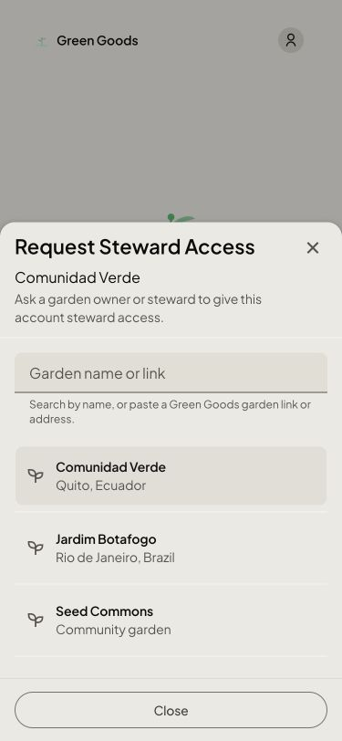
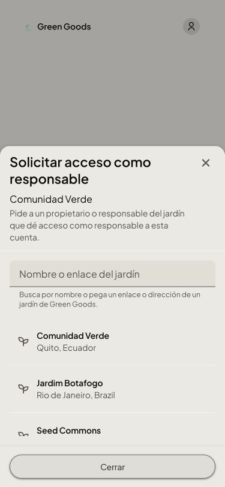
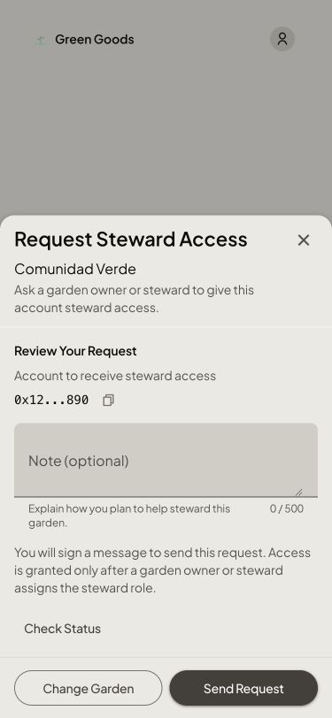
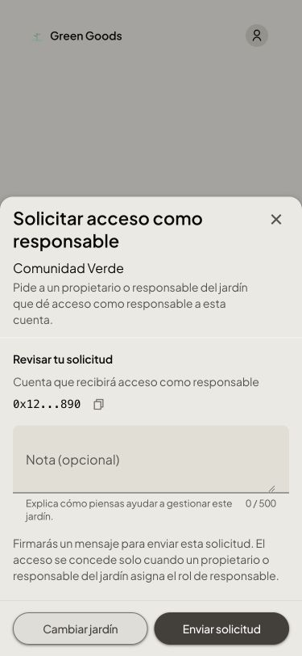
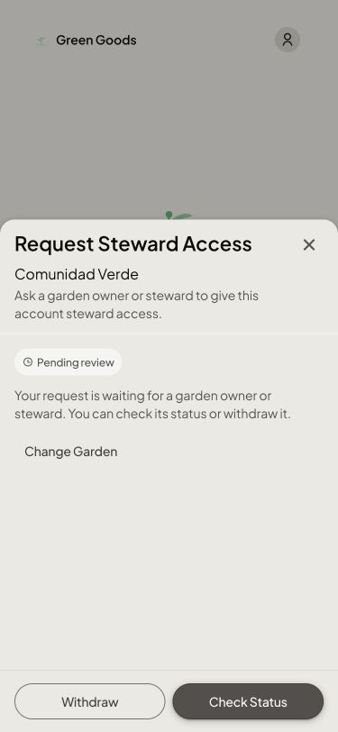
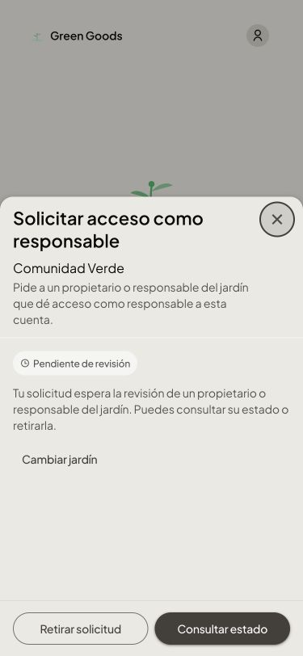

# Steward access design references

Engine/session: **Brave · Storybook**, October 8, 2026. Synthetic fixture data.
These images show the implemented tall mobile sheet; they do not prove authenticated beta behavior.

| State | English | Español |
|---|---|---|
| Choose a Garden |  |  |
| Review |  |  |
| Pending |  |  |

All three states retain the same sheet height. Review content scrolls when needed; footer actions remain visible. Buttons stay on one line in the prepared English and Spanish examples.
