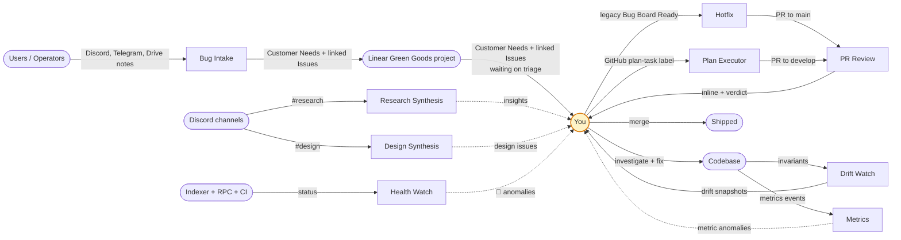
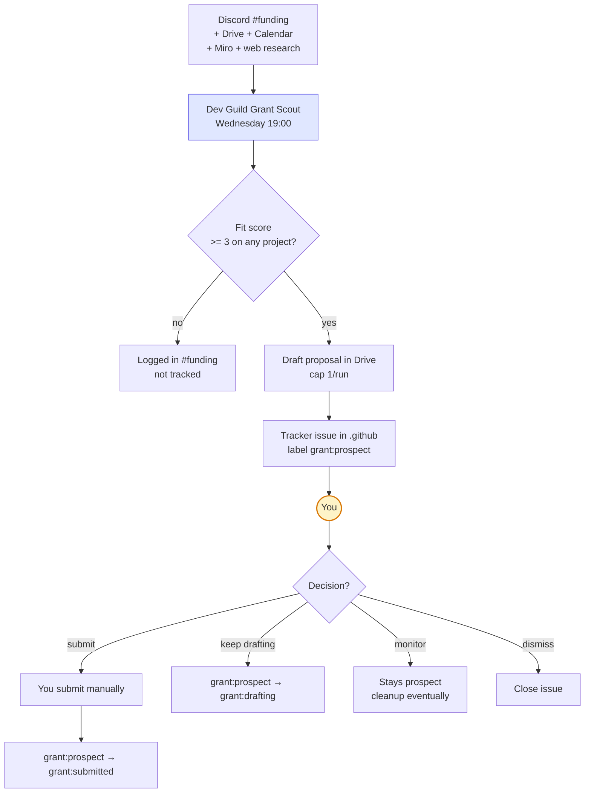

# Routine Workflows & Human-in-the-Loop

Where you (Afo) plug into the routine system. Routines do the inventory; you make the decisions.

## HITL touchpoints — at a glance

| Routine | Your action | Trigger / signal | Frequency |
|---|---|---|---|
| **Green Goods Bug Intake** | Review Customer Needs in Linear and decide whether a linked Issue should exist; linked Issues stay in `Backlog`/`Todo` until a later dispatch pass | @mention when unlinked/unreviewed Customer Needs plus linked Issues needing triage exceed 3, or on Linear setup failure | ~5 min/day |
| **Green Goods Hotfix** | Review + merge PR to `main` | @mention on PR open + CI green/red | ~10 min when fired (most runs fire zero — the legacy GitHub queue is exception-only) |
| **Green Goods Plan Executor** | Apply `plan-task` label to dispatch GitHub issues; Linear `Ready` + `automation:claude` is documented but not active yet | Daily summary in `#product` | ~10 min/day |
| | Review + merge PRs to `develop` | (PR Review comments inline) | per PR |
| **Green Goods Health Watch** | Investigate real anomalies across indexer, 8-lane CI, and contracts | @mention only on 🔴 | rare |
| **Green Goods Drift Watch** | Read package snapshots → label `plan-task` on items worth fixing | Sunday morning Discord summary | ~45 min/week |
| **Green Goods Metrics** | Review + merge weekly digest PR; investigate metric anomalies | @mention on anomaly | ~15 min/week |
| **Green Goods PR Review** | Read inline review comments; address invariant violations | inline on PR | per PR |
| **Dev Guild Daily Synthesis** | Read lead-council digest (optional) | private `#lead-council` | optional |
| **Dev Guild Grant Scout** | Decide submit / draft-more / monitor / dismiss; manually submit if going | weekly Drive drafts + `#funding` | ~20 min/week |
| **Dev Guild Product Dev Synthesis** | Read private memo (optional) | private Drive | optional |
| **Dev Guild Weekly Check-In** | Read Sunday check-in to inform Monday priorities | private Drive + `#lead-council` | ~20 min/week |
| **Dev Guild Research Synthesis** | Read synthesis; promote insights via `plan-task` label | @mention when action maps to GG | ~10 min/week |
| **Dev Guild Design Synthesis** | Read synthesis; label items `plan-task` for implementation | @mention when action maps to GG | ~10 min/week |
| **Dev Guild Routine Cleanup** | Audit cleanup if many closures (rare); reopen any false closure | @mention if > 10 closures or risky | rare |
| **Dev Guild Routine Self-Audit** | Review meta report; adjust caps/scope on flagged routines | @mention only when flagged | ~10 min/week |
| **/dream-on** (local skill) | Invoke manually when overnight reflection useful; read morning brief | n/a — you trigger it | optional |

**Total weekly HITL load**: ~5 hours of routine-driven coordination. Everything else is your build time.

## Gating signals — where you control the flow

Signals you control move work through the system. In this pass, Linear is the intake and triage surface for user-reported signals, while GitHub remains the active implementation dispatch surface. Linear `Ready` + an `automation:*` label is documented for the later implementer migration but not active yet.

| Signal | What it does | Applied where |
|---|---|---|
| **Linear Customer Need → linked Issue in `Backlog`/`Todo`** | Records the actionable subset of user-reported intake for human review; future dispatch uses this Issue | Linear `Green Goods` project |
| **Future: linked Issue → `Ready` + `automation:claude` / `automation:codex`** | Later migration path for Claude/Codex implementers, not active in this pass | Linear `Green Goods` project, on the linked Issue |
| **Bug Board #18 `Ready` column** | Releases legacy GitHub bug to Hotfix → PR to `main` (expected to stay near-empty because bug-intake no longer writes there) | Drag bug card on board (legacy) |
| **GitHub `plan-task` label** | Releases routine-generated GitHub issue to Plan Executor → PR to `develop` | Apply label on any GitHub issue |
| **Grant lifecycle labels** | Promotes grant from prospect → drafting → submitted | Apply after manual submit |
| **Remove `agent:assigned:claude` (GitHub)** | Releases GitHub issue back into dispatch pool (retry) | Remove label to re-dispatch |
| **Future: move Linear Issue back to `Ready`** | Later retry mechanism after Linear dispatch is enabled | Linear `Green Goods` project, on the Issue |

Without these signals, routines write evidence and stop. They never auto-merge, never auto-submit, never auto-promote without a human signal.

## Actions vs routines

GitHub Actions are now the deterministic execution layer: `contracts.yml`, `indexer.yml`, `shared.yml`, `client.yml`, `admin.yml`, `agent.yml`, `design.yml`, and `docs.yml`. Package tests/builds, CodeQL, focused Playwright projects, Storybook/design checks, docs deploys, trusted contract fork readiness, and Lighthouse advisories live there. Client/admin source-map processing runs inside the Vercel deploy build so the uploaded maps match the published bundle.

Judgment-heavy work lives outside Actions: Claude routines cover PR review, weekly engineering pulse (drift + ops + anomalies), health triage, hotfixes (on-demand), and issue execution; Copilot automatic review and GitHub native review provide additional PR perspectives. Removed meta workflows such as product sync, guidance checks, source-structure review, test-quality review, mutation reliability review, and contracts security review should re-enter through `engineering-pulse`, `pr-review`, `health-watch`, or an explicit `plan-task`, not as new standalone Actions.

---

## Diagrams

### Overview — all pipelines



### Bug pipeline — user report → Linear → fix on main

```mermaid
flowchart LR
    U[User reports bug or idea<br/>Discord / Telegram / Drive]
    U --> BI[Green Goods Bug Intake<br/>daily 04:00 weekday]
    BI -->|every validated signal| CN[Linear Customer Need<br/>project/customer/request context<br/>no workflow status]
    BI -->|actionable subset only| LI[Linear Issue<br/>status: Backlog or Todo<br/>label: work:polish + area:*]
    CN -.->|relates to| LI
    BI -.->|@mention if<br/>un-triaged > 3<br/>OR setup failure| AFO1((You))

    AFO1 -->|review Customer Need<br/>decide if Issue is worth doing| DEC{Worth shipping?}
    DEC -->|yes — create/review actionable work| TRIAGE[Linked Issue remains<br/>Backlog or Todo]
    TRIAGE -.->|later implementer migration| DISPATCH[Future: Ready<br/>+ automation:*]
    DEC -->|stays as feedback| KEEP[Customer Need remains<br/>feedback context]

    DISPATCH -.->|future Linear pickup| HF[Green Goods Hotfix<br/>10:00 + 16:00 weekday]
    DISPATCH -.->|future Linear pickup| PE[Plan Executor<br/>06:30 weekday]
    DISPATCH -.->|future Codex pickup| CDX[Codex implementer]

    HF -->|cap 2/run<br/>opens PR| PR[PR to main]
    PR --> PRR[PR Review<br/>inline]
    HF -.->|@mention on PR open<br/>and CI green/red| AFO2((You))
    AFO2 -->|merge| Main[main]
    Main --> HF2[Hotfix backport check]
    HF2 -->|follow-up PR| BPR[Backport PR to develop]
    BPR --> AFO3((You))
    AFO3 -->|merge| Dev[develop]
    PR -.->|Linear GitHub integration<br/>flips Issue → In Review<br/>then Done on merge| LI
    
    classDef human fill:#fef3c7,stroke:#d97706,stroke-width:2px
    classDef routine fill:#e0e7ff,stroke:#4f46e5
    classDef linear fill:#e0f2fe,stroke:#0284c7
    class AFO1,AFO2,AFO3 human
    class BI,HF,HF2,PRR,PE routine
    class CN,LI,READY,READYC linear
```

### Plan pipeline — labeled issue → fix on develop

```mermaid
flowchart LR
    SRC[Issue source]
    SRC -->|drift snapshot| DI[Drift issue]
    SRC -->|research insight| RI[research:insight issue]
    SRC -->|design feedback| DESI[Design issue]
    SRC -->|filed manually| MI[Manual issue]
    
    DI --> AFO1((You))
    RI --> AFO1
    DESI --> AFO1
    MI --> AFO1
    
    AFO1 -->|apply plan-task| LBL[Issue with<br/>plan-task label]
    LBL --> PE[Green Goods Plan Executor<br/>06:30 weekday]
    PE -->|cap 4/run, max 5/bundle| DEVPR[Bundled PR to develop]
    PE -.->|@mention only on<br/>aborts/blockers| AFO2((You))
    DEVPR --> PRR[PR Review<br/>inline]
    PRR --> AFO3((You))
    AFO3 -->|merge| Dev[develop]
    
    classDef human fill:#fef3c7,stroke:#d97706,stroke-width:2px
    classDef routine fill:#e0e7ff,stroke:#4f46e5
    class AFO1,AFO2,AFO3 human
    class PE,PRR routine
```

### Drift pipeline — weekly snapshot → curated work

```mermaid
flowchart TD
    Code[CLAUDE.md invariants<br/>+ codebase]
    DW[Green Goods Drift Watch<br/>Sunday 02:00]
    Code --> DW
    DW -->|one rolling issue per package| DS[5 drift snapshots<br/>client / admin / shared / contracts / indexer]
    DW -.->|@mention if escalated| AFO1((You))
    DS --> AFO2((You))
    AFO2 -->|read snapshot| DEC{Worth fixing?}
    DEC -->|yes| LBL[Apply plan-task label]
    DEC -->|no, accept drift| KEEP[Snapshot stays open<br/>refreshed next week]
    DEC -->|no longer relevant| CLOSE[Manually close<br/>fresh snapshot next week]
    LBL --> PE[Plan Executor pipeline]
    
    classDef human fill:#fef3c7,stroke:#d97706,stroke-width:2px
    classDef routine fill:#e0e7ff,stroke:#4f46e5
    class AFO1,AFO2 human
    class DW PE routine
```

### Health pipeline — production status → maybe an issue

```mermaid
flowchart LR
    HW[Green Goods Health Watch<br/>weekday 07:30]
    Indexer[Envio indexer]
    RPC[Arbitrum RPC]
    CI[GitHub CI]
    
    Indexer --> HW
    RPC --> HW
    CI --> HW
    
    HW --> CHK{All 🟢?}
    CHK -->|yes| GREEN[Discord #product<br/>green summary, no issue]
    CHK -->|🟡 informational| YELLOW[Discord summary<br/>no @mention, no issue]
    CHK -->|🔴 real anomaly| ISSUE[health:* issue<br/>with Sprints field]
    HW -.->|@mention on 🔴| AFO((You))
    AFO -->|investigate + fix| Resolved[Underlying cause resolved]
    Resolved -->|next run sees recovery| HW
    HW -->|3 consecutive 🟢 runs| AC[Auto-close issue<br/>with recovery comment]
    
    classDef human fill:#fef3c7,stroke:#d97706,stroke-width:2px
    classDef routine fill:#e0e7ff,stroke:#4f46e5
    class AFO human
    class HW routine
```

### Synthesis pipelines — Discord channel → curated actions

```mermaid
flowchart LR
    Channel[Discord<br/>#research or #design]
    Channel --> SR[Synthesis Routine<br/>Friday 17:00 / 18:00]
    SR -->|themes + concrete actions| Post[Discord post<br/>back to channel]
    SR -.->|optional, cap 3/run| Issues[research:insight<br/>or design issues]
    SR -.->|@mention if action<br/>maps to GG active work| AFO1((You))
    AFO1 --> READ[Read synthesis]
    READ --> DEC{Action worth taking?}
    DEC -->|yes, on GG| PROMOTE[Apply plan-task label<br/>on related issue]
    DEC -->|yes, on other project| MENTION[Surface to project owner]
    DEC -->|no| ARCHIVE[Insight stays in synthesis<br/>cleanup eventually]
    PROMOTE --> PE[Plan Executor pipeline]
    
    classDef human fill:#fef3c7,stroke:#d97706,stroke-width:2px
    classDef routine fill:#e0e7ff,stroke:#4f46e5
    class AFO1 human
    class SR routine
```

### Grant pipeline — discovery → submission



### Meta hygiene — keeping the system honest

```mermaid
flowchart TD
    Issues[All automated/claude issues<br/>across 6 active repos]
    RC[Dev Guild Routine Cleanup<br/>Friday 22:00]
    Issues --> RC
    RC -->|Rule 1: PR merged| C1[Close: already fixed]
    RC -->|Rule 2: health recovered| C2[Close: recovered]
    RC -->|Rule 3: stale > 30d| C3[Close: stale]
    RC -->|Rule 4: superseded snapshot| C4[Close: superseded]
    RC -.->|@mention if<br/>> 10 closures| AFO1((You))
    
    Routines[Last week's<br/>routine output]
    RSA[Dev Guild Routine Self-Audit<br/>Sunday 23:00]
    Routines --> RSA
    RSA -->|per-routine: ran/output/conversion| Report[Meta report<br/>Discord #engineering]
    RSA -.->|@mention if silent routine<br/>or low conversion| AFO2((You))
    Report --> AFO2
    AFO2 --> ADJ[Adjust cron/cap/scope<br/>if flagged]
    
    classDef human fill:#fef3c7,stroke:#d97706,stroke-width:2px
    classDef routine fill:#e0e7ff,stroke:#4f46e5
    class AFO1,AFO2 human
    class RC,RSA routine
```

---

## Notification surfaces — where the @mentions land

All routines @mention you via `<@${DISCORD_USER_ID_AFO}>` only when your action is required. Daily and weekly heartbeats with no anomalies fire silently.

| Channel | When you'll get pinged |
|---|---|
| `#product` | Bug intake (queue > 3); Hotfix (PR open + CI); Plan executor (aborts only); Health watch (🔴); Metrics (anomaly) |
| `#engineering` | Drift watch (escalated); Routine cleanup (>10 closures); Routine self-audit (flagged routine) |
| `#research` | Research synthesis (action maps to GG) |
| `#design` | Design synthesis (action maps to GG) |
| `#funding` | (read-only — you check on Wed evening for grant drafts) |
| `#community` | (read-only — daily/weekly guild pulse, no @mentions) |
| `#lead-council` | (read-only — private guild ops digests) |
| inline on PR | PR review comments + summary verdict |

The pattern: **you're either being asked to triage / decide / merge, or you're not being asked at all.** Most days, most channels stay quiet.
