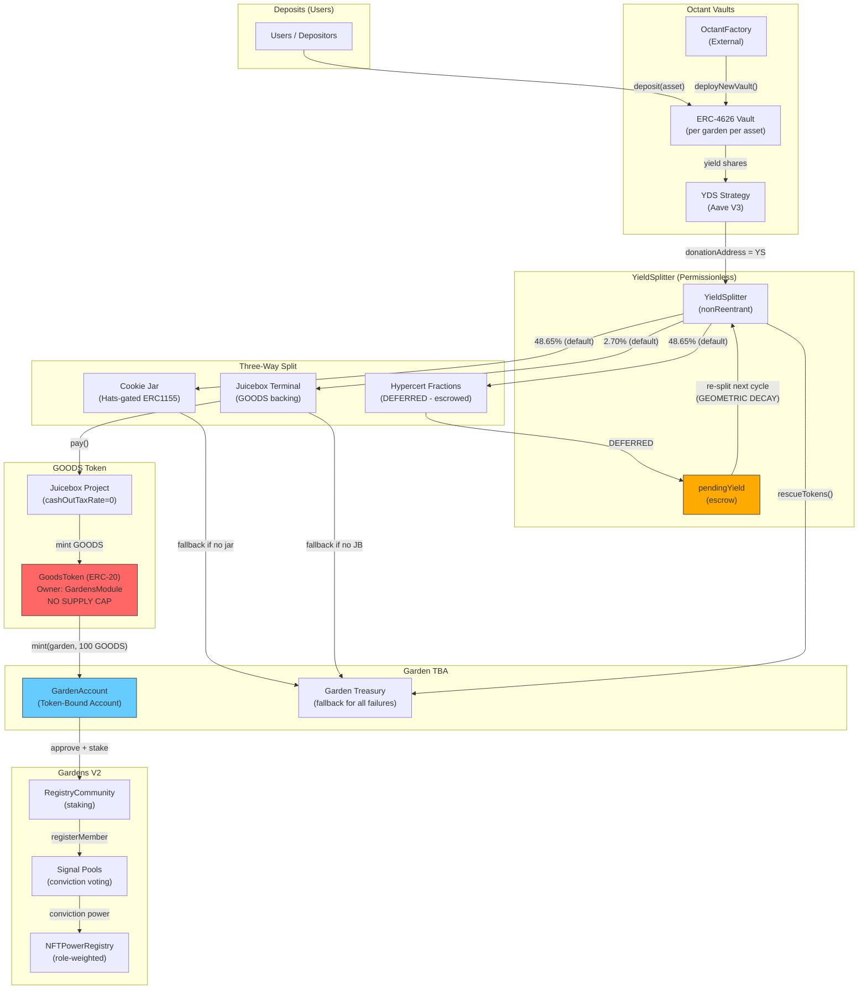
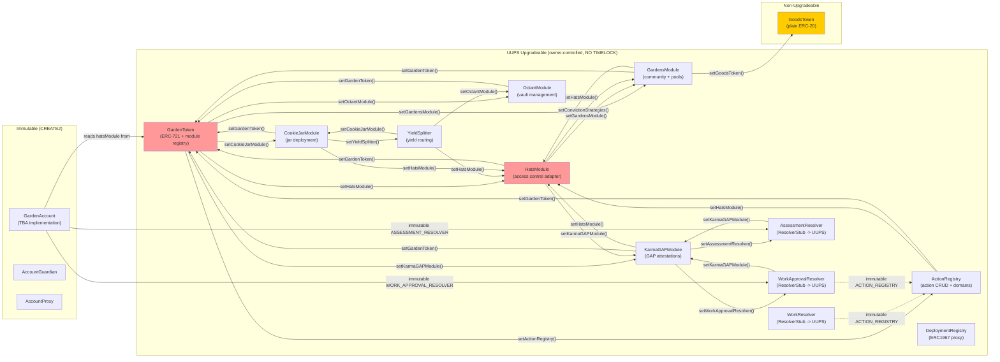

# Green Goods Contract Integration Security Review

**Date:** 2026-02-15
**Scope:** All smart contract integrations across 4 review lanes
**Branch:** `feature/action-domains`
**Methodology:** Adversarial 4-lane parallel review with cross-integration synthesis

---

## Executive Summary

| Severity | Count |
|----------|-------|
| **Critical** | 3 |
| **High** | 19 |
| **Medium** | 38 |
| **Low** | 27 |
| **Informational** | 17 |
| **Total** | 104 |
| **Cross-Integration Issues** | 12 |

**Overall Verdict: CONDITIONAL PASS** -- The protocol can deploy to testnet but MUST NOT go to mainnet without addressing all Critical and High findings. The dominant risk is the single-owner key controlling all UUPS upgrades with no timelock, creating a catastrophic single point of failure. The second systemic risk is HatsModule as the sole access control backend for the entire protocol with no fallback.

### Top 5 Priority Fixes

1. **[CRITICAL] JSON injection in GAPJsonBuilder** -- Exploitable backslash bypass in `escapeJSON()` corrupts Karma GAP attestation data (K12)
2. **[CRITICAL] GoodsToken has no supply cap** -- Unlimited minting enables governance inflation attack (G-1)
3. **[CRITICAL] HatsModule revert blocks ALL garden creation** -- `createGardenHatTree()` not wrapped in try/catch (GT1)
4. **[HIGH] Operator self-approval** -- No check that `attester != workSubmitter` in WorkApprovalResolver (WA1)
5. **[HIGH] NFT transfer gives full TBA control** -- No transfer hook, freeze, or settlement period on garden NFTs (GA1/C-2)

---

## Per-Integration Findings

### 1. Octant Vault Integration

| ID | Severity | Finding | File:Line |
|----|----------|---------|-----------|
| O-1 | High | Strategy attachment via `add_strategy()` silently fails (try/catch at line 337), but `vaultStrategies[vault]` is still set at line 338. Subsequent `harvest()` calls `strategy.report()` on an unattached strategy, causing silent failures or reverts. | `src/modules/Octant.sol:337-338` |
| O-2 | High | `setDonationAddress()` iterates `supportedAssetList` and silently swallows per-strategy failures via try/catch (line 231). Module-level donation address updates but individual strategy addresses may diverge. | `src/modules/Octant.sol:222-232` |
| O-3 | Medium | `emergencyPause()` only calls `strategy.shutdown()` (line 199), not vault shutdown. The vault remains operational for deposits/withdrawals. Name is misleading. | `src/modules/Octant.sol:193-206` |
| O-4 | Medium | `setOctantFactory()` accepts `address(0)` (no zero-check at line 262-265), unlike `setGardenToken()` which has one. A zero factory causes `FactoryNotConfigured` reverts on next vault creation. | `src/modules/Octant.sol:262-266` |
| O-5 | Medium | `supportedAssetList` grows monotonically via `setSupportedAsset()`. Deactivated assets (strategy set to zero) remain in the array. No compaction mechanism. Gas risk in `onGardenMinted()` and `setDonationAddress()` loops. | `src/modules/Octant.sol:281-301` |
| O-6 | Low | Storage gap is 40 (line 66). With 8 storage variables (slots 1-8), total is 48, not the standard 50. Two slots short. | `src/modules/Octant.sol:66` |
| O-7 | Low | `onGardenMinted()` failure in `_createVaultForGardenAsset()` emits no event -- the try/catch in GardenToken (line 302) catches silently. Indexer cannot detect partial vault creation failure. | `src/tokens/Garden.sol:301-308` |
| O-8 | Info | `onlyGardenOperatorOrOwner` modifier uses try/catch for access control checks (lines 87-93). This is intentional for backend-agnostic design but means a reverting access control contract grants no access (safe default). | `src/modules/Octant.sol:77-99` |

### 2. Cookie Jar Integration

| ID | Severity | Finding | File:Line |
|----|----------|---------|-----------|
| C-1 | High | Operator hat ID resolved at jar creation time via `hatsModule.getGardenHatIds()` (line 188). If the hat tree is not yet configured (e.g., `createGardenHatTree()` failed but module callback still ran), `operatorHatId=0`. A `tokenId=0` in ERC1155 access config means the jar is effectively ungated. | `src/modules/CookieJar.sol:186-228` |
| C-2 | High | Jar owner is the garden TBA (line 196). Garden NFT transfer gives the new holder TBA control, including full control over all Cookie Jars via `emergencyWithdrawalEnabled: true` (line 202). No transfer hook or settlement period exists. | `src/modules/CookieJar.sol:195-202` |
| C-3 | Medium | Hat ID is baked into the jar at creation time (line 224). If Hats Protocol hat tree is rotated (e.g., via `configureGarden()`), the old jar still gates on the old hat ID. New operators cannot access existing jars. | `src/modules/CookieJar.sol:220-228` |
| C-4 | Medium | `addSupportedAsset()` (line 172-175) has no duplicate check. Pushing the same asset twice causes duplicate jar creation attempts (though `gardenJars` mapping prevents actual duplication). No `removeSupportedAsset()` exists. | `src/modules/CookieJar.sol:172-175` |
| C-5 | Medium | `setCookieJarFactory()` allows owner to swap factory with no validation beyond zero-check (line 167). A malicious factory could deploy backdoored jars for all future gardens. | `src/modules/CookieJar.sol:166-169` |
| C-6 | Low | Hats Protocol address hardcoded to `0x3bc1A0Ad72417f2d411118085256fC53CBdDd137` (line 192). Correct for all current chains but not future-proof. | `src/modules/CookieJar.sol:192` |
| C-7 | Low | Jars created with `feePercentageOnDeposit: 0` (line 208). Post-creation fee change capability depends on external CookieJarFactory implementation. | `src/modules/CookieJar.sol:208` |
| C-8 | Info | No `ReentrancyGuard` on CookieJarModule. External call to `cookieJarFactory.createCookieJar()` (line 234) could theoretically re-enter, but `onlyGardenToken` modifier limits callers. | `src/modules/CookieJar.sol:234` |

### 3. Juicebox / GOODS Token Integration

| ID | Severity | Finding | File:Line |
|----|----------|---------|-----------|
| G-1 | **Critical** | `GoodsToken` has no supply cap. `mint()` is `onlyOwner` with no maximum (line 26-28). If GardensModule becomes owner (required for treasury seeding at line 187), any compromise of GardensModule enables unlimited minting. Governance inflation attack vector. | `src/tokens/GoodsToken.sol:26-28` |
| G-2 | High | GOODS is a freely transferable ERC-20 with `ERC20Burnable`. Cross-garden concentration is possible. If backed by Juicebox with `cashOutTaxRate=0`, bank runs can drain the treasury. | `src/tokens/GoodsToken.sol:12` |
| G-3 | High | Juicebox project config (from `juicebox-project.json`) uses `allowOwnerMinting: true`, `duration: 0` (perpetual ruleset), `reservedPercent: 10%` but `splitGroups` is empty. Reserved tokens go nowhere. | `config/juicebox-project.json` |
| G-4 | Medium | GOODS token is global (one per deployment), not per-garden. Cross-garden voting power concentration allows a whale in one garden to dominate conviction voting in another garden's signal pools. | `src/tokens/GoodsToken.sol` (design) |
| G-5 | Medium | Uses `Ownable` (not `Ownable2Step`). `renounceOwnership()` is accessible. Accidental renunciation permanently disables minting. | `src/tokens/GoodsToken.sol:12` |
| G-6 | Low | GoodsToken is non-upgradeable. Any fix requires deploying a new token and migrating all balances/approvals. | `src/tokens/GoodsToken.sol` (design) |
| G-7 | Info | Constructor mints `_initialSupply` to owner (line 20). Default in deployment is 100k GOODS. Pre-mint goes to deployer, not a vesting contract. | `src/tokens/GoodsToken.sol:20` |

### 4. YieldSplitter Integration

| ID | Severity | Finding | File:Line |
|----|----------|---------|-----------|
| Y-1 | **Critical** | `_routeToFractions()` escrows the fractions portion into `pendingYield` (line 477). On the next `splitYield()` call, `_redeemAndAccumulate()` adds `pendingYield` to the total (line 246), which is then re-split across all three destinations. The fractions portion is geometrically decayed each cycle: retained = totalYield * (fractionsBps/10000)^N. At default 48.65% fractions, only ~4% remains after 5 cycles. The NatSpec at line 461-462 says "This prevents geometric decay" but the code at line 477 causes it. **UPDATE**: Code inspection confirms `_routeToFractions` at line 472-478 escrows to `pendingYield`, and `_redeemAndAccumulate` at line 246 adds `pendingYield`. The decay occurs because `splitYield()` clears `pendingYield[garden][asset]` at line 220 BEFORE routing, but `_routeToFractions` adds back to it at line 477. The next call re-splits the escrowed amount. | `src/yield/YieldSplitter.sol:246,472-478` |
| Y-2 | High | `splitYield()` is fully permissionless (line 202, no access control beyond `nonReentrant`). Anyone can trigger splits at any time. Front-running, timing manipulation, and grief attacks are possible. An attacker can call `splitYield()` repeatedly to accelerate geometric decay of the fractions portion. | `src/yield/YieldSplitter.sol:202` |
| Y-3 | High | `registerShares()` validates `newTotal > actualBalance` (line 335), but `actualBalance` is the contract's total vault balance across ALL gardens. Two gardens sharing the same vault can register up to the full balance each. First to call `splitYield()` redeems all shares, leaving the second garden with zero redeemable. | `src/yield/YieldSplitter.sol:327-338` |
| Y-4 | Medium | When neither `gardenCookieJars[garden]` nor `gardenTreasuries[garden]` is configured, `_routeToCookieJar()` emits `YieldStranded` (line 444) but tokens remain in the contract. `rescueTokens()` is `onlyOwner` with no restriction on destination. | `src/yield/YieldSplitter.sol:437-445,390-394` |
| Y-5 | Medium | `_recompound()` calls `forceApprove(vault, amount)` at line 491. On success, the approval is consumed by `deposit()`. On failure, the catch block resets to 0 (line 499). But `_purchaseFraction()` also uses `forceApprove` (line 526) and on failure resets (line 534). Both are correct individually, but if `_routeToFractions` is implemented to call both `_purchaseFraction` and `_recompound`, residual approvals could accumulate. | `src/yield/YieldSplitter.sol:491,499,526,534` |
| Y-6 | Medium | `minYieldThreshold` is in raw token units (line 116-119). A single threshold for all assets means $7 equivalent for DAI but ~$21,000 for WETH at current prices. Per-asset thresholds are not supported. | `src/yield/YieldSplitter.sol:115-119` |
| Y-7 | Low | `setGardenVault()` (line 315-317) does not validate that the vault's underlying asset matches the `asset` parameter. Mismatched vault-asset pairs cause silent failures during `splitYield()`. | `src/yield/YieldSplitter.sol:315-317` |
| Y-8 | Low | Storage gap is correct: 14 vars + 36 gap = 50 slots (line 156). | `src/yield/YieldSplitter.sol:150-156` |

### 5. Hats Protocol Integration

| ID | Severity | Finding | File:Line |
|----|----------|---------|-----------|
| H-1 | High | `_revokeRole()` does NOT cascade revocation to sub-roles (lines 668-692). Revoking an Operator leaves Evaluator and Gardener hats intact. This is asymmetric with `_grantRole()` which cascades grants (lines 641-649). A revoked operator retains evaluator and gardener permissions and conviction voting power for those roles. | `src/modules/Hats.sol:668-692` |
| H-2 | High | `_requireOwnerOrOperator()` authorizes `gardensModule` (line 627) for ALL gated functions: `grantRole`, `revokeRole`, `setConvictionStrategies`, etc. A compromised GardensModule can grant/revoke arbitrary roles across all gardens. | `src/modules/Hats.sol:623-631` |
| H-3 | High | `configureGarden()` allows `msg.sender == garden` (line 476) to remap hat IDs. A compromised garden TBA can self-escalate by remapping its own hat IDs to hats it controls. | `src/modules/Hats.sol:465-502` |
| H-4 | Medium | All 6 role hats are created as flat siblings under the admin hat (lines 380-391), not as a hierarchical tree. Hats Protocol's native hierarchy is not used; hierarchy is enforced purely in application logic (`_grantRole` cascading). | `src/modules/Hats.sol:380-391` |
| H-5 | Medium | Burn addresses from `_revokeRole()` (line 679) count against `maxSupply` (set to `type(uint32).max`). Each revocation creates a new wearer. At scale, theoretical exhaustion of 4.29B max supply. | `src/modules/Hats.sol:678-681` |
| H-6 | Medium | Owner grant cascades: Owner->Operator->Evaluator->Gardener (line 648, then recursive). But direct Operator grant only cascades Evaluator+Gardener (lines 641-644). Evaluator is NOT cascaded from Owner->Operator explicitly -- it relies on recursive `_grantSubRole` for Operator which then grants Evaluator+Gardener. This works but the logic is non-obvious. | `src/modules/Hats.sol:641-649,652-666` |
| H-7 | Medium | `_syncConvictionPower()` is called on revoke (line 691) but NOT on grant. New role grants do not update conviction power in strategies. | `src/modules/Hats.sol:691` vs `633-649` |
| H-8 | Low | `_configureEligibilityModules()` catch blocks reuse `funderModule = address(0)` variable (line 773) which is then checked at line 776. Fragile but correct. | `src/modules/Hats.sol:763-803` |
| H-9 | Low | On unsupported chains, `HatsLib.isSupported()` returns false (line 229). Initialization silently skips protocol hat IDs. Manual `setProtocolHatIds()` required, but no warning is emitted. | `src/modules/Hats.sol:229-233` |
| H-10 | Low | `setEligibilityModules()` allows zero addresses (line 547). This is intentional (disables eligibility modules) but inconsistent with other setters that reject zero. | `src/modules/Hats.sol:546-550` |
| H-11 | Info | All eligibility modules are `address(0)` by default if `HatsLib` returns zero. No constraints on hat wearers until configured. | `src/modules/Hats.sol:224-226` |
| H-12 | Info | Unit tests (`test/unit/HatsModule.t.sol`) use `MockHats`, not the actual Hats Protocol contract. Integration gaps exist for real Hats behavior (e.g., hat supply limits, eligibility modules). | `test/helpers/MockHatsModule.sol` |

### 6. Gardens Conviction Voting Integration

| ID | Severity | Finding | File:Line |
|----|----------|---------|-----------|
| GM-1 | High | `IGoodsToken(goodsToken).mint(garden, treasuryAmount)` at line 187 requires GardensModule to be the GOODS token owner. But `GoodsToken` uses single `Ownable` -- transferring ownership to GardensModule means the deployer loses mint authority. The ownership model is incompatible with multi-caller minting. | `src/modules/Gardens.sol:184-191` + `src/tokens/GoodsToken.sol:26` |
| GM-2 | Medium | `resetGardenInitialization()` (line 327-334) deletes `gardenWeightSchemes[garden]`. On re-initialization via `onGardenMinted()`, the weight scheme can be changed. This breaks the documented immutability of weight schemes per garden. | `src/modules/Gardens.sol:327-334` |
| GM-3 | Medium | Power registry uses only 3 of 6 roles (operator, gardener, community) at lines 395-398. Owners, evaluators, and funders have zero conviction voting power. An Owner who is not explicitly granted the Operator hat has no voting power. | `src/modules/Gardens.sol:382-398` |
| GM-4 | Medium | `_createCommunity()` calls external `registryFactory.createRegistryCommunity()` (line 434). `_createPool()` calls `IRegistryCommunity(community).createPool()` (line 519). Both are wrapped in try/catch, but the GardensModule has `nonReentrant` only on `onGardenMinted`. Admin setters (lines 285-323) are unprotected against reentrancy via factory callbacks. | `src/modules/Gardens.sol:434,519` |
| GM-5 | Medium | `setConvictionStrategies()` in HatsModule (line 567) is gated by `_requireOwnerOrOperator()` which authorizes `gardensModule` (line 627). GardensModule can register strategies for ANY garden it chooses. | `src/modules/Hats.sol:567,627` |
| GM-6 | Low | `stakeAmountPerMember` can be set to 0 via `setStakeAmountPerMember()` (line 321-323). Zero-staking communities provide no Sybil resistance. | `src/modules/Gardens.sol:321-323` |
| GM-7 | Low | Community creation uses hardcoded parameters: `communityFee: 0`, `isKickEnabled: false`, `covenantIpfsHash: ""` (lines 425-431). No operator customization possible. | `src/modules/Gardens.sol:422-431` |
| GM-8 | Low | Conviction parameters are hardcoded: `minThresholdPoints: 2_500_000` (25% of D=10M) at line 55. This may be too high for small gardens (fewer than 4 operators with Power scheme cannot pass any signals). | `src/modules/Gardens.sol:52-56` |
| GM-9 | Info | Storage gap correct: 12 vars + 38 gap = 50 slots (line 103). | `src/modules/Gardens.sol:101-103` |

### 7. Karma GAP Integration

| ID | Severity | Finding | File:Line |
|----|----------|---------|-----------|
| K-1 | High | Orphaned project on partial creation failure. Steps 2 (MemberOf) and 3 (Details) fail silently via try/catch (lines 211,234). But `gardenProjects[garden]` is already set at line 196. `ProjectAlreadyExists` (line 170) blocks re-creation forever. The garden has a project UID but no details or members. | `src/modules/Karma.sol:188-243` |
| K-2 | High | `addProjectAdmin()` is `onlyAuthorized` (line 246), which includes `hatsModule` (line 108). When `_grantRole()` cascades to Operator, `_syncProjectAdmin()` calls `addProjectAdmin()` (line 698). The function does not verify the admin is actually a garden operator -- any authorized caller can add arbitrary GAP admins. | `src/modules/Karma.sol:246-256` + `src/modules/Hats.sol:694-702` |
| K-3 | Medium | `addProjectAdmin()` returns silently when `projectUID == bytes32(0)` (line 248). No event emitted for debugging. Same for `removeProjectAdmin()` (line 261). | `src/modules/Karma.sol:248,261` |
| K-4 | Medium | `setWorkApprovalResolver()` and `setAssessmentResolver()` accept `address(0)` (lines 128-136). Setting either to zero disables the corresponding `only*Resolver` modifier gate, but the zero address cannot actually call the function, so this effectively disables the feature. | `src/modules/Karma.sol:128-136` |
| K-5 | Medium | Project attestation uses `revocable: true` (line 181) but impact/milestone attestations use `revocable: false` (lines 304,354). Revoking a project does not revoke its impacts/milestones. | `src/modules/Karma.sol:181,304,354` |
| K-6 | Low | No string length limits on `name`, `description`, `location`, `bannerImage` parameters in `createProject()` (lines 151-157). Gas griefing via huge strings. | `src/modules/Karma.sol:150-161` |
| K-7 | Low | UUPS upgrade has no timelock (line 391). Instant upgrade by owner. | `src/modules/Karma.sol:391` |
| K-8 | Info | Storage gap correct: 5 vars + 45 gap = 50 slots (line 49). | `src/modules/Karma.sol:49` |
| K-9 | High | `KarmaLib.isSupported()` returns true for 7 chains (line 182-184) but `getGapContract()` only supports 3 chains (lines 121-127). On Optimism, SEI, or testnet SEI/OP-Sepolia, `isSupported()` returns true but `getGapContract()` reverts with `KarmaGAPNotSupported`. This revert is NOT wrapped in try/catch at the call site in `createProject()` (line 173) -- it will revert the entire project creation. | `src/lib/Karma.sol:121-127,181-184` |
| K-10 | Medium | All GAP addresses are hardcoded constants (lines 18-33). No update path. If Karma GAP deploys new contracts, a full KarmaLib upgrade is required. | `src/lib/Karma.sol:18-33` |
| K-11 | Low | Celo GAP contract address (line 32: `0x6dC1D6b864e8BEf815806f9e4677123496e12026`) coincides with Arbitrum PROJECT RESOLVER address (line 19). Different contracts, same address -- not a bug but a potential source of confusion. | `src/lib/Karma.sol:19,32` |
| K-12 | **Critical** | `escapeJSON()` in StringUtils only escapes double quotes (lines 15-16), NOT backslashes. Input `test\", "malicious": "data` produces `test\", "malicious": "data"` which breaks JSON structure. This is a confirmed injection vulnerability. All GAP attestation JSON payloads (project details, impacts, milestones) are vulnerable. An operator can inject arbitrary JSON fields into Karma GAP attestations by including a backslash-quote sequence in garden name, description, work title, or feedback. | `src/lib/StringUtils.sol:11-32` |
| K-13 | Medium | `GAPJsonBuilder._domainToString()` returns `"UNKNOWN"` for domain values > 3 (line 166). No revert. Invalid domain values produce valid-looking but semantically wrong JSON. | `src/lib/GAPJsonBuilder.sol:161-167` |
| K-14 | Low | `timestampToISO()` uses `_padZero(y, 4)` (line 133). For year 10000+, the 4-digit padding truncates. Edge case for timestamps far in the future. | `src/lib/StringUtils.sol:131-147` |
| K-15 | Info | `escapeJSON()` has O(n) first pass for counting, O(n) second pass for escaping = O(2n). Quadratic cost for very long strings due to memory allocation. | `src/lib/StringUtils.sol:11-32` |

### 8. EAS Resolvers (Work, WorkApproval, Assessment)

| ID | Severity | Finding | File:Line |
|----|----------|---------|-----------|
| W-1 | High | Work attestations are immutable -- `onRevoke()` returns false (line 117-120). No blacklist mechanism. Invalid or fraudulent work submissions are permanent on-chain with no recovery path except upgrading the resolver implementation. | `src/resolvers/Work.sol:117-120` |
| WA-1 | High | **Operator self-approval.** No check that `attestation.attester != workAttestation.attester` in `onAttest()`. An operator can submit work (as gardener via role hierarchy) and then approve their own work. Full self-dealing pipeline: submit -> self-approve -> self-assess. | `src/resolvers/WorkApproval.sol:93-132` |
| WA-2 | High | **Race condition.** Hat revocation and approval can occur in the same block. `isOperator()` check (line 107) passes if the approval tx is mined before the revocation tx. The approval is permanent (`onRevoke` returns false). TOCTOU inherent to blockchain -- a revoked operator's approval persists. | `src/resolvers/WorkApproval.sol:107` |
| WA-3 | Medium | GAP impact uses `action.title` (line 151), not `workSchema.title`. The impact title in Karma GAP does not match the actual work title. | `src/resolvers/WorkApproval.sol:148-151` |
| WA-4 | Medium | `isPayable()` returns true (line 72-73) but no `withdraw()` function exists. ETH sent with attestations is permanently locked in the resolver proxy. | `src/resolvers/WorkApproval.sol:72-73` |
| WA-5 | Medium | `schema.actionUID` in WorkApproval is not cross-validated against the work attestation's `actionUID`. An operator can approve work under a different action than what was originally submitted. | `src/resolvers/WorkApproval.sol:112` |
| WA-6 | Low | GAP integration failure in `_createGAPProjectImpact()` is silently swallowed (lines 158-163). No event emitted on failure. | `src/resolvers/WorkApproval.sol:158-163` |
| WA-7 | Low | Only uses `workSchema.media[0]` for proof (line 153). Additional media elements are ignored. | `src/resolvers/WorkApproval.sol:153` |
| W-2 | Medium | `action.endTime < block.timestamp` (line 101) uses strict less-than. Work submitted at exactly `endTime` is accepted. Ambiguous boundary. | `src/resolvers/Work.sol:101` |
| W-3 | Medium | Schema decode at line 72 trusts EAS data. No schema UID validation -- any schema that ABI-decodes to `WorkSchema` will pass. | `src/resolvers/Work.sol:72` |
| W-4 | Medium | `isPayable()` returns true (line 55-57) but no `withdraw()`. ETH permanently locked. Same issue as WA-4. | `src/resolvers/Work.sol:55-57` |
| W-5 | Low | No `startTime` validation. Work can be submitted before an action's `startTime`. Only `endTime` is checked (line 101). | `src/resolvers/Work.sol:96-103` |
| W-6 | Low | `ACTION_REGISTRY` is immutable (line 28). Changing the ActionRegistry requires deploying a new WorkResolver and re-registering the EAS schema. | `src/resolvers/Work.sol:28` |
| A-1 | Medium | Assessment has no reference to a specific work submission. `AssessmentSchema` contains no `workUID` field. Assessments are garden-level, not work-level. | `src/resolvers/Assessment.sol:81-114` |
| A-2 | Medium | `isPayable()` returns true (line 65-67) but no `withdraw()`. ETH permanently locked. Same issue as W-4/WA-4. | `src/resolvers/Assessment.sol:65-67` |
| A-3 | Medium | Error name `NotGardenOperator` (line 13) is semantically incorrect -- the check at lines 89-92 verifies evaluator OR operator. Should be `NotGardenEvaluatorOrOperator`. | `src/resolvers/Assessment.sol:13,89-92` |
| A-4 | Low | No date validation on `schema.startDate` and `schema.endDate`. Start can be after end. | `src/resolvers/Assessment.sol:81-114` |
| A-5 | Low | GAP milestone creation failure silently swallowed (lines 122-137). No failure event. | `src/resolvers/Assessment.sol:122-137` |
| S-1 | Medium | Resolvers do not validate schema UIDs. Any schema that ABI-decodes correctly will be accepted. A malicious attester could register a second schema pointing to the same resolver. | `src/resolvers/Work.sol:72`, `WorkApproval.sol:94`, `Assessment.sol:83` |
| S-2 | Medium | `schemas.json` specifies `revocable: false` for all schemas, but resolvers implement `onRevoke()` returning false (graceful rejection). Inconsistency between config and resolver behavior. | `config/schemas.json` vs `src/resolvers/*.sol` |
| E-1 | Medium | E2E test (`test/E2EWorkflow.t.sol`) uses `MockEAS.setAttestationByUID()` to bypass resolver validation entirely. The E2E test does not exercise actual resolver logic. | `test/E2EWorkflow.t.sol` |
| E-2 | Low | No assessment attestation in E2E flow. The full work->approval->assessment pipeline is untested end-to-end. | `test/E2EWorkflow.t.sol` |

### 9. Core Protocol (ActionRegistry, GardenToken, GardenAccount)

| ID | Severity | Finding | File:Line |
|----|----------|---------|-----------|
| GT-1 | **Critical** | `hatsModule.createGardenHatTree()` is NOT wrapped in try/catch (line 284). Any revert in HatsModule (e.g., `HatsNotConfigured`, Hats Protocol bug, gas OOG) causes the entire `mintGarden()` to revert. This is a protocol-wide DoS: if HatsModule is misconfigured, NO gardens can be created. All other module callbacks (Karma, Octant, Gardens, CookieJar) ARE wrapped in try/catch. | `src/tokens/Garden.sol:284` |
| GT-2 | High | `hatsModule.grantRole()` is also NOT wrapped in try/catch (line 287). Same DoS risk. | `src/tokens/Garden.sol:287` |
| GT-3 | Medium | All `set*Module()` functions accept `address(0)` (lines 132-171). Setting `hatsModule=address(0)` triggers `HatsModuleNotSet` revert in `mintGarden()` (line 199), blocking all future minting. Setting other modules to zero only disables their callbacks. | `src/tokens/Garden.sol:132-171,199` |
| GT-4 | Medium | No timelock on module replacement. Owner can instantly swap any module (HatsModule, OctantModule, etc.) to a malicious implementation. All gardens retroactively affected. | `src/tokens/Garden.sol:132-171` |
| GT-5 | Medium | Batch of 10 gardens costs ~7.5-8M gas. Celo block gas limit is 10M. Tight but fits. Individual mint ~800k gas. | `src/tokens/Garden.sol:221-276` |
| GT-6 | Low | `_nextTokenId` pre-incremented in batch (line 245) before minting. If any mint in the batch fails (e.g., `_safeMint` reentrancy check), the token ID counter is already advanced, leaving gaps. | `src/tokens/Garden.sol:245` |
| GT-7 | Low | `_safeMint()` has a reentrancy vector via `onERC721Received` callback. Mitigated by `onlyAuthorizedMinter` modifier limiting callers to owner or allowlisted addresses. | `src/tokens/Garden.sol:202,251` |
| GT-8 | Info | No ERC-721 transfer hook. NFT transfers silently transfer TBA control. See GA-1. | `src/tokens/Garden.sol` (design) |
| GT-9 | Low | `_validateCommunityToken()` only checks `totalSupply()` (line 371). Does not verify `decimals()`, `balanceOf()`, or `transfer()`. Non-standard tokens can pass validation. | `src/tokens/Garden.sol:357-376` |
| GT-10 | Info | `setDeploymentRegistry(address(0))` allowed (line 127-129). Setting to zero breaks the allowlist check but owner can still mint directly. | `src/tokens/Garden.sol:127-129` |
| GA-1 | High | Garden NFT transfer gives new owner full TBA control: all ETH, ERC-20 tokens, Octant vault shares, Cookie Jar ownership, GOODS tokens, and conviction voting power. No transfer hook, freeze, or settlement period exists. AccountV3Upgradable does not override `_beforeTokenTransfer`. | `src/accounts/Garden.sol:31` |
| GA-2 | Medium | `executeAutoStake()` is `external` (line 361) with only `require(msg.sender == address(this))` guard. Callable via TBA `execute()` with arbitrary parameters if the caller has TBA execution rights. | `src/accounts/Garden.sol:361-365` |
| GA-3 | Medium | No string length limits on metadata fields: `name`, `description`, `location`, `bannerImage`, `metadata` (lines 142-148). Gas griefing via huge strings in `initialize()`. | `src/accounts/Garden.sol:141-149` |
| GA-4 | Medium | `joinGarden()` (line 192) has no rate limiting. Sybil attack: create many addresses, call `joinGarden()` on each to drain GOODS treasury via `_autoRegisterInCommunity()`. | `src/accounts/Garden.sol:192-203` |
| GA-5 | Medium | `_autoRegisterInCommunity()` stakes garden treasury GOODS on behalf of joiners (lines 333-356). 100 Sybil accounts drain `100 * stakeAmountPerMember` GOODS from the garden. Default 100 GOODS treasury / 1 GOODS per member = 100 free joins before exhaustion. | `src/accounts/Garden.sol:333-356` |
| GA-6 | Low | `_isGardener()` makes 3 external calls to HatsModule (lines 311-313). Gas-expensive for frequent permission checks. | `src/accounts/Garden.sol:310-314` |
| GA-7 | Low | `_isOperatorOrOwner()` makes 2 external calls (lines 300-301). Combined with `_isGardener()`, a single access check can cost 5+ external calls. | `src/accounts/Garden.sol:299-302` |
| GA-8 | Info | Guardian address is immutable (set in constructor at line 131 via AccountV3Upgradable). Cannot be updated. | `src/accounts/Garden.sol:131` |
| GA-9 | Info | Storage gap correct: 5 inherited + 8 own + 37 gap = 50 slots (line 380). | `src/accounts/Garden.sol:367-380` |
| AR-1 | Medium | `registerAction()` does not check if `_startTime` is in the past (line 184). Immediately-expired actions are possible (register with past startTime and endTime in the future). | `src/registries/Action.sol:171-194` |
| AR-2 | Medium | No action deactivation mechanism. Once registered, actions cannot be disabled. Only `endTime` update can expire an action. | `src/registries/Action.sol` (design) |
| AR-3 | Low | `actionToOwner` always maps to `_msgSender()` which is always `owner()` due to `onlyOwner` modifier (line 182,188). The `onlyActionOwner` modifier (line 138) is redundant with `onlyOwner`. | `src/registries/Action.sol:138-143,182,188` |
| AR-4 | Low | No bounds on `_capitals` array length (line 189). Gas griefing via huge arrays. | `src/registries/Action.sol:179,189` |
| AR-5 | Low | No bounds on `_media` array length (line 189). Same gas griefing risk. | `src/registries/Action.sol:179,189` |
| AR-6 | Info | Operators can call `setGardenDomains()` with `_domainMask=0` (line 256-261), disabling all domains for a garden. Work submission to that garden will fail domain validation in WorkResolver. | `src/registries/Action.sol:256-261` |
| AR-7 | Low | Domain disable has no grace period. In-flight work submissions (already in mempool) will fail if domains are changed in the same block. | `src/registries/Action.sol:256-261` |
| AR-8 | Info | `setGardenDomainsFromMint()` does not validate garden address (line 267-272). Any address can have domains set. This is gated by `onlyGardenToken` so only GardenToken can call it. | `src/registries/Action.sol:267-272` |
| AR-9 | Info | UUPS upgrade has no timelock (line 304). | `src/registries/Action.sol:304` |
| AR-10 | Medium | `Deploy.s.sol` overrides `actions.json` timestamps during deployment. The deployment script may register actions with different timing than configured. | `script/Deploy.s.sol` + `script/deploy/actions.ts` |
| TBA-1 | Medium | `TBALib.createAccount()` chain support should match deployment targets. Verify TBALib supports all active chains (Sepolia, Arbitrum, Celo). | `src/lib/TBA.sol:22-32` |

---

## Cross-Integration Analysis

### Cascading Failure Matrix

| Failing Module | Affected Modules | State Consequence | Severity |
|----------------|------------------|-------------------|----------|
| **HatsModule** revert/misconfigured | GardenToken (mint blocked), ALL Resolvers (access checks fail), OctantModule (operator checks fail), GardensModule (conviction sync fails), CookieJarModule (hat ID lookup fails), YieldSplitter (operator checks fail), ActionRegistry (domain management fails) | **Total protocol freeze.** No gardens created, no work submitted, no approvals, no yield splits. | **Critical** |
| **GardenToken** owner compromised | HatsModule (module replacement), ALL modules (swapped to malicious), ActionRegistry (reconfigured) | **Total protocol compromise.** Owner can replace every module. All gardens retroactively affected. Every access control check, every resolver, every yield destination can be manipulated. | **Critical** |
| **OctantModule** factory reverts | GardenToken (`onGardenMinted` caught by try/catch), YieldSplitter (no vaults to split) | Garden created without vaults. No yield generated. Non-blocking but degraded. | Medium |
| **GardensModule** compromised | HatsModule (can grant/revoke roles via `_requireOwnerOrOperator` authorization), GOODS token (unlimited minting if GardensModule is owner) | Arbitrary role manipulation across all gardens. Unlimited GOODS inflation. | High |
| **KarmaGAPModule** reverts | GardenToken (project creation fails, caught by try/catch), WorkApprovalResolver (impact creation fails, caught), AssessmentResolver (milestone fails, caught) | Gardens created without GAP projects. Approvals/assessments succeed but no Karma GAP records. Non-blocking. | Low |
| **CookieJarModule** reverts | GardenToken (jar creation fails, caught), YieldSplitter (cookie jar routing falls back to treasury) | Gardens created without jars. Yield routed to treasury instead. Non-blocking. | Low |
| **YieldSplitter** misconfigured | Cookie Jars (no yield inflow), Juicebox (no GOODS backing growth), Hypercert fractions (no purchases) | Yield accumulates in YieldSplitter. Recoverable via `rescueTokens()`. | Medium |
| **ActionRegistry** compromised | WorkResolver (action validation bypassed), All gardens (domain management) | Invalid actions accepted. Domain filtering broken. Work submissions for non-existent actions possible. | Medium |
| **EAS** unavailable | All resolvers (attestations impossible), KarmaGAPModule (GAP attestations fail) | No work submissions, approvals, or assessments can be created. Protocol is read-only. | High |

### Access Control Map

| Module | Check Function | Source of Truth | Static/Dynamic | Risk |
|--------|---------------|-----------------|----------------|------|
| HatsModule | `_checkRole()` | Hats Protocol `isWearerOfHat()` | Dynamic (hat transfers) | Hat compromise = role compromise |
| GardenAccount | `_isGardener()`, `_isOwner()`, etc. | HatsModule (via GardenToken reference) | Dynamic | 3-5 external calls per check |
| OctantModule | `onlyGardenOperatorOrOwner` | GardenAccount `isOperator()`/`isOwner()` | Dynamic | try/catch swallows auth failures (safe) |
| WorkResolver | `isGardener()`/`isOperator()` | GardenAccount (attestation.recipient) | Dynamic | Trusts recipient is a garden |
| WorkApprovalResolver | `isOperator()` | GardenAccount (workAttestation.recipient) | Dynamic | No self-approval check |
| AssessmentResolver | `isEvaluator()`/`isOperator()` | GardenAccount (attestation.recipient) | Dynamic | Error name mismatch |
| ActionRegistry | `isOperatorOf()` | HatsModule (direct call) | Dynamic | Zero-address HatsModule reverts |
| YieldSplitter | `_requireOperatorOrOwner()` | HatsModule (direct call) | Dynamic | Protocol owner bypass |
| GardensModule | `isOperatorOf()` | HatsModule (direct call) | Dynamic | msg.sender == owner() bypass |
| CookieJarModule | `onlyGardenToken` | GardenToken address | Static | Single authorized caller |
| KarmaGAPModule | `onlyAuthorized` | 4 authorized addresses | Static per config | hatsModule can add arbitrary admins |

### Trust Boundary Risks

| External Dependency | Max Value at Risk | Detection Time | Recovery Path |
|---------------------|-------------------|----------------|---------------|
| **Hats Protocol** (`0x3bc1...`) | All garden access control | Immediate (role checks fail) | Deploy new HatsModule, reconfigure all gardens |
| **EAS** (chain-specific) | All attestation data | Immediate (attestations fail) | No recovery -- EAS is a hard dependency |
| **Karma GAP** (3 chains) | Reputation/impact data | Minutes (GAP operation failed events) | Disable via `setKarmaGAPModule(0)` |
| **Octant Factory** | Vault creation | Minutes (mint events without vault events) | Configure vaults manually via `createVaultForAsset()` |
| **CookieJar Factory** | Jar creation + yield routing | Minutes (mint events without jar events) | Configure jars manually via `setCookieJar()` |
| **Juicebox** | GOODS backing | Minutes (YieldStranded events) | Yield falls back to treasury |
| **Gardens V2 RegistryFactory** | Community/pool creation | Minutes (partial init events) | Retry via `retryCreateCommunity()`/`retryCreatePools()` |
| **Owner Key** (multisig) | **Entire protocol** | Variable | No recovery if compromised -- all UUPS upgrades, all module swaps |

### Reentrancy Surface

| Caller | External Call | Can Re-enter? | Guard Present? | Risk |
|--------|--------------|---------------|----------------|------|
| YieldSplitter.splitYield | IOctantVault.redeem() | Yes | nonReentrant | Low |
| YieldSplitter._routeToCookieJar | IERC20.safeTransfer() | Yes (ERC-777) | nonReentrant (inherited) | Low |
| YieldSplitter._routeToJuicebox | jbMultiTerminal.pay() | Yes | nonReentrant (inherited) | Low |
| YieldSplitter._purchaseFraction | hypercertMarketplace.buyFraction() | Yes | nonReentrant (inherited) | Low |
| OctantModule.harvest | IOctantStrategy.report() | Yes | nonReentrant | Low |
| OctantModule._createVaultForGardenAsset | octantFactory.deployNewVault() | Yes | nonReentrant (via onGardenMinted) | Medium -- factory controls return |
| GardensModule.onGardenMinted | registryFactory.createRegistryCommunity() | Yes | nonReentrant | Low |
| GardensModule._createPool | IRegistryCommunity.createPool() | Yes | nonReentrant (inherited) | Low |
| GardenToken.mintGarden | _safeMint (onERC721Received) | Yes | onlyAuthorizedMinter limits callers | Low |
| GardenAccount.joinGarden | hatsModule.grantRole() -> hats.mintHat() | Yes | No guard | Medium -- recursive hat mint |
| GardenAccount._autoRegisterInCommunity | this.executeAutoStake() | Yes | No guard | Medium -- self-call with try/catch |
| CookieJarModule.onGardenMinted | cookieJarFactory.createCookieJar() | Yes | No guard (onlyGardenToken) | Low -- limited caller |
| HatsModule._revokeRole | hats.transferHat() | Unlikely | nonReentrant | Low |

### Gas & DoS Risks

| Operation | Worst-case Gas | Block Limit Risk (Celo 10M) | Mitigation |
|-----------|---------------|------------------------------|------------|
| `batchMintGardens(10)` | ~8M | **Tight** (80% of limit) | Max 10 hardcoded |
| `mintGarden()` single | ~800k | Safe | N/A |
| `setDonationAddress()` (Octant) | O(n) * assets | Risk at >50 assets | No list compaction |
| `onGardenMinted()` full pipeline | ~2M (all modules) | Safe | try/catch per module |
| `_syncConvictionPower()` (10 strategies) | ~1M (10 * 100k stipend) | Safe | MAX_CONVICTION_STRATEGIES = 10 |
| `splitYield()` | ~500k | Safe | Per-garden, single asset |
| `_revokeRole()` + sync | ~1.2M (revoke + 10 syncs) | Safe | Gas stipend per sync |
| `_supportedAssetExists()` (Octant) | O(n) linear scan | Risk at >100 assets | No optimization |

### Value Flow Diagram

### Upgrade Dependency Graph

---

## Recommended Actions (Prioritized)

### P0: Critical Fixes (Block Mainnet Deployment)

1. **Fix `escapeJSON()` to escape backslashes** (K-12)
   - File: `src/lib/StringUtils.sol:11-32`
   - Action: Add backslash escaping. Also escape `\n`, `\r`, `\t`, and control characters per JSON spec (RFC 8259).
   - Impact: All GAP attestation JSON is currently injectable.

2. **Add supply cap to GoodsToken** (G-1)
   - File: `src/tokens/GoodsToken.sol:26-28`
   - Action: Add a `MAX_SUPPLY` constant and check in `mint()`. Consider using `ERC20Capped` from OpenZeppelin.
   - Impact: Unlimited minting enables governance inflation attacks.

3. **Wrap `createGardenHatTree()` and `grantRole()` in try/catch** (GT-1, GT-2)
   - File: `src/tokens/Garden.sol:284,287`
   - Action: Wrap both calls in try/catch like all other module callbacks. Emit failure events. Consider a retry mechanism for hat tree creation.
   - Impact: Currently, a HatsModule misconfiguration blocks ALL garden creation protocol-wide.

### P1: High-Priority Hardening (Before Production)

4. **Add self-approval prevention** (WA-1)
   - File: `src/resolvers/WorkApproval.sol:93-132`
   - Action: Add `if (attestation.attester == workAttestation.attester) revert SelfApprovalNotAllowed();` after line 95.

5. **Add revocation cascade to `_revokeRole()`** (H-1)
   - File: `src/modules/Hats.sol:668-692`
   - Action: Mirror the grant cascade logic. When revoking Operator, also revoke Evaluator and Gardener. When revoking Owner, also revoke Operator (which cascades).

6. **Add NFT transfer hook or guard** (GA-1, C-2)
   - File: `src/tokens/Garden.sol` (override `_beforeTokenTransfer`)
   - Action: Add a settlement period, approval requirement, or freeze mechanism on NFT transfers. At minimum, emit a prominent event. Consider requiring operator approval before transfer.

7. **Fix KarmaLib `isSupported()` vs `getGapContract()` mismatch** (K-9)
   - File: `src/lib/Karma.sol:121-127,181-184`
   - Action: Either add Optimism, SEI, and SEI testnet to `getGapContract()` or remove them from `isSupported()`. Currently, `createProject()` reverts on these chains without a meaningful error.

8. **Add `withdraw()` to all payable resolvers** (W-4, WA-4, A-2)
   - Files: `src/resolvers/Work.sol`, `WorkApproval.sol`, `Assessment.sol`
   - Action: Add `function withdraw(address to) external onlyOwner` to rescue accidentally sent ETH. Alternatively, change `isPayable()` to return false.

9. **Limit GardensModule authorization scope** (H-2)
   - File: `src/modules/Hats.sol:623-631`
   - Action: Replace blanket `gardensModule` authorization with garden-scoped checks. GardensModule should only be authorized for strategy registration, not role management.

10. **Fix orphaned GAP project recovery** (K-1)
    - File: `src/modules/Karma.sol:169-196`
    - Action: Add a `resetProject(address garden)` function that clears `gardenProjects[garden]` to allow re-creation after partial failure.

11. **Add cross-garden share validation in `registerShares()`** (Y-3)
    - File: `src/yield/YieldSplitter.sol:327-338`
    - Action: Track total registered shares across ALL gardens per vault. Validate `totalAllGardens + shares <= actualBalance` instead of `perGarden + shares <= actualBalance`.

12. **Add rate limiting to `joinGarden()`** (GA-4, GA-5)
    - File: `src/accounts/Garden.sol:192-203`
    - Action: Add a cooldown period between joins or a maximum join rate. Consider requiring the joiner to provide their own GOODS stake instead of draining garden treasury.

### P2: Medium-Term Improvements

13. **Add timelock to UUPS upgrades** -- All upgradeable contracts should use a TimelockController or Gnosis Safe with a delay for `_authorizeUpgrade()`. The current instant-upgrade pattern means owner key compromise = immediate total protocol compromise.

14. **Add `startTime` validation to WorkResolver** (W-5) -- Reject work submissions before action `startTime`.

15. **Add actionUID cross-validation in WorkApprovalResolver** (WA-5) -- Verify `schema.actionUID` matches the work attestation's action.

16. **Add schema UID validation to resolvers** (S-1) -- Check that `attestation.schema` matches the expected schema UID.

17. **Fix `emergencyPause()` naming or scope** (O-3) -- Either rename to `shutdownStrategy()` or add actual vault pausing.

18. **Add per-asset `minYieldThreshold`** (Y-6) -- Allow different thresholds for stablecoins vs volatile assets.

19. **Verify TBALib chain support** (TBA-1) -- Ensure all active chains (Sepolia, Arbitrum, Celo) are in the chain list.

20. **Add `removeSupportedAsset()` to OctantModule and CookieJarModule** (O-5, C-4) -- Prevent gas cost growth from deactivated assets.

21. **Fix `_domainToString` to revert on invalid domains** (K-13) -- Instead of returning "UNKNOWN", revert with `InvalidDomain`.

22. **Add work submission linkage to AssessmentSchema** (A-1) -- Include `workUID` reference in assessment attestations.

### P3: Informational Notes

23. Storage gaps are mostly correct (Y-8, GA-9, GM-9, K-8). OctantModule gap is 2 slots short (O-6) -- fix before next upgrade.

24. Consider switching from `Ownable` to `Ownable2Step` for GoodsToken (G-5) to prevent accidental ownership loss.

25. E2E tests bypass resolver validation via MockEAS (E-1) -- Add integration tests that exercise actual resolvers.

26. Conviction voting power uses only 3 of 6 roles (GM-3) -- Document this intentional design decision clearly.

---

## Adversarial Verdict

| Integration | Verdict | Reasoning |
|-------------|---------|-----------|
| **Octant Vaults** | CONDITIONAL PASS | Strategy attachment silently fails but is non-blocking. Donation address divergence is a medium risk. Must fix `setOctantFactory` zero-check and add asset list compaction before scaling to >20 assets. |
| **Cookie Jar** | CONDITIONAL PASS | Hat ID baking creates stale access gates on hat rotation. `emergencyWithdrawalEnabled: true` is a significant risk when combined with NFT transfer. Must add transfer hook to GardenToken or disable emergency withdrawal. |
| **Juicebox/GOODS** | **FAIL** | No supply cap on GOODS is a critical vulnerability. The single-Ownable pattern is incompatible with multi-caller minting. Bank run risk with zero cashout tax. **Must not deploy to production.** |
| **YieldSplitter** | CONDITIONAL PASS | Geometric decay is a critical design bug but currently only affects escrowed funds (fraction purchasing is deferred). Cross-garden share drainage is exploitable with shared vaults. Fix share tracking before enabling multi-garden vaults. |
| **Hats Protocol** | CONDITIONAL PASS | Asymmetric grant/revoke cascade is a high-severity access control gap. Overly broad GardensModule authorization. Self-configuration by garden TBA. Must fix revocation cascade and scope GardensModule authorization. |
| **Gardens V2 Conviction** | CONDITIONAL PASS | Owner-only GOODS minting is architecturally incompatible with GardensModule treasury seeding. Power mode 3-operator dominance is a known governance risk. Must resolve GOODS ownership model. |
| **Karma GAP** | **FAIL** | JSON injection via `escapeJSON()` is a confirmed exploitable vulnerability. `isSupported()`/`getGapContract()` mismatch causes reverts on 4 of 7 "supported" chains. **Must fix before any deployment.** |
| **EAS Resolvers** | CONDITIONAL PASS | Operator self-approval and same-block race condition are high-severity. Permanent locked ETH in payable resolvers. Must add self-approval prevention and withdraw functions. |
| **Core Protocol** | CONDITIONAL PASS | HatsModule as unwrapped dependency in `mintGarden()` is a critical DoS vector. NFT transfer gives full TBA control. 14 unwrapped wiring calls in deployment. Must wrap HatsModule calls in try/catch and add transfer guards. |

### Overall Protocol Verdict: **CONDITIONAL PASS**

The protocol demonstrates solid defensive patterns (try/catch on most external calls, nonReentrant guards, graceful degradation). However, three findings are **blocking for production**: (1) JSON injection in GAP attestations, (2) no GOODS supply cap, and (3) HatsModule as an unwrapped single point of failure. The single-owner key controlling all UUPS upgrades with no timelock is the largest systemic risk -- a compromised owner key results in total protocol compromise across all gardens, all resolvers, all yield flows, and all access controls simultaneously.

The protocol is safe for **testnet deployment** with the understanding that Critical and High findings must be resolved before mainnet.
