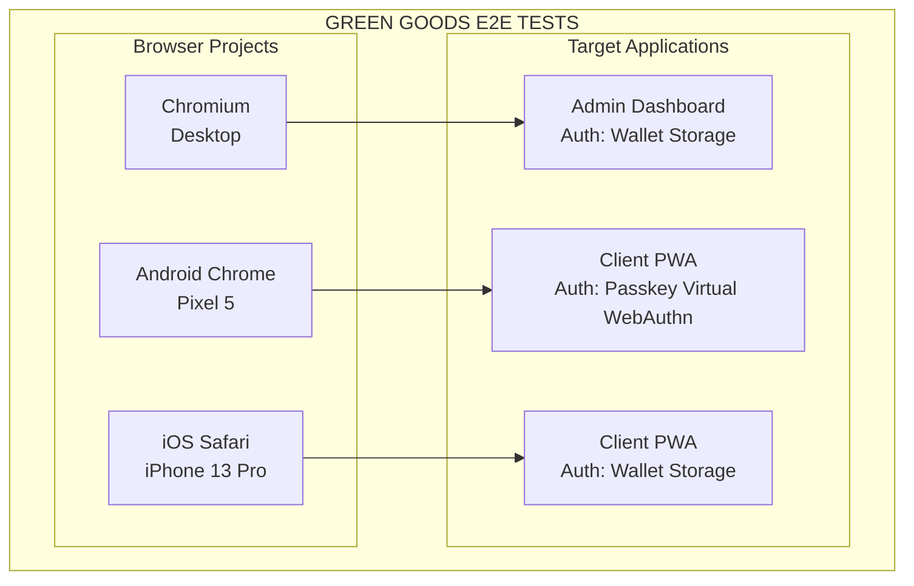
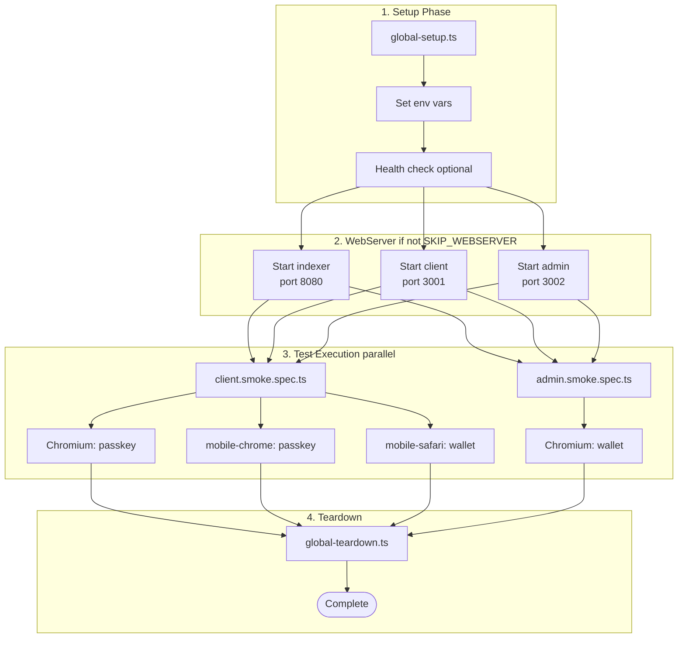

# Playwright Test Architecture

Technical deep dive into the Green Goods E2E testing infrastructure.

> **For quick start and usage:** See [`README.md`](./README.md)
>
> **Canonical diagrams:** See [E2E Test Flow](../docs/developer/architecture/diagrams.md#e2e-test-flow) for the execution lifecycle.

## Platform Matrix



## Authentication Implementation

### Android Chrome - Virtual WebAuthn

Uses Chrome DevTools Protocol to simulate biometric authentication:

```typescript
// 1. Create virtual authenticator
const client = await page.context().newCDPSession(page);
await client.send("WebAuthn.enable");

const { authenticatorId } = await client.send("WebAuthn.addVirtualAuthenticator", {
  options: {
    protocol: "ctap2",              // FIDO2 protocol
    transport: "internal",          // Platform authenticator (not USB/NFC)
    hasResidentKey: true,           // Discoverable credentials
    hasUserVerification: true,      // Biometric capable
    isUserVerified: true,           // Auto-approve all prompts
  },
});

// 2. User interaction triggers WebAuthn
// App calls: navigator.credentials.create({ publicKey: {...} })
// Virtual authenticator auto-approves (no user prompt)

// 3. Cleanup
await client.send("WebAuthn.removeVirtualAuthenticator", { authenticatorId });
```

**Flow:**
```
Test → setupPasskeyAuth() → CDP session → Virtual authenticator
  ↓
User triggers: "Sign Up" button
  ↓
App calls: navigator.credentials.create()
  ↓
Virtual authenticator responds (automatic)
  ↓
App stores credential ID → Navigate to /home
  ↓
Test continues with authenticated context
```

**Limitations:**
- Chromium-only (Firefox/WebKit don't support CDP WebAuthn)
- Simulated biometric (not testing real hardware)
- Localhost-only (different for production)

### iOS Safari - Storage Injection

Injects mock wallet state into localStorage before page load:

```typescript
// 1. Inject before page loads
await page.addInitScript(({ address, authModeKey }) => {
  // Set auth mode
  localStorage.setItem(authModeKey, "wallet");

  // Mock wagmi state (Reown AppKit)
  const wagmiState = {
    state: {
      connections: {
        __type: "Map",
        value: [[
          "mock",
          { accounts: [address], chainId: 84532 }
        ]]
      },
      current: "mock"
    }
  };
  localStorage.setItem("wagmi.store", JSON.stringify(wagmiState));

  // Set AppKit state
  localStorage.setItem("@w3m/connected_connector", '"mock"');
  localStorage.setItem("@w3m/active_caip_network_id", '"eip155:84532"');
}, { address: "0xAddress", authModeKey: "greengoods_auth_mode" });

// 2. Navigate to authenticated route
await page.goto("/home");

// 3. App reads localStorage and sees "wallet connected"
// AuthProvider detects authMode=wallet, checks wagmi state, renders as authenticated
```

**Flow:**
```
Test → injectWalletAuth() → addInitScript()
  ↓
page.goto("/home")
  ↓
App loads → Reads localStorage → Sees wallet connected
  ↓
AuthProvider: authMode=wallet, eoaAddress=0xAddress
  ↓
Renders authenticated home page
  ↓
Test continues with authenticated context
```

**Limitations:**
- Doesn't test real wallet connect UI
- Doesn't test MetaMask integration
- Storage may not persist in some Safari configurations
- No transaction signing (use mocked viem client if needed)

### Admin Desktop - Storage Injection

Same pattern as iOS Safari, but for desktop browser:

```typescript
const helper = new AdminTestHelper(page);
await helper.injectWalletAuth();
await page.goto("/dashboard");

// RequireAuth checks: isAuthenticated && eoaAddress
// Both satisfied via localStorage
```

**Why not test real wallet connect?**
- MetaMask extension automation is brittle
- Storage injection validates auth state management
- Faster test execution (no wallet popup delays)
- Real wallet testing done in manual QA

## Test Execution Flow



## Test Helper Architecture

### ClientTestHelper

```typescript
class ClientTestHelper {
  // ───────────────────────────────────────────────────────
  // Passkey methods (Android/Chromium only)
  // ───────────────────────────────────────────────────────
  async setupPasskeyAuth(): Promise<string>
    → Creates virtual WebAuthn authenticator via CDP
    → Returns authenticatorId for cleanup

  async createPasskeyAccount(username: string): Promise<string>
    → Navigates to /login
    → Fills username input
    → Triggers WebAuthn (auto-approved by virtual authenticator)
    → Waits for redirect to /home

  async loginWithPasskey(username?: string): Promise<void>
    → Login flow for returning users

  async cleanup(): Promise<void>
    → Removes virtual authenticator

  // ───────────────────────────────────────────────────────
  // Wallet methods (iOS Safari only)
  // ───────────────────────────────────────────────────────
  async injectWalletAuth(address?: string): Promise<void>
    → Injects mock wagmi state into localStorage
    → Must be called before page.goto()

  // ───────────────────────────────────────────────────────
  // Common methods
  // ───────────────────────────────────────────────────────
  async waitForPageLoad(): Promise<void>
  async isAuthenticated(): Promise<boolean>
}
```

### AdminTestHelper

```typescript
class AdminTestHelper {
  async injectWalletAuth(address?: string): Promise<void>
    → Same as ClientTestHelper.injectWalletAuth()

  async goToLogin(): Promise<void>
  async goToDashboard(): Promise<void>
  async isOnLoginPage(): Promise<boolean>
  async waitForPageLoad(): Promise<void>
}
```

## Service Utilities

```typescript
// Check all services
const status = await checkServices(page);
// → { indexer: boolean, client: boolean, admin: boolean }

// Require services or skip test
await requireServices(page, ["client", "indexer"]);

// Check if test data exists
const gardensExist = await hasGardens(page);

// Query indexer directly
const data = await queryIndexer<T>(page, query, variables);
```

## Cursor + Playwright Integration

### Debugging Workflow

```
┌────────────────────────────────────────────────────────┐
│              Test Fails in CI                          │
└────────────────────────────────────────────────────────┘
                         ↓
1. Run locally: bun test:e2e:ui
   → Playwright UI opens
   → See DOM snapshot at failure point
   → Check network requests
   → View console logs
                         ↓
2. Still unclear? Use Cursor browser MCP
   → @browser navigate to https://localhost:3001
   → @browser snapshot (get element refs)
   → @browser click on element
   → Manually explore the failure scenario
                         ↓
3. Fix identified in code
   → Edit component/hook in Cursor
   → Re-run: bun test:e2e:smoke
   → Verify fix
                         ↓
4. Commit fix
   → Git hooks run lint + format
   → CI runs full suite
```

### When to Use Which Tool

| Tool | Use Case | Pros | Cons |
|------|----------|------|------|
| **Playwright UI** | Automated test debugging | Time-travel, DOM snapshots, network tab | Requires test to run |
| **Playwright `--headed`** | Watch test execution live | See browser, visual feedback | No time-travel |
| **Playwright `--debug`** | Step through test code | Breakpoints, pause/resume | Slower workflow |
| **Cursor Browser MCP** | Manual exploration | AI-assisted, interactive | Not automated |
| **Playwright Trace** | Share failure with team | Zip file, reproducible | After-the-fact only |

**Recommendation:** 90% Playwright UI, 10% Cursor browser MCP for manual verification.

### MCP Servers vs Playwright

You have these MCP servers configured (`.cursor/mcp.json`):

| MCP Server | Purpose | Overlap with Playwright? |
|------------|---------|--------------------------|
| **GitHub** | Issues, PRs, code search | ❌ No - different domain |
| **Figma** | Design specs, screenshots | ❌ No - different domain |
| **Vercel** | Deployments, preview URLs | ❌ No - different domain |
| **Railway** | Agent hosting | ❌ No - different domain |
| **Miro** | Diagrams, boards | ❌ No - different domain |
| **Cursor Browser** | Manual web navigation | ⚠️ Partial - manual vs automated |

**You do NOT need a Playwright MCP** because:
- Playwright has built-in UI (`--ui`)
- Playwright has built-in debugger (`--debug`)
- Playwright generates traces (shareable debugging)
- Cursor browser MCP serves a different purpose (manual exploration)

**Use Cursor browser MCP when:**
- You need to manually test a complex flow
- Playwright test is too hard to write
- You want AI assistance exploring the UI
- You need to inspect network waterfall

**Use Playwright when:**
- Automating regression tests
- CI/CD validation
- Debugging test failures (UI mode)

## Environment Variables

Tests use these env vars (set in `global-setup.ts`):

```typescript
process.env.TEST_CLIENT_URL = "https://localhost:3001";
process.env.TEST_ADMIN_URL = "https://localhost:3002";
process.env.TEST_INDEXER_URL = "http://localhost:8080/v1/graphql";
process.env.TEST_CHAIN_ID = "84532";  // Base Sepolia
```

**Control flags:**
```bash
SKIP_WEBSERVER=true       # Don't auto-start services
SKIP_HEALTH_CHECK=true    # Skip global-setup health checks
ENABLE_PWA_E2E=true        # Enable service worker in tests
```

## CI/CD Strategy

### GitHub Actions

```yaml
# Fast feedback - runs on every push
e2e-smoke:
  runs-on: ubuntu-latest
  steps:
    - name: Start services
      run: bun dev &
    
    - name: Run smoke tests
      run: bun test:e2e:smoke  # Chromium only
      env:
        CI: true
```

**Why Chromium-only in CI:**
- Fastest (headless)
- Most stable (no mobile emulation quirks)
- Covers 90% of functionality

**Mobile tests run:**
- Locally during development
- Before major releases
- On staging deployments (manually)

### Real Device Testing

For production releases, manually test on:

**iOS Safari (real iPhone):**
```
1. Open Safari on iPhone
2. Navigate to https://preview-url.vercel.app
3. Test passkey registration (real biometric)
4. Test wallet connect (real MetaMask)
5. Test offline mode (airplane mode)
6. Test PWA install (Add to Home Screen)
```

**Android Chrome (real Pixel):**
```
1. Open Chrome on Pixel
2. Navigate to https://preview-url.vercel.app
3. Test passkey registration (fingerprint)
4. Test offline queue sync
5. Test PWA install
6. Test notifications (if enabled)
```

**When to run real device tests:**
- Before production deploys
- After auth changes
- After PWA manifest changes
- When mobile-specific bugs reported

## WebAuthn Technical Details

### Virtual Authenticator Configuration

```typescript
{
  protocol: "ctap2",              // FIDO2 Client to Authenticator Protocol
  transport: "internal",          // Platform authenticator (not external USB)
  hasResidentKey: true,           // Supports discoverable credentials
  hasUserVerification: true,      // Biometric/PIN capable
  isUserVerified: true,           // Auto-approve all verification prompts
}
```

**What this simulates:**
- Touch ID / Face ID on macOS/iOS
- Fingerprint sensor on Android
- Windows Hello
- PIN fallback

**What this doesn't simulate:**
- Real hardware security module (HSM)
- Real biometric templates
- Device-specific quirks
- Cross-device passkey sync (iCloud Keychain, Google Password Manager)

### Storage Keys Used in Tests

```typescript
// From shared/src/modules/auth/session.ts
const AUTH_STORAGE_KEYS = {
  authMode: "greengoods_auth_mode",      // "passkey" | "wallet"
  username: "greengoods_username",        // Pimlico server username
  rpId: "greengoods_rp_id",              // RP ID for Android compat
};

// wagmi storage (Reown AppKit)
"wagmi.store"                             // Connection state
"@w3m/connected_connector"                // Active connector
"@w3m/active_caip_network_id"            // Active chain
```

**Injection strategy:**
```typescript
await page.addInitScript(({ address, authModeKey }) => {
  // This runs BEFORE page JavaScript executes
  localStorage.setItem(authModeKey, "wallet");
  localStorage.setItem("wagmi.store", JSON.stringify(mockState));
}, { address, authModeKey });
```

## Test Execution Timeline

```
T+0s    global-setup.ts runs
        ├─ Set env vars
        └─ Health check (optional)

T+5s    webServer starts (parallel)
        ├─ bun dev:indexer → port 8080 ready
        ├─ bun dev:client  → port 3001 ready (60-120s)
        └─ bun dev:admin   → port 3002 ready (60-120s)

T+60s   Tests begin (after webServer ready)
        ├─ Chromium tests (parallel workers)
        ├─ Mobile Chrome tests
        └─ Mobile Safari tests

T+90s   Tests complete
        └─ global-teardown.ts runs

Total:  ~90-120s for full suite
        ~30-45s for smoke only
```

## Performance Considerations

### Parallel Execution

```typescript
// playwright.config.ts
{
  fullyParallel: true,       // Run tests in parallel
  workers: process.env.CI ? 2 : undefined,  // Limit workers in CI
}
```

**Trade-offs:**
- ✅ Faster execution (2-3x speedup)
- ❌ Harder to debug race conditions
- ❌ More resource intensive

### Retries

```typescript
{
  retries: process.env.CI ? 2 : 1,  // Retry flaky tests in CI
}
```

**When tests retry:**
- Network timeouts
- Service startup delays
- Race conditions
- Flaky selectors

**Best practice:** Fix flaky tests instead of relying on retries.

### WebServer Timeout

```typescript
webServer: [{
  command: "bun dev:client",
  port: 3001,
  timeout: 120000,  // 2 minutes for Vite cold start
  reuseExistingServer: !process.env.CI,  // Reuse local dev server
}]
```

**Why 2 minutes:**
- Vite cold start (dependency scanning)
- TypeScript compilation
- Service worker registration

## Cursor + Agent + MCP Workflow

### Development Cycle

```
┌────────────────────────────────────────────────────────┐
│  1. Make code changes in Cursor                        │
└────────────────────────────────────────────────────────┘
                         ↓
┌────────────────────────────────────────────────────────┐
│  2. Run smoke tests: bun test:e2e:smoke               │
│     → Validates auth + data loading                    │
└────────────────────────────────────────────────────────┘
                         ↓
                  ┌──────────┐
                  │ Pass? ───┼─── Yes → Commit
                  └──────────┘
                         │
                        No
                         ↓
┌────────────────────────────────────────────────────────┐
│  3. Debug with Playwright UI: bun test:e2e:ui         │
│     → Time-travel through test                         │
│     → Inspect DOM at failure point                     │
│     → Check network requests                           │
└────────────────────────────────────────────────────────┘
                         ↓
┌────────────────────────────────────────────────────────┐
│  4. Still stuck? Use Cursor browser MCP                │
│     → @browser navigate to https://localhost:3001      │
│     → @browser snapshot                                │
│     → Manually explore the failure scenario            │
└────────────────────────────────────────────────────────┘
                         ↓
┌────────────────────────────────────────────────────────┐
│  5. Fix code → Re-run tests → Commit                   │
└────────────────────────────────────────────────────────┘
```

### Agent-Assisted Testing

**Cursor Agent can:**
- ✅ Read test failures from terminal output
- ✅ Analyze test code and suggest fixes
- ✅ Update test selectors based on component changes
- ✅ Generate new test cases
- ✅ Use Cursor browser MCP to manually verify flows

**Cursor Agent cannot:**
- ❌ Run Playwright tests directly (use terminal commands)
- ❌ Control Playwright UI mode
- ❌ Access Playwright trace files
- ❌ Modify running test execution

**Example agent workflow:**
```
You: "E2E test failing - gardens not loading"
Agent: *Reads test output, checks component code*
        "The test is looking for [data-testid="garden-card"]
        but GardenCard.tsx uses className="garden-card".
        Updating test selector..."
        *Updates test file*
        "Run: bun test:e2e:client to verify"
```

## Writing Robust Tests

### 1. Platform Detection

```typescript
test("feature works on all platforms", async ({ page }, testInfo) => {
  const helper = new ClientTestHelper(page);
  const ios = testInfo.project.name === "mobile-safari";

  // Authenticate appropriately
  if (ios) {
    await helper.injectWalletAuth();
    await page.goto("/feature");
  } else {
    await helper.setupPasskeyAuth();
    await helper.createPasskeyAccount();
  }

  // Rest of test is platform-agnostic
});
```

### 2. Graceful Data Handling

```typescript
// Query indexer to check if test data exists
const gardensExist = await hasGardens(page);

if (gardensExist) {
  // Test happy path with real data
  await expect(page.locator('[data-testid="garden-card"]').first()).toBeVisible();
} else {
  // Test empty state
  await expect(page.locator("text=Create your first garden")).toBeVisible();
}
```

### 3. Timeout Management

```typescript
// Short timeout for UI elements
await expect(element).toBeVisible({ timeout: 5000 });

// Long timeout for blockchain operations
await expect(txStatus).toHaveText("Confirmed", { timeout: 30000 });

// Very long timeout for initial page load
await page.waitForLoadState("domcontentloaded", { timeout: 60000 });
```

### 4. Flaky Test Prevention

```typescript
// ❌ Bad - race condition
await page.click("button");
await expect(page.locator(".result")).toBeVisible();

// ✅ Good - wait for network idle
await page.click("button");
await page.waitForLoadState("networkidle");
await expect(page.locator(".result")).toBeVisible();

// ✅ Better - wait for specific condition
await page.click("button");
await page.waitForResponse((res) => res.url().includes("/api/gardens"));
await expect(page.locator(".result")).toBeVisible();
```

## CI/CD Optimization

### Parallelization

```yaml
# Run different platforms in parallel jobs
jobs:
  e2e-chromium:
    runs-on: ubuntu-latest
    steps:
      - run: bun test:e2e:smoke --project=chromium

  e2e-mobile:
    runs-on: ubuntu-latest
    steps:
      - run: bun test:e2e:mobile
```

### Caching

```yaml
- name: Cache Playwright browsers
  uses: actions/cache@v4
  with:
    path: ~/.cache/ms-playwright
    key: playwright-${{ runner.os }}-${{ hashFiles('**/package-lock.json') }}
```

### Failure Artifacts

```yaml
- name: Upload Playwright Report
  if: failure()
  uses: actions/upload-artifact@v4
  with:
    name: playwright-report
    path: playwright-report/
```

## Quick Reference

| Command | What It Tests | Duration |
|---------|---------------|----------|
| `bun test:e2e:smoke` | Login + basic views | ~30s |
| `bun test:e2e:mobile` | Client on Android + iOS | ~60s |
| `bun test:e2e` | Full suite | ~90s |
| `bun test:e2e:ui` | Visual debugger | Interactive |

**Development workflow:**
```bash
bun dev                 # Terminal 1 - services
bun test:e2e:ui        # Terminal 2 - tests
```

**CI workflow:**
```bash
SKIP_WEBSERVER=false bun test:e2e:smoke  # Auto-start services
```

## Reference

- [Playwright Docs](https://playwright.dev)
- [WebAuthn API](https://developer.mozilla.org/en-US/docs/Web/API/Web_Authentication_API)
- [Chrome DevTools Protocol](https://chromedevtools.github.io/devtools-protocol/)
- [Green Goods Developer Guide](../docs/developer/getting-started.md)
- [Test README](./README.md)
